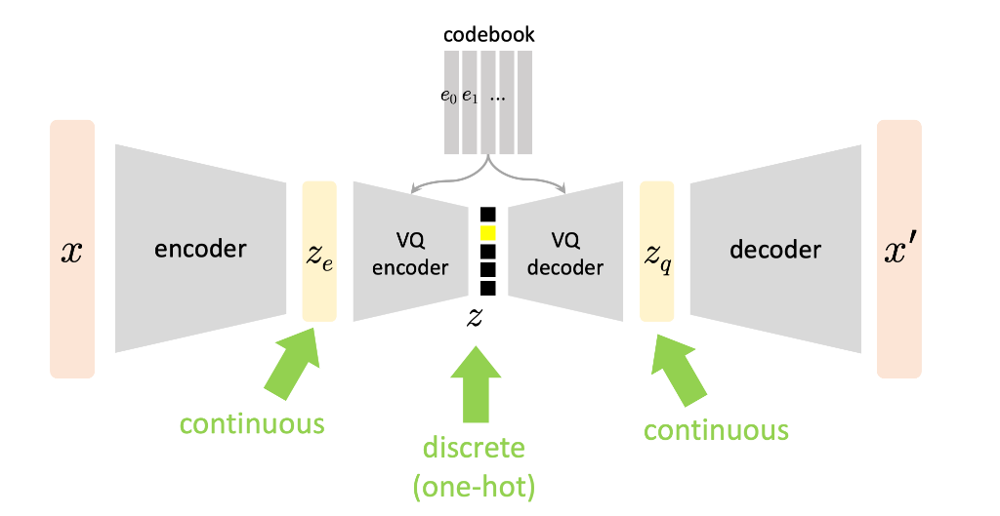

# [MIT 6.S978 Deep Generative Models](https://mit-6s978.github.io/schedule.html)

## 课程笔记与详细解析 (Fall 2024)

## [第二讲：变分自编码器 VAE](https://mit-6s978.github.io/assets/pdfs/lec2_vae.pdf)

本章深入探讨了**潜在变量模型**（Latent Variable Models），详细推导了**ELBO**（Evidence Lower Bound，证据下界），并解释了 VAE 的完整架构。课程还探讨了 VAE 与 EM 算法的关系，以及 VQ-VAE 如何处理离散潜在变量。

### 📖 Slide 1-2: 课程概览

Lecture 2 的主要内容：

- **Variational Autoencoder (VAE)**：核心模型
- **Relation to Expectation-Maximization (EM)**：与经典 EM 算法的联系
- **Vector Quantized VAE (VQ-VAE)**：处理离散潜在变量的扩展

### 📖 Slide 3-10: 潜在变量模型的基本设定

**数据生成假设**：

假设存在一个数据生成过程：

- **z** - **潜在变量**（latent variables）：如姿态、尺寸、颜色、品种等高层语义属性
- **x** - **观测变量**（observed variables）：如图像、视频、音频等实际数据

生成过程：

1. 从**先验分布**采样潜在变量：$z \sim p(z)$
2. 通过**生成器**（世界模型、物理模型、渲染器等）生成观测：$x \sim p(x|z)$
3. 观测 x 具有**复杂分布**，但可以通过 z 来分解

用神经网络表示：

- $\theta$ - 可学习的参数
- 生成器表示为函数：$p_\theta(x|z)$
- 边际分布（我们要建模的目标）：

$$
p_\theta(x) = \int p(z) p_\theta(x|z) dz
$$

我们的目标是让模型分布 $p_\theta(x)$ 接近真实数据分布 $p_\text{data}(x)$。我们使用**KL 散度**（Kullback-Leibler divergence）来度量两个分布的差异。对于两个概率分布 $p(x)$ 和 $q(x)$，KL 散度定义为：

$$
D_{KL}(p \| q) = \int p(x) \log \frac{p(x)}{q(x)} dx
$$

或者等价地写成：

$$
D_{KL}(p \| q) = \mathbb{E}_{x \sim p}\left[\log \frac{p(x)}{q(x)}\right] = \mathbb{E}_{x \sim p}[\log p(x) - \log q(x)]
$$

直观理解：

- KL 散度度量了用分布 $q$ 来近似分布 $p$ 时的信息损失
- $D_{KL}(p \| q) \geq 0$，当且仅当 $p = q$ 时等号成立
- 注意：KL 散度**不对称**，即 $D_{KL}(p \| q) \neq D_{KL}(q \| p)$

**目标：最小化 KL 散度**

$$
\begin{aligned}
\argmin_\theta D_{KL}(p_\text{data}(x) \| p_\theta(x)) &= \argmin_\theta \mathbb{E}_{x \sim p_\text{data}}[\log p_\text{data}(x) - \log p_\theta(x)] \\
&= \argmin_\theta \left[\mathbb{E}_{x \sim p_\text{data}}[\log p_\text{data}(x)] - \mathbb{E}_{x \sim p_\text{data}}[\log p_\theta(x)]\right]
\end{aligned}
$$

关键观察：

- 第一项 $\mathbb{E}_{x \sim p_\text{data}}[\log p_\text{data}(x)]$ 是数据分布的熵，**与参数 $\theta$ 无关**
- 因此，最小化 KL 散度等价于最大化第二项

$$
\argmin_\theta D_{KL}(p_\text{data} \| p_\theta) \Leftrightarrow \argmax_\theta \mathbb{E}_{x \sim p_\text{data}}[\log p_\theta(x)]
$$

在训练时，我们用数据集 $\{x_1, x_2, ..., x_N\}$ 来近似期望：

$$
\mathbb{E}_{x \sim p_\text{data}}[\log p_\theta(x)] \approx \frac{1}{N} \sum_{i=1}^N \log p_\theta(x_i)
$$

因此，我们的优化目标是：

$$
\max_\theta \sum_{i=1}^N \log p_\theta(x_i)
$$

这就是**最大似然估计**（Maximum Likelihood Estimation, MLE）！

但是：

- 积分 $\int p(z) p_\theta(x|z) dz$ 通常是**不可处理的**（intractable）
- 无法直接计算 $\log p_\theta(x)$
- 无法对 $\theta$ 求梯度

两组未知量：

1. **$\theta$**：生成器的参数——我们需要优化
2. **$p(z)$**：真实的潜在变量分布——我们**无法控制**

解决方案：引入一个"可控"的分布 $q(z)$ 来近似后验 $p(z|x)$

### 📖 Slide 11-23: ELBO 的详细推导

**核心思想**：通过引入变分分布 $q(z)$，将不可处理的 log 似然转化为可优化的下界。

对于**任意**分布 $q(z)$，我们可以写出：

$$
\begin{aligned}
\log p_\theta(x) &= \log p_\theta(x) \int q(z) dz \\
&= \int q(z) \log p_\theta(x) dz \\
&= \int q(z) \log \frac{p_\theta(x,z)}{p_\theta(z|x)} dz \quad \text{（贝叶斯规则）} \\
&= \int q(z) \log \frac{p_\theta(x,z)}{p_\theta(z|x)} \frac{q(z)}{q(z)}dz \\
&= \int q(z) \left[\log \frac{p_\theta(x,z)}{q(z)} + \log \frac{q(z)}{p_\theta(z|x)}\right]dz \\
&= \int q(z) \left[\log \frac{p_\theta(x,z)}{q(z)} \right]dz + \int q(z) \left[\log \frac{q(z)}{p_\theta(z|x)}\right]dz \\
&=\mathbb{E}_{z\sim q(z)} \left[\log \frac{p_\theta(x,z)}{q(z)}\right] + D_{KL}\left(q(z) \| p_\theta(z|x)\right)
\end{aligned}
$$

- 第一项是**ELBO**（Evidence Lower Bound）
- 第二项是$q(z)$相对于$p_\theta(z|x)$的 KL 散度
- **可处理项**（tractable）：ELBO 中的项都可以计算或估计
- **不可处理项**（intractable）：$p_\theta(z|x)$ 和 $\log p_\theta(x)$ 通常无法直接计算

关键性质：

- KL 散度 $\geq 0$（总是非负）
- 因此：$\log p_\theta(x) \geq \text{ELBO}$
- ELBO 是 log 似然的**下界**（Lower Bound）
- 当 $q(z) = p_\theta(z|x)$ 时，$D_{KL}=0$，下界达到最紧

重要标注：

- **可处理项**（tractable）：ELBO 中的项都可以计算或估计
- **不可处理项**（intractable）：$p_\theta(z|x)$ 和 $\log p_\theta(x)$ 通常无法直接计算

### 📖 Slide 21-23: 参数化 q 和简化 ELBO

**参数化变分分布**：

用神经网络参数化 q，用$q_\phi(z|x)$替换上面结果中的$q(z)$

- $\phi$ - encoder 的可学习参数
- 给定 x，输出 z 的分布参数

**简化先验**：

让 $p_\theta(z) = p(z)$ 为简单的已知先验（如标准高斯）：

$$
p(z) = \mathcal{N}(0, I)
$$

**ELBO 的进一步分解**：

$$
\begin{aligned}
\text{ELBO} &= \mathbb{E}_q\left[\log \frac{p_\theta(x,z)}{q_\phi(z|x)}\right] \\
&= \mathbb{E}_q\left[\log \frac{p_\theta(x|z) p(z)}{q_\phi(z|x)}\right] \\
&= \mathbb{E}_q[\log p_\theta(x|z)] + \mathbb{E}_q\left[\log \frac{p(z)}{q_\phi(z|x)}\right] \\
&= \mathbb{E}_q[\log p_\theta(x|z)] - D_{KL}(q_\phi(z|x) \| p(z))
\end{aligned}
$$

**VAE 的目标函数**：

最大化 ELBO ⇔ 最小化负 ELBO：

$$
\text{Loss} = -\mathbb{E}_q[\log p_\theta(x|z)] + D_{KL}(q_\phi(z|x) \| p(z))
$$

两项解释：

- **重构损失**（Reconstruction Loss）：$-\mathbb{E}_q[\log p_\theta(x|z)]$
  - 确保从 z 重构 x 的质量
  - 类似于传统 autoencoder 的重构误差
- **正则化损失**（Regularization Loss）：$D_{KL}(q_\phi(z|x) \| p(z))$
  - 确保编码分布接近先验分布
  - 防止"作弊"（把所有信息编码到 z 中）

### 📖 Slide 24-30: VAE 架构与重参数化技巧

**VAE 的完整架构**：

$$
\begin{array}{ccccccc}
x & \xrightarrow{\text{Encoder } \phi} & (\mu, \sigma) & \xrightarrow{\text{采样}} & z & \xrightarrow{\text{Decoder } \theta} & x' \\

\end{array}
$$

**Encoder（编码器）**：

- 输入：数据 x
- 输出：潜在分布的参数
  - 均值：$\mu = f_\phi^\mu(x)$
  - 标准差：$\sigma = f_\phi^\sigma(x)$
- 编码分布：$q_\phi(z|x) = \mathcal{N}(\mu, \text{diag}(\sigma^2))$

**Decoder（解码器）**：

- 输入：采样的潜在变量 z
- 输出：重构数据 x'的分布参数
- 解码分布：$p_\theta(x|z)$（例如高斯或伯努利）

**重构损失的具体形式**（以高斯为例）：

假设 $p_\theta(x|z) = \mathcal{N}(g_\theta(z), \sigma^2 I)$，其中 $g_\theta$ 是 decoder 网络。

**重要假设**：这里 $\sigma^2$ 是**固定的常数**（不是 decoder 的输出）

- Decoder 网络 $g_\theta(z)$ 只输出**均值** $\mu = g_\theta(z)$
- 方差 $\sigma^2$ 是一个超参数，在训练中保持不变
- 这简化了模型和训练过程

负对数似然：

$$
\begin{aligned}
-\log p_\theta(x|z) &= -\log \mathcal{N}(x | g_\theta(z), \sigma^2 I) \\
&= \frac{1}{2\sigma^2}\|x - g_\theta(z)\|^2 + \text{常数项}
\end{aligned}
$$

因此，**重构损失 ≈ L2 损失**（当 $\sigma^2$ 固定时，常数因子可以忽略）

**注意**：

- 在实践中，通常直接使用 $\|x - g_\theta(z)\|^2$ 作为重构损失
- 这等价于假设 $\sigma^2 = 1$（或其他固定值）
- 如果需要学习方差，decoder 需要输出 $(\mu, \sigma^2)$ 两个参数

使用**单样本蒙特卡洛**估计期望：

$$
\mathbb{E}_q[-\log p_\theta(x|z)] \approx -\log p_\theta(x|\tilde{z}), \quad \text{其中} \; \tilde{z} \sim q_\phi(z|x)
$$

**正则化损失的具体形式**（高斯先验）：

当 $p(z) = \mathcal{N}(0,I)$ 和 $q_\phi(z|x) = \mathcal{N}(\mu, \text{diag}(\sigma^2))$ 时，KL 散度有**闭式解**：

$$
D_{KL}(q_\phi(z|x) \| p(z)) = \frac{1}{2} \sum \left[\mu^2 + \sigma^2 - \log(\sigma^2) - 1\right]
$$

**关键问题：如何反向传播通过采样操作？**

采样操作 $z \sim \mathcal{N}(\mu, \sigma^2)$ 是**不可微**的！

**解决方案：重参数化技巧（Reparameterization Trick）**

核心思想：将随机性从参数中分离出来

**原始采样**（不可微）：

$$
z \sim \mathcal{N}(\mu, \sigma^2)
$$

**重参数化后**（可微）：

$$
\begin{aligned}
\epsilon &\sim \mathcal{N}(0, I) \quad \text{(与} \mu, \sigma \text{无关的噪声)} \\
z &= \mu + \sigma \odot \epsilon \quad \text{(确定性变换)}
\end{aligned}
$$

这样：

- 随机性来自**固定的** $\epsilon$
- z 关于 $\mu$ 和 $\sigma$ 是**确定性函数**
- 可以通过自动微分计算梯度！

**VAE 训练流程**：

1. 输入数据 x
2. Encoder 输出 $\mu$ 和 $\sigma$
3. 采样 $\epsilon \sim \mathcal{N}(0,I)$
4. 计算 $z = \mu + \sigma \odot \epsilon$
5. Decoder 生成重构 x'
6. 计算两部分损失：
   - 重构损失：$\|x - x'\|^2$
   - KL 损失：$\frac{1}{2}\sum[\mu^2 + \sigma^2 - \log(\sigma^2) - 1]$
7. 反向传播更新 $\phi$ 和 $\theta$

### 📖 Slide 31-35: VAE 的推理（生成）

**训练完成后，如何生成新样本？**

**生成过程**：

1. 从先验采样：$z \sim p(z) = \mathcal{N}(0, I)$
2. 通过 decoder 映射：$x = g_\theta(z)$
3. 得到生成的样本 x

**注意**：

- 生成时**不使用**encoder
- 直接从简单的先验分布采样
- Decoder 作为确定性映射（从一个分布到另一个分布）

**Slides 展示的可视化**：

- 从标准高斯的不同位置采样 z
- 通过 decoder 生成对应的 x
- 展示了潜在空间到数据空间的连续映射

### 📖 Slide 36-40: "自编码分布"的视角

**另一种理解 VAE 的方式**：不是编码单个数据点，而是**编码分布**。

**Encoder 的作用**：

- 将**数据分布** $p_\text{data}(x)$ 映射到**潜在分布**
- 编码后的潜在分布：

$$
q_\phi(z) = \int p_\text{data}(x) q_\phi(z|x) dx
$$

**Decoder 的作用**：

- 将**潜在分布** $p(z)$ 映射到**数据分布** $p_\theta(x)$

**VAE 的目标**：

- 使 $q_\phi(z)$ 接近先验 $p(z)$（通过 KL 项）
- 使 $p_\theta(x)$ 接近数据分布 $p_\text{data}(x)$（通过重构项）

这个视角启发了其他变体，如**InfoVAE**（Information Maximizing VAE, 2017），直接优化 $D_{KL}(q_\phi(z) \| p(z))$。

### 📖 Slide 41-48: VAE 在 MNIST 上的可视化

**2D 潜在空间实验**：

当潜在空间维度为 2 时（$z \in \mathbb{R}^2$），可以直接可视化：

- **Encoder 的输出**：不同数字的编码分布在 2D 平面上的位置
  - 不同类别聚集在不同区域
  - 同一类别形成一个分布（不是单点！）
- **Decoder 的输出**：从 2D 潜在空间的不同位置解码得到的图像
  - 在潜在空间中移动，生成的数字连续变化
  - 展示了潜在空间的**连续性和插值性**
- **动画演示**（slides 提到）：
  - 在潜在空间中沿路径移动
  - 观察生成图像的平滑变化
  - 展示了 VAE 学到的流形结构

**在 Frey Face 数据集上的结果**：

引用 Kingma and Welling 的原始论文（Auto-Encoding Variational Bayes, ICLR 2014），展示了 VAE 在人脸数据集上的表现。

### 📖 Slide 49-67: VAE 与 EM 算法的关系

#### EM 算法回顾

**Expectation-Maximization 算法**是一个经典的统计学习算法，用于含有隐变量的概率模型。

**问题设定**：

- 观测数据：$x$
- 隐变量：$z$
- 参数：$\theta$
- 目标：最大化边际似然 $p_\theta(x) = \int p_\theta(x,z) dz$

**EM 算法的适用前提**：

**前提 1**：后验分布 $p_{\theta}(z|x)$ 可以**解析计算**

这意味着：

- 联合分布 $p_\theta(x, z)$ 可以解析计算（模型定义）
- 边际分布 $p_\theta(x) = \int p_\theta(x,z) dz$ 可以计算（通过求和/积分）
- 后验分布 $p_{\theta}(z|x) = \frac{p_\theta(x,z)}{p_\theta(x)}$ 可以通过贝叶斯规则得到

**关键点**：

- $p_{\theta}(z|x)$ 不是"直接给出"的，而是从$p_\theta(x, z)$出发通过计算得到的
- 在经典模型（如 GMM）中，边际分布的积分/求和是**可处理的**（有限求和或有闭式解）
- 在深度生成模型中，这个积分是**不可处理的**（高维积分 intractable）→ 需要 VAE

**前提 2**：Q 函数可优化

$Q(\theta | \theta^{(t)})$ 的最大化有闭式解或容易求解

**EM 算法的两步迭代**：

1. **E-step（期望步）**：给定当前参数 $\theta^{(t)}$，计算隐变量的后验分布

$$
q(z) = p_{\theta^{(t)}}(z|x)
$$

2. **M-step（最大化步）**：最大化 Q 函数在数据集上的积分（实际以离散数据集的求和代替），更新参数

$$
\begin{aligned}
Q_x(\theta | \theta^{(t)}) &= \mathbb{E}_{z \sim p_{\theta^{(t)}}(z|x)}[\log p_\theta(x, z)] = \int p_{\theta^{(t)}}(z|x) \log p_\theta(x, z) dz \\
\theta^{(t+1)} &= \arg\max_\theta \int p_{data}(x) Q_x(\theta | \theta^{(t)})dx \approx\arg\max_\theta\frac{1}{N}\sum_{i=1}^NQ_{x_i}(\theta|\theta^{(t)})
\end{aligned}
$$

这两步交替迭代，直到收敛。

---

**Q 函数的详细解释**：

**什么是"完全数据"（Complete Data）？**

- **不完全数据**：只有观测变量 $x$（这是我们实际拥有的）
- **完全数据**：同时有观测变量 $x$ 和隐变量 $z$（这是我们想象的"完整"情况）
- 如果我们知道 $z$ 的值，优化 $\log p_\theta(x, z)$ 会很容易

**Q 函数的含义**：

- Q 函数是**完全数据对数似然** $\log p_\theta(x, z)$ 关于**隐变量后验分布** $q(z) = p_{\theta^{(t)}}(z|x)$ 的**期望**
- 换句话说：因为我们不知道真实的 $z$，所以对所有可能的 $z$ 值取加权平均，权重就是在当前参数 $\theta^{(t)}$ 下，$z$ 的后验概率$q(z) = p_{\theta^{(t)}}(z|x)$

**为什么需要 Q 函数？**

关键问题：直接优化 $\log p_\theta(x)$ 很难，因为：

$$
\log p_\theta(x) = \log \int p_\theta(x, z) dz
$$

**重要区分**：

- ✅ **计算** $p_\theta(x)$ 的值：在简单模型（如 GMM）中可以做到
- ❌ **优化** $\log p_\theta(x)$：找到最优参数 $\theta$，这很困难！

**用 GMM 例子详细说明**：

假设有 K 个高斯分量，参数 $\theta = \{\pi_k, \mu_k, \Sigma_k\}_{k=1}^K$：

**1. 计算 $\log p_\theta(x_i)$ 的值（可以做到）**：

$$
p_\theta(x_i) = \sum_{k=1}^K \pi_k \mathcal{N}(x_i | \mu_k, \Sigma_k)
$$

给定具体的参数值，这只是 K 个数的加法，很容易计算。

**2. 优化 $\sum_{i=1}^N \log p_\theta(x_i)$（很困难）**：

$$
\mathcal{L}(\theta) = \sum_{i=1}^N \log \left( \sum_{k=1}^K \pi_k \mathcal{N}(x_i | \mu_k, \Sigma_k) \right)
$$

**为什么困难？让我们尝试求梯度**：

对 $\mu_k$ 求导：

$$
\frac{\partial \mathcal{L}}{\partial \mu_k} = \sum_{i=1}^N \frac{1}{p_\theta(x_i)} \cdot \frac{\partial}{\partial \mu_k} \left[ \pi_k \mathcal{N}(x_i | \mu_k, \Sigma_k) \right]
$$

展开后：

$$
\frac{\partial \mathcal{L}}{\partial \mu_k} = \sum_{i=1}^N \frac{\pi_k \mathcal{N}(x_i | \mu_k, \Sigma_k)}{p_\theta(x_i)} \cdot \Sigma_k^{-1}(x_i - \mu_k)
$$

注意：

- 分母 $p_\theta(x_i) = \sum_{j=1}^K \pi_j \mathcal{N}(x_i | \mu_j, \Sigma_j)$ 包含**所有分量**
- 梯度中出现了 $\frac{\pi_k \mathcal{N}(x_i | \mu_k, \Sigma_k)}{p_\theta(x_i)}$，这正是后验 $p(z_i=k|x_i)$！

**问题**：设置 $\frac{\partial \mathcal{L}}{\partial \mu_k} = 0$ 求解 $\mu_k$：

$$
\sum_{i=1}^N p(z_i=k|x_i) \cdot \Sigma_k^{-1}(x_i - \mu_k) = 0
$$

$$
\Rightarrow \mu_k = \frac{\sum_{i=1}^N p(z_i=k|x_i) \cdot x_i}{\sum_{i=1}^N p(z_i=k|x_i)}
$$

**循环依赖**：

- 要计算 $\mu_k$，需要知道后验 $p(z_i=k|x_i)$
- 要计算 $p(z_i=k|x_i) = \frac{\pi_k \mathcal{N}(x_i|\mu_k, \Sigma_k)}{\sum_j \pi_j \mathcal{N}(x_i|\mu_j, \Sigma_j)}$，需要知道**所有参数**（包括 $\mu_k$ 本身！）
- 这是一个**耦合的非线性方程组**，所有变量相互依赖
- **没有闭式解**！

**3. 对比：如果我们知道 $z_i$ 的值（完全数据情况）**：

假设我们神奇地知道了每个数据点的真实隐变量 $z_i$，优化：

$$
\mathcal{L}_{\text{complete}}(\theta) = \sum_{i=1}^N \log p_\theta(x_i, z_i) = \sum_{i=1}^N [\log \pi_{z_i} + \log \mathcal{N}(x_i | \mu_{z_i}, \Sigma_{z_i})]
$$

对 $\mu_k$ 求导：

$$
\frac{\partial \mathcal{L}_{\text{complete}}}{\partial \mu_k} = \sum_{i: z_i=k} \Sigma_k^{-1}(x_i - \mu_k)
$$

设为零：

$$
\mu_k = \frac{1}{N_k} \sum_{i: z_i=k} x_i
$$

这是**简单的加权平均**，有闭式解！没有循环依赖！

**4. Q 函数的巧妙之处**：

Q 函数：

$$
Q(\theta | \theta^{(t)}) = \sum_{i=1}^N \sum_{k=1}^K p_{\theta^{(t)}}(z_i=k|x_i) \log p_\theta(x_i, z_i=k)
$$

最大化 Q 函数关于 $\mu_k$：

$$
\frac{\partial Q}{\partial \mu_k} = \sum_{i=1}^N p_{\theta^{(t)}}(z_i=k|x_i) \cdot \Sigma_k^{-1}(x_i - \mu_k)
$$

设为零：

$$
\mu_k^{(t+1)} = \frac{\sum_{i=1}^N p_{\theta^{(t)}}(z_i=k|x_i) \cdot x_i}{\sum_{i=1}^N p_{\theta^{(t)}}(z_i=k|x_i)}
$$

**关键观察**：

- 后验 $p_{\theta^{(t)}}(z_i=k|x_i)$ 使用**固定的旧参数** $\theta^{(t)}$，已经在 E-step 计算好了
- 这不是一个关于新参数 $\mu_k^{(t+1)}$ 的函数！
- **没有循环依赖**！
- 有**闭式解**，可以直接计算

**本质区别总结**：

| 方法                            | 优化目标                                                               | 梯度表达式                                                                                           | 是否有循环依赖        | 是否有闭式解 |
| ------------------------------- | ---------------------------------------------------------------------- | ---------------------------------------------------------------------------------------------------- | --------------------- | ------------ |
| **直接优化** $\log p_\theta(x)$ | $\sum_i \log \sum_k \pi_k \mathcal{N}(x_i\|\mu_k, \Sigma_k)$           | 包含$\frac{\pi_k \mathcal{N}(x_i\|\mu_k, \Sigma_k)}{\sum_j \pi_j \mathcal{N}(x_i\|\mu_j, \Sigma_j)}$ | ✅ 有（所有参数耦合） | ❌ 无        |
| **EM 优化 Q 函数**              | $\sum_i \sum_k p_{\theta^{(t)}}(z_i=k\|x_i) \log p_\theta(x_i, z_i=k)$ | 后验使用**固定的旧参数**                                                                             | ❌ 无（解耦）         | ✅ 有        |
| **完全数据（理想情况）**        | $\sum_i \log p_\theta(x_i, z_i)$                                       | 直接依赖数据                                                                                         | ❌ 无                 | ✅ 有        |

**直观理解**：

- **问题根源**：log 里有 sum（$\log \sum_k$），导致参数之间复杂耦合
- **EM 的智慧**：
  1. E-step：用当前参数"猜测"隐变量分布（计算后验）
  2. M-step：在这个"猜测"下优化，此时把后验当作**固定权重**
  3. 这样就打破了循环依赖，每步都有闭式解
  4. 通过迭代，逐步逼近真实最优解

**为什么可以这样做？**

EM 算法保证：

$$
\log p_{\theta^{(t+1)}}(x) \geq \log p_{\theta^{(t)}}(x)
$$

虽然每一步 M-step 只是优化一个下界（Q 函数），但这保证了真实目标函数（对数似然）单调递增！

**Q 函数的作用总结**：

1. 将困难的耦合优化问题转化为容易的解耦优化问题
2. 用"当前最佳猜测"的后验作为固定权重
3. 在这个固定权重下，优化变得简单（有闭式解）
4. 迭代更新，逐步改进

**直观例子（高斯混合模型）**：

假设我们有数据点 $x_i$，想用 K 个高斯分布拟合：

- **隐变量** $z_i \in \{1, 2, ..., K\}$：数据点 $x_i$ 来自哪个高斯分量
- **完全数据对数似然**：$\log p_\theta(x_i, z_i) = \log p(z_i) + \log \mathcal{N}(x_i | \mu_{z_i}, \Sigma_{z_i})$
- **Q 函数**：

$$
Q(\theta | \theta^{(t)}) = \sum_{i=1}^N \sum_{k=1}^K p_{\theta^{(t)}}(z_i=k | x_i) \log p_\theta(x_i, z_i=k)
$$

这里：

- $p_{\theta^{(t)}}(z_i=k | x_i)$ 是"责任"（responsibility）：数据点 $x_i$ 属于第 $k$ 个高斯的概率
- $\log p_\theta(x_i, z_i=k)$ 是假设 $x_i$ 来自第 $k$ 个高斯时的对数似然
- Q 函数把所有可能的分配加权求和

**Q 函数的性质**：

1. **下界性质**：最大化 Q 函数会增加真实的对数似然 $\log p_\theta(x)$
2. **可处理性**：Q 函数通常比原始对数似然更容易优化
3. **单调性**：EM 算法保证 $\log p_{\theta^{(t+1)}}(x) \geq \log p_{\theta^{(t)}}(x)$
4. **M-step（最大化步）**：最大化 Q 函数得到新参数

$$
\theta^{(t+1)} = \arg\max_\theta Q(\theta | \theta^{(t)})
$$

#### VAE vs. EM 的对比

经典 EM 算法 vs. VAE 的核心区别：

- **经典 EM**：假设 $p_\theta(z|x)$ 可精确计算（如高斯混合模型）
- **VAE**：当 $p_\theta(z|x)$ **不可计算**时，用神经网络 $q_\phi(z|x)$ 来**近似**后验

**VAE vs. 经典 EM 算法的详细对比**：

| 对比维度               | EM/GMM                                                                                        | 非摊销变分推理                                  | VAE（摊销变分推理）                              |
| ---------------------- | --------------------------------------------------------------------------------------------- | ----------------------------------------------- | ------------------------------------------------ |
| **后验计算**           | 精确计算$p_\theta(z\|x)$（贝叶斯规则）需要计算边际概率 $p_\theta(x) = \sum_k p_\theta(x,z=k)$ | 为每个数据点优化独立的变分分布$q_i(z)$          | 学习共享的 encoder$q_\phi(z\|x)$                 |
| **模型复杂度**         | 简单分布（高斯混合等）适合低维、简单数据                                                      | 可以是复杂分布                                  | 深度神经网络适合高维、复杂数据（如图像）         |
| **存储需求**           | $O(K \times d^2)$（K 个高斯参数）                                                             | $O(N \times \|\lambda\|)$（每个数据点独立参数） | $O(\|\phi\|)$（共享 encoder 参数）               |
| **训练时间(单次迭代)** | $O(N \times K)$（N 个数据点，每个 K 次求和）                                                  | $O(N \times T \times C)$（每个点 T 次优化迭代） | $O(N \times C_{\text{encoder}})$（N 次前向传播） |
| **新数据推理**         | $O(K \times d^2)$（K 次高斯密度计算）                                                         | $O(T \times C)$（重新优化 T 步）                | $O(C_{\text{encoder}})$（一次前向传播）          |
| **泛化能力**           | ✅ 可以泛化到新数据点（无需重新训练模型）                                                     | ❌ 不能泛化（每个新数据点需要重新优化）         | ✅ 可以泛化到新数据点（encoder 学到了通用映射）  |
| **适用场景**           | 简单分布，K 较小，数据维度不高                                                                | 理论工具实践中几乎不用（太慢）                  | 复杂高维数据需要强大的表达能力                   |

**关键洞察**：

1. **EM vs VAE**：不是速度的比较，而是**表达能力 vs 简单性**的权衡

   - GMM：简单、可解释、精确，但**表达能力有限**（对复杂高维数据无能为力）
   - VAE：强大、可扩展、灵活，但更复杂

2. **"摊销"对比的是非摊销变分推理，不是 EM**：

   - **非摊销 VI**：每个数据点有独立的变分参数（实践中不实用，太慢且存储爆炸）
   - **VAE（摊销 VI）**：所有数据点共享 encoder 参数
   - "摊销"解决的是**参数爆炸**和**推理慢**的问题

3. **计算复杂度不是关键**：

   - $O(N \times K)$ vs $O(N \times C_{\text{encoder}})$ 没有绝对优劣
   - 取决于 K、网络大小、数据复杂度
   - **VAE 的优势在于表达能力和可扩展性，不是速度**

4. **EM 的计算瓶颈**（以 GMM 为例）：

   - 计算边际概率 $p_\theta(x_i) = \sum_k \pi_k \mathcal{N}(x_i\|\mu_k, \Sigma_k)$ 需要对 K 个分量求和
   - 虽然工程上可以优化（避免重复计算），但复杂度仍是 $O(N \times K)$
   - **关键问题**：log 里有 sum（$\log \sum_k$），导致参数耦合，无闭式解
   - EM 通过 Q 函数解耦，但每次迭代仍需 $O(N \times K)$ 计算后验

5. **VAE 的优势**（相对于非摊销 VI）：

   - **推理阶段**：新数据点只需一次前向传播，而非摊销 VI 需要重新优化
   - **存储**：参数量与数据集大小 $N$ 无关
   - **泛化**：encoder 学到了通用的 $x \to z$ 映射函数

#### K-means 作为 EM 的特殊情况

课程展示了一个精彩的联系：**K-means 聚类**本质上是一个特殊的 EM 算法。

**K-means 的概率解释**：

- **隐变量**：$z \in \{1, 2, ..., K\}$（数据点属于哪个簇）
- **模型**：

$$
\begin{aligned}
p(z=k) &= \frac{1}{K} \quad \text{（均匀先验）} \\
p(x|z=k) &= \mathcal{N}(x | \mu_k, \sigma^2 I) \quad \text{（每个簇是一个高斯）}
\end{aligned}
$$

**K-means 的 EM 步骤**：

1. **E-step**：计算后验（硬分配）

$$
q(z=k|x) = \begin{cases}
1 & \text{if } k = \arg\min_j \|x - \mu_j\|^2 \\
0 & \text{otherwise}
\end{cases}
$$

这是**硬分配**（hard assignment），而非软分配

2. **M-step**：计算该问题的 Q 函数：

$$
\begin{aligned}
Q(\theta|\theta^{(t)}) &= \sum_{i=1}^N\sum_{k=1}^Kp_{\theta^{(t)}}(z_i=k|x_i)\log p_{\theta}(x_i, z_i = k) \\
&= \sum_{i=1}^N\sum_{k=1}^Kp_{\theta^{(t)}}(z_i=k|x_i)\log \left[\frac{1}{K}\mathcal{N}(x_i|\mu_k, \sigma^2I) \right]\\
&= \sum_{i=1}^N\sum_{k=1}^Kp_{\theta^{(t)}}(z_i=k|x_i)\left[-\frac{1}{2\sigma^2}\Vert x_i-\mu_k\Vert^2\right] + \text{const}\\
\end{aligned}
$$

可见最大化 Q 函数等价于一个加权最小二乘问题。求解最优$\mu_k$：

$$
\frac{\partial Q}{\partial\mu_k}\propto\sum_{i=1}^Np_{\theta^{(t)}}(z_i=k|x_i)(x_i-\mu_k)=0
$$

$$
\mu_k^{(t+1)}=\frac{\sum_{i=1}^Np_{\theta^{(t)}}(z_i=k|x_i)\cdot x_i}{\sum_{i=1}^Np_{\theta^{(t)}}(z_i=k|x_i)}
$$

根据 E-step 中的硬分配，对于所有属于 k 簇的点，其后验概率为 1，其余点后验概率为 0，因此我们得到

$$
\mu_k^{(t+1)}=\frac{1}{N_k}\sum_{x_i\in C_k}x_i
$$

这正是 k-means 更新簇中心的标准操作。

**K-means vs. GMM vs. VAE**：

| 模型        | 隐变量类型     | 后验形式           | 生成能力             |
| ----------- | -------------- | ------------------ | -------------------- |
| **K-means** | 离散（簇索引） | 硬分配（one-hot）  | 弱（只能重现簇中心） |
| **GMM**     | 离散（簇索引） | 软分配（概率分布） | 中等（高斯混合）     |
| **VAE**     | 连续（向量）   | 高斯分布           | 强（神经网络解码器） |

**洞察**：K-means 可以看作**极度简化的 VAE**：

- 隐变量是离散的，而非连续的
- 后验是确定性的（硬分配），而非概率性的
- "解码器"只是返回簇中心，而非复杂的神经网络

### 📖 Slide 68-74: Vector Quantized VAE (VQ-VAE)

#### 动机：为什么需要离散潜在变量？

**标准 VAE 的局限**：

- 潜在变量 z 是**连续的**（来自高斯分布）
- 这对某些任务不够自然：
  - **语言建模**：词汇本质上是离散的
  - **分层建模**：想要像"符号"一样的离散表示
  - **与自回归模型结合**：Autoregressive 模型通常在离散空间上工作（如预测下一个 token）

**VQ-VAE 的核心思想**：

使用**离散的潜在变量**，通过向量量化（Vector Quantization）技术，结合神经网络编码器和解码器。

#### VQ-VAE 与标准 VAE 的对比

**标准 VAE 的潜在变量**：

- **连续**的高斯分布：$q_\phi(z|x) = \mathcal{N}(\mu, \sigma^2)$
- 通过重参数化技巧采样
- 适合建模连续的变化（如图像的平滑变换）

**VQ-VAE 的潜在变量**：

- **离散**的类别分布（categorical distribution）
- 从固定的**码本**（codebook）中选择
- 更适合某些任务：
  - 语言建模（词汇本质上是离散的）
  - 符号推理和规划
  - 多模态分布建模

#### 离散潜在变量的挑战

**问题**：如何对离散采样操作进行反向传播？

在标准 VAE 中：

- 采样是连续的，可以用重参数化技巧
- $z = \mu + \sigma \odot \epsilon$

在离散情况下：

- 采样是 argmax 操作（不可微）
- 无法直接使用重参数化技巧

**启发**：回顾 K-means！

K-means 可以看作一个特殊的自编码器：

- **编码器**：将数据点 $x$ 映射到最近的簇中心（one-hot 向量）
- **解码器**：将 one-hot 向量映射回簇中心。这里的“解码”是非常简单的操作，属于簇中心$\mu_i$的点解码后的结果就是$\mu_i$，其与$\mu_i$的区别就丢失了
- **码本**：$K$ 个簇中心 $\{\mu_1, \mu_2, ..., \mu_K\}$
- **损失函数**：重构损失 $\|x - \mu_{k^*}\|^2$，其中 $k^* = \arg\min_k \|x - \mu_k\|^2$

**K-means 的优点**：

- 隐式鼓励码本的均匀性（每个簇都会被使用）
- 有明确的目标函数
- 是自编码器的一种形式

这启发了 VQ-VAE 的设计！

#### 对 K-means 隐式鼓励码本均匀性的详细解释

K-means 的 M-step 更新公式：

$$
\mu_k^{(t+1)} = \frac{1}{N_k}\sum_{x_i\in C_k}x_i
$$

其中 $N_k$ 是分配到簇$k$的数据点数量。

**关键观察**：

1. **如果某个簇没有数据点**（$N_k=0$）：

   - 传统 K-means：${\mu_k}$ 的更新变为 $\frac{0}{0}$（未定义）
   - 实践中的处理：
     - **重新初始化**：随机选择一个新的中心位置
     - **或者删除该簇**：减少 K 的值
     - **或者分裂大簇**：从数据点最多的簇中分离出一个新簇

2. **如果某个簇只有很少数据点**：

   - 该簇中心会移动到这些少数点的均值位置
   - 这可能使它在下一轮迭代中捕获到更多数据点
   - 或者继续只有少数点，但至少它"存在"并持续更新

3. **算法的动态平衡**：

   - 大簇（很多数据点）：簇中心是大量点的平均，移动缓慢
   - 小簇（少数据点）：簇中心更灵活，容易调整到未被充分覆盖的区域
   - 空簇（无数据点）：会被重新初始化到新位置，有机会"复活"

4. **不是显式约束，而是算法机制的自然结果:**

   1. K-means 的目标函数中没有明确的正则化项来强制均匀性
   2. 不像某些方法会加入$\sum_kN_k\log N_k$ （熵正则化）来显式鼓励均匀分布

### 📖 Slide 75-78: VQ-VAE 的完整架构

**VQ-VAE 的流程**：



**四个关键组件**：

1. **Encoder**：神经网络，将输入 $x$ 映射到连续的嵌入向量 $z_e$
2. **VQ Encoder（向量量化编码器）**：

   - 输入：连续向量 $z_e$
   - 码本：$\mathcal{C} = \{e_0, e_1, ..., e_{K-1}\}$（$K$ 个可学习的向量）
   - 操作：找到最近的码本向量

   $$
   k^* = \arg\min_k \|z_e - e_k\|^2
   $$

   - 输出：one-hot 向量 $z \in \{0,1\}^K$，其中 $z_{k^*} = 1$

3. **VQ Decoder（向量量化解码器）**：

   - 输入：one-hot 向量 $z$
   - 输出：量化后的嵌入向量 $z_q = e_{k^*}$

4. **Decoder**：神经网络，将 $z_q$ 映射回数据空间，生成重构 $x'$

**VQ-VAE 的损失函数**：

总损失包含两项：

$$
\mathcal{L} = \mathcal{L}_{\text{recon}} + \mathcal{L}_{\text{regularization}}
$$

**1. 重构损失**（Reconstruction Loss）：

$$
\mathcal{L}_{\text{recon}} = \|x - \text{Decoder}(z_q)\|^2
$$

这与标准 VAE 的重构损失类似，确保生成质量。

**2. 正则化损失**（Regularization Loss）：

从概念上讲，这类似于 K-means 的重构损失 $\|z_e - z_q\|^2$：

- 使编码器输出 $z_e$ 与选中的码本向量 $z_q$ 保持接近
- 确保量化操作不会导致过大的信息损失
- 具体实现细节参见原始 VQ-VAE 论文

#### Straight-Through Estimator（直通估计器）

**核心问题**：如何对 argmax（one-hot）操作进行反向传播？

**解决方案**：Straight-Through Trick

- **前向传播**：使用 **hardmax**（argmax + one-hot），输出离散的 one-hot 向量
- **反向传播**：使用 **softmax** 的梯度（连续且可微）

**实现技巧**（伪代码）：

```python
# 前向传播
z_hard = one_hot(argmax(logits))  # 离散，用于前向
z_soft = softmax(logits)           # 连续，用于梯度

# Straight-through trick
z = stop_gradient(z_hard - z_soft) + z_soft
```

这样：

- 前向时使用离散的 one-hot 向量
- 反向时梯度通过连续的 softmax 流动
- 实现了"直通"效果

**直观理解**：

- 我们"假装" argmax 是可微的
- 用 softmax 的梯度代替 argmax 的梯度
- 这是一种有偏但实用的近似

**关于 `stop_gradient` 函数**：

`stop_gradient` 用于阻止梯度通过某个操作反向传播。在 PyTorch 中对应 `.detach()` 方法：

```python
# PyTorch实现
z_hard = one_hot(argmax(logits))  # 离散
z_soft = softmax(logits)          # 连续

# Straight-through trick
z = (z_hard - z_soft).detach() + z_soft
```

**工作原理**：

- **前向传播**：计算 `z = z_hard`（因为 `(z_hard - z_soft) + z_soft = z_hard`）
- **反向传播**：
  - `(z_hard - z_soft).detach()` 被当作**常数**，梯度为 0
  - 梯度只通过 `z_soft` 流动
  - 结果：$\frac{\partial z}{\partial \text{logits}} = \frac{\partial z_{\text{soft}}}{\partial \text{logits}}$（softmax 的梯度）

**等价写法**：

```python
# 方式1（原始写法）
z = (z_hard - z_soft).detach() + z_soft

# 方式2（更直观）
z = z_hard.detach() + z_soft - z_soft.detach()

# 方式3（显式梯度覆盖）
z = z_soft + (z_hard - z_soft).detach()
```

三种写法在前向和反向传播时完全等价。

---

**关于 Straight-Through Estimator 的本质**：

**这不是 VQ-VAE 首创的技巧**，而是深度学习中的一个经典"hack"：

**起源**：

- **Bengio et al., 2013** - "Estimating or Propagating Gradients Through Stochastic Neurons for Conditional Computation"
- 最初用于训练离散神经元（binary neurons）

**数学上的"罪行"**：

```
前向：f(x) = hardmax(x)  (离散，不可微)
反向：假装 f(x) = softmax(x)  (连续，可微)

这在数学上完全不一致！
```

**为什么说这是"炼金术"？**

1. **没有理论保证**：

   - 没有收敛性证明
   - 没有梯度偏差的严格分析
   - 纯粹是"试出来的"

2. **与严格工程方法的对比**：

   - **工程**（数值模拟、有限元分析、蒙特卡洛）：有理论基础、误差分析、收敛保证
   - **Straight-Through**：前向用一个函数，反向假装用另一个函数——数学上荒谬，但实践中 work

3. **为什么能 work？没人完全理解**：

   - 梯度的"方向"大致正确（直觉）
   - SGD 本身有噪声，多一点 bias 也能容忍（经验）
   - "It just works" 🤷（实用主义）

**有没有"更优雅"的替代方案？**

| 方法                 | 理论优雅性      | 实践效果 | 训练稳定性 |
| -------------------- | --------------- | -------- | ---------- |
| **Straight-Through** | ❌ (hack)       | ✅ 好    | ✅ 稳定    |
| **Gumbel-Softmax**   | ✅ (有理论)     | ⚠️ 中等  | ⚠️ 需调参  |
| **REINFORCE**        | ✅✅ (数学正确) | ❌ 差    | ❌ 高方差  |

**现实**：大家几乎都用 Straight-Through，因为它 work。

**同类的"炼金术"技巧**：

- **Dropout**：训练时随机删除神经元，测试时不删除（为什么 work？）
- **Batch Normalization**：训练用 batch 统计量，测试用全局统计量（为什么稳定？）
- **Label Smoothing**：故意把标签变模糊（为什么有效？）

**结论**：

深度学习很多时候是**经验驱动**，而非理论驱动：

- Dropout (2012) → 理论解释 (2013+)
- Batch Norm (2015) → 至今没有完全理论解释
- Straight-Through (2013) → 理论分析仍不完善

**实用建议**：

1. **知道它存在**：这是 VQ-VAE 的标准组件
2. **理解直觉**：前向离散，反向连续
3. **不必深究**：没有完美的理论解释
4. **直接用**：实践中效果不错，这就够了

### 📖 Slide 79-81: VQ-VAE 作为 Tokenizer

**单个潜在变量的局限性**：

如果 VQ-VAE 只输出**一个** one-hot 向量：

- 这等价于"深度 K-means"：用深度神经网络作为编码器和解码器的 K-means
- 是一个有效的生成模型，但不是一个"好"的模型
- 表达能力太弱，无法捕捉复杂数据的多样性

**VQ-VAE 的实际用途：作为 Tokenizer**

VQ-VAE 通常输出**多个** one-hot 向量：

- **不降维到单个向量**：保持空间/时间维度
- **使用卷积网络或 Transformer**：
  - Encoder：将 $x \in \mathbb{R}^{H \times W \times C}$ 映射到 $z_e \in \mathbb{R}^{h \times w \times d}$（通常 $h < H, w < W$）
  - 对每个空间位置 $(i,j)$ 独立地进行向量量化
  - 得到离散码的网格：$z \in \{0,1,...,K-1\}^{h \times w}$
  - Decoder：将量化后的嵌入网格映射回图像

**示例**：

```
输入图像：256×256×3
  ↓ ConvNet Encoder (下采样)
嵌入网格：32×32×256 (连续)
  ↓ VQ Encoder (每个位置独立量化，码本大小K=512)
离散码：32×32 (每个位置是0到511之间的一个整数)
  ↓ VQ Decoder (查表)
量化嵌入：32×32×256 (连续)
  ↓ ConvNet Decoder (上采样)
重构图像：256×256×3
```

**关键特点**：

- 将高维数据（图像）转换为**离散 token 序列。**（上述例子中 32\*32 个离散码每个都是一个 token）
- 每个 token 来自固定的码本
- 类似于文本中的词表（vocabulary）

**VQ-VAE 作为表示学习**：

- **压缩**：从像素空间到紧凑的离散表示
- **离散化**：便于与离散生成模型（如自回归模型）结合
- **可解释性**：码本中的向量可以被可视化和分析

**重要观察**：

标准 VAE 和 VQ-VAE 都有一个共同的局限：

**先验分布 $p(z)$ 的假设**：

- 在标准 VAE 中：$p(z) = \mathcal{N}(0, I)$（标准高斯）
- 在 VQ-VAE 中：$p(z)$ 是均匀分布（每个码本向量等概率）

这些先验都假设：

- **每个潜在变量（token）是独立的**
- 只建模了**边缘分布** $p(z_i)$
- 没有建模**联合分布** $p(z_1, z_2, ..., z_n)$

**问题**：

对于空间/序列数据，不同位置的 token **不是独立的**！

例如：

- 图像中：相邻像素高度相关
- 文本中：相邻词语有语法和语义依赖
- 视频中：相邻帧高度相关

**后果**：

在推理（生成）时：

- 如果从 i.i.d. 先验 $p(z) = \prod_i p(z_i)$ 采样
- 生成的样本会缺乏结构和连贯性
- 质量较差

**解决方案**：需要更强大的先验模型！

这引出了后续课程的内容：

1. **自回归模型**（Autoregressive Models）：

   - 建模 $p(z_1, ..., z_n) = \prod_i p(z_i | z_{<i})$
   - 例如：PixelCNN, Transformer

2. **掩码模型**（Masked Models）：

   - 并行化的自回归变体
   - 例如：BERT, MaskGIT

3. **扩散模型**（Diffusion Models）：

   - 通过迭代去噪过程建模联合分布
   - 例如：DDPM, LDM (Latent Diffusion Models)

**完整的两阶段生成框架**：

```
阶段1: 学习离散表示（VQ-VAE）
  x → [Encoder] → z (离散tokens)

阶段2: 学习token的联合分布（先验模型）
  p(z) = p(z_1, ..., z_n)  (自回归/扩散等)

生成:
  采样 z ~ p(z) → [Decoder] → x
```

这种两阶段方法的优势：

- **解耦**：表示学习和分布建模分离
- **效率**：在压缩的潜在空间中建模，而非原始像素空间
- **灵活性**：可以对同一个 VQ-VAE 使用不同的先验模型

**现代应用**：

- **DALL-E** (OpenAI, 2021)：VQ-VAE + Transformer 自回归模型
- **Stable Diffusion** (Stability AI, 2022)：VAE + 扩散模型（在潜在空间）
- **MaskGIT** (Google, 2022)：VQ-VAE + 掩码 Transformer

### 📖 Slide 82-83: 课程总结与参考文献

**本讲内容回顾**：

1. **变分自编码器（VAE）**：

   - 潜在变量模型的基础
   - ELBO 推导与优化
   - 重参数化技巧
   - 编码器-解码器架构

2. **与 EM 算法的关系**：

   - VAE 作为"摊销 EM"
   - K-means 作为特殊情况
   - 坐标上升 vs. 随机梯度下降

3. **向量量化 VAE（VQ-VAE）**：

   - 离散潜在变量
   - 码本学习
   - Straight-through 估计器
   - 作为 Tokenizer 的应用

**主要参考文献**：

1. **Kingma and Welling. "Auto-Encoding Variational Bayes", ICLR 2014**

   - VAE 的开创性论文
   - 详细推导 ELBO 和重参数化技巧

2. **Neal and Hinton. "A view of the EM algorithm that justifies incremental, sparse, and other variants", 1999**

   - EM 算法的深入分析
   - VAE 与 EM 的联系

3. **Hastie, et al. "The Elements of Statistical Learning", 2001**

   - 经典统计学习教材
   - EM 算法的详细介绍

4. **van den Oord, et al. "Neural Discrete Representation Learning", NeurIPS 2017**

   - VQ-VAE 的原始论文
   - 离散表示学习的开创性工作

**关键要点**：

- VAE 提供了一个**原则性的框架**来学习潜在变量模型
- **ELBO**是连接似然优化和变分推理的桥梁
- **摊销推理**使得 VAE 可以扩展到大规模数据
- **离散潜在变量**（VQ-VAE）为许多现代生成模型奠定了基础
- VAE/VQ-VAE 的**局限**激发了更复杂的生成模型（下一讲内容）

**思考问题**：

1. 为什么 KL 正则化项对 VAE 至关重要？如果去掉会发生什么？
2. VQ-VAE 的码本大小 $K$ 如何影响模型性能？
3. 如何在 VAE 框架下建模多模态分布？
4. Straight-through 估计器的偏差如何影响训练？

---

## 扩展阅读

**VAE 的变体与扩展**：

- **β-VAE** (Higgins et al., 2017)：通过调整 KL 项权重实现解耦表示学习
- **InfoVAE** (Zhao et al., 2017)：直接优化聚合后验与先验的 KL 散度
- **WAE** (Tolstikhin et al., 2018)：使用 Wasserstein 距离替代 KL 散度
- **VQ-VAE-2** (Razavi et al., 2019)：分层 VQ-VAE，提升生成质量

**VQ-VAE 的应用**：

- **DALL-E** (Ramesh et al., 2021)：文本到图像生成
- **Jukebox** (Dhariwal et al., 2020)：音乐生成
- **VideoGPT** (Yan et al., 2021)：视频生成
- **MaskGIT** (Chang et al., 2022)：并行解码的图像生成

**理论深入**：

- 为什么 ELBO 是下界？背后的数学直觉是什么？
- 重参数化技巧的理论保证？何时有效？
- VAE 的后验坍塌（posterior collapse）问题及解决方案
- 离散潜在变量的其他梯度估计方法（Gumbel-Softmax, REINFORCE 等）

---

**课程笔记完成！**

本章全面介绍了变分自编码器（VAE）的理论基础、实现细节和扩展变体，为理解现代深度生成模型奠定了坚实基础。
