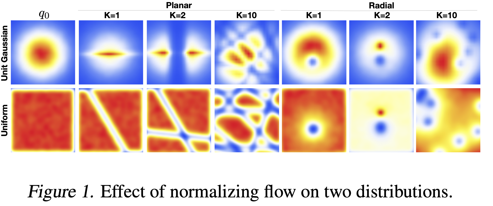
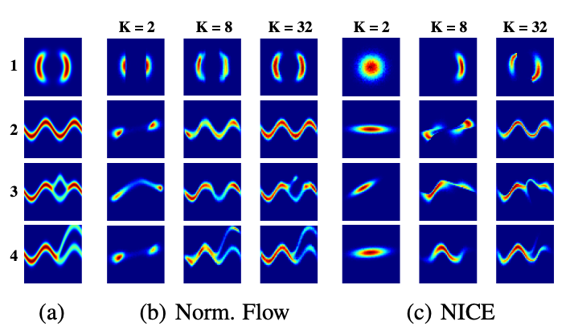

# MIT 6.S978 Reading 2: Normalizing Flows（归一化流）

## 概述

归一化流代表了生成建模领域的一个重要突破，它通过一系列可逆变换将简单分布转化为复杂分布，同时保持精确的似然计算能力。

### 🎯 核心思想

**从简单到复杂的变换链**：归一化流的核心理念是从一个容易采样和计算密度的简单分布（通常是标准高斯分布 $\mathcal{N}(0,I)$）出发，通过一系列可逆的、可微的变换，逐步构造出能够建模复杂数据分布的生成模型。

**数学表达**：设有 $K$ 个变换 $f_1, f_2, \ldots, f_K$，则：

$$
z_0 \xrightarrow{f_1} z_1 \xrightarrow{f_2} z_2 \xrightarrow{\ldots} z_K = x
$$

其中 $z_0 \sim p_0(z_0)$ 是简单的基础分布， $x$ 是最终的复杂数据分布。

### 💡 关键优势

**1. 精确的似然计算**

- 与VAE不同，归一化流不需要优化下界，而是直接优化数据的精确对数似然
- 这消除了变分下界与真实似然之间的gap，提供更准确的概率估计

**2. 精确的后验推断**

- 给定数据点 $x$，可以通过逆变换精确计算对应的隐变量 $z = f^{-1}(x)$
- 这在VAE中只能近似完成，在GAN中根本无法实现

**3. 高效的采样**

- 生成过程只需要一次前向传播，具有良好的并行性
- 相比之下，自回归模型需要序列化生成，效率较低

**4. 稳定的训练**

- 直接优化似然目标，避免了GAN中的对抗训练不稳定问题
- 提供清晰的梯度信号，便于训练深层网络

### 🔍 变量变换公式的深层含义

**为什么变量变换公式如此重要？**

变量变换公式是归一化流的数学基石：

$$
p_x(x) = p_z(z) \left| \det \frac{\partial f^{-1}}{\partial x} \right| = p_z(f^{-1}(x)) \left| \det \frac{\partial f}{\partial z} \right|^{-1}
$$

#### 📐 数学证明

**定理（变量变换公式）**：设 $z \sim p_z(z)$ 为 $\mathbb{R}^d$ 上的随机变量, $f: \mathbb{R}^d \to \mathbb{R}^d$ 为可逆的可微变换, $x = f(z)$，则 $x$ 的概率密度函数为：

$$
p_x(x) = p_z(f^{-1}(x)) \left| \det \frac{\partial f^{-1}}{\partial x} \right|
$$

**证明**：

**步骤1：从积分的角度理解概率守恒**

概率的基本要求是，任意可测集合 $A$ 的概率在变换前后保持不变：

$$
P(x \in A) = P(z \in f^{-1}(A))
$$

用密度函数表示：

$$
\int_A p_x(x) dx = \int_{f^{-1}(A)} p_z(z) dz
$$

**步骤2：应用换元积分公式**

考虑从 $z$ 空间到 $x$ 空间的变换。令 $z = f^{-1}(x)$，则在 $z$ 空间上的积分可以变换为 $x$ 空间上的积分。

根据多元微积分的换元公式：

$$
\int_{f^{-1}(A)} p_z(z) dz = \int_A p_z(f^{-1}(x)) \left| \det \frac{\partial f^{-1}}{\partial x} \right| dx
$$

其中 $\left| \det \frac{\partial f^{-1}}{\partial x} \right|$ 是变换的雅可比行列式的绝对值。

**步骤3：比较两个积分**

现在我们有：

$$
\int_A p_x(x) dx = \int_A p_z(f^{-1}(x)) \left| \det \frac{\partial f^{-1}}{\partial x} \right| dx
$$

由于这对任意可测集合 $A$ 都成立，被积函数必须相等：

$$
p_x(x) = p_z(f^{-1}(x)) \left| \det \frac{\partial f^{-1}}{\partial x} \right|
$$

**步骤4：利用逆函数定理转换形式**

由逆函数定理（Inverse Function Theorem），有：

$$
\frac{\partial f^{-1}}{\partial x} = \left( \frac{\partial f}{\partial z} \right)^{-1}
$$

其中 $z = f^{-1}(x)$。

利用行列式的性质 $\det(A^{-1}) = \frac{1}{\det(A)}$：

$$
\det \frac{\partial f^{-1}}{\partial x} = \det \left[ \left( \frac{\partial f}{\partial z} \right)^{-1} \right] = \frac{1}{\det \frac{\partial f}{\partial z}}
$$

因此：

$$
\left| \det \frac{\partial f^{-1}}{\partial x} \right| = \left| \det \frac{\partial f}{\partial z} \right|^{-1}
$$

**最终形式**：

$$
p_x(x) = p_z(f^{-1}(x)) \left| \det \frac{\partial f}{\partial z} \right|^{-1}
$$

其中 $z = f^{-1}(x)$，即：

$$
p_x(f(z)) = p_z(z) \left| \det \frac{\partial f}{\partial z} \right|^{-1}
$$

□（证明完毕）

#### 🎯 几何直观理解

**为什么需要雅可比行列式？**

考虑一个微小的"体积元素" $dz$ 在 $z$ 空间中，变换 $f$ 将其映射到 $x$ 空间中的体积元素 $dx$。

雅可比矩阵 $J_f = \frac{\partial f}{\partial z}$ 描述了这个局部线性近似：

$$
dx \approx J_f \cdot dz
$$

体积的变化由行列式给出：

$$
|dx| = |\det(J_f)| \cdot |dz|
$$

**概率守恒**：概率质量必须守恒，即：

$$
p_x(x) \cdot |dx| = p_z(z) \cdot |dz|
$$

代入体积关系：

$$
p_x(x) \cdot |\det(J_f)| \cdot |dz| = p_z(z) \cdot |dz|
$$

两边消去 $|dz|$：

$$
p_x(x) = \frac{p_z(z)}{|\det(J_f)|} = p_z(z) \left| \det \frac{\partial f}{\partial z} \right|^{-1}
$$

#### 💡 直观理解

- $p_z(f^{-1}(x))$：在隐空间中对应点的概率密度
- $\left| \det \frac{\partial f}{\partial z} \right|$：变换的"体积扩张因子"，衡量变换如何局部地拉伸或压缩空间

当变换 $f$ 局部拉伸空间时，雅可比行列式 $> 1$，概率密度相应减小；当变换压缩空间时，雅可比行列式 $< 1$，概率密度增大。这保证了概率的守恒性。

**物理类比**：
想象一块橡皮泥，拉伸它会使密度降低（体积变大但质量不变），压缩它会使密度增加。概率密度的变化遵循同样的规律。

**对数形式**：

$$
\log p_x(x) = \log p_z(f^{-1}(x)) + \log \left| \det \frac{\partial f}{\partial z} \right|
$$

对于 $K$ 个变换的组合：

$$
\log p_x(x) = \log p_z(z_0) + \sum_{k=1}^K \log \left| \det \frac{\partial f_k}{\partial z_{k-1}} \right|
$$

### 📊 与其他生成模型的对比

| 特性       | 归一化流    | VAE         | GAN         | 自回归模型  |
| ---------- | ----------- | ----------- | ----------- | ----------- |
| 似然计算   | ✅ 精确     | ❌ 下界     | ❌ 无法计算 | ✅ 精确     |
| 采样效率   | ✅ 并行     | ✅ 并行     | ✅ 并行     | ❌ 序列化   |
| 训练稳定性 | ✅ 稳定     | ✅ 稳定     | ❌ 不稳定   | ✅ 稳定     |
| 潜在空间   | ✅ 精确推断 | ❌ 近似推断 | ❌ 无编码器 | ❌ 未知边际 |

## 第一篇论文：Variational Inference with Normalizing Flows (Rezende & Mohamed, 2015)

**论文链接**: [https://arxiv.org/abs/1505.05770](https://arxiv.org/abs/1505.05770)
**发表于**: ICML 2015

### 1. 动机：为什么需要归一化流？

#### 🎯 变分推断的核心困境

变分推断通过优化证据下界（ELBO）来进行近似推断：

$$
\mathcal{L} = \mathbb{E}_{q_{\phi}(z|x)}[\log p(x|z)] - \text{KL}[q_{\phi}(z|x) \| p(z)]
$$

但这个方法的效果**严重依赖**于近似后验 $q_{\phi}(z|x)$ 与真实后验 $p(z|x)$ 的匹配程度。

#### 🔍 Mean-Field近似的致命缺陷

**独立性假设的局限**：
传统的mean-field近似假设 $q_{\phi}(z|x) = \prod_{i=1}^d q_{\phi}(z_i|x)$，这导致：

**1. 无法捕获变量间相关性**

- 真实后验中的变量可能高度相关
- 强制独立假设会丢失重要的依赖关系

**2. 系统性低估后验方差**

- 独立假设倾向于产生过于"尖锐"的后验
- 这导致对不确定性的低估，影响模型的校准性

**3. 多峰后验的灾难性近似**

- Mean-field只能产生单峰分布
- 对于多峰真实后验，只能近似其中一个峰，丢失其他模式

**4. 参数估计偏差**

- 后验近似的偏差会传播到参数估计
- 导致最大似然估计的系统性偏差

#### 💡 归一化流的解决方案

**核心洞察**：通过可逆变换序列构造灵活的后验族

$$
q_K(z_K) = q_0(z_0) \prod_{k=1}^K \left| \det \frac{\partial f_k}{\partial z_{k-1}} \right|^{-1}
$$

这样：

- 可以从简单分布（如对角高斯）开始
- 通过变换逐渐增加复杂性
- 最终逼近任意复杂的真实后验

### 2. 核心概念

#### 2.1 变量变换的数学基础

**单个变换的几何直观**：

考虑可逆变换 $f: \mathbb{R}^d \to \mathbb{R}^d$，它将随机变量 $z$ 映射到 $z' = f(z)$。

**为什么需要雅可比行列式？**

想象一个小的"体积元素" $dz$ 围绕点 $z$，变换 $f$ 将其映射到 $f(z)$ 周围的体积元素 $dz'$。雅可比矩阵 $J_f = \frac{\partial f}{\partial z}$ 描述了这个局部线性近似，而其行列式 $|\det J_f|$ 就是体积缩放因子。

**概率密度的变换规则**：

$$
p_{z'}(z') = p_z(z) \left| \det \frac{\partial f^{-1}}{\partial z'} \right| = p_z(f^{-1}(z')) \left| \det \frac{\partial f}{\partial z} \right|^{-1}
$$

**多个变换的复合**：

对于变换链 $z_0 \xrightarrow{f_1} z_1 \xrightarrow{f_2} \cdots \xrightarrow{f_K} z_K$：

$$
\log p_K(z_K) = \log p_0(z_0) - \sum_{k=1}^K \log \left| \det \frac{\partial f_k}{\partial z_{k-1}} \right|
$$

**链式法则的威力**：每个变换的对数行列式相加，使得复杂变换的概率计算变得可行。

#### 2.2 有限流（Finite Flows）



#### 🔷 Planar Flow（平面流）

**变换形式**：

$$
f(z) = z + u h(w^T z + b)
$$

其中：

- $u, w \in \mathbb{R}^d$ 是参数向量
- $b \in \mathbb{R}$ 是偏置
- $h(\cdot)$ 是平滑的激活函数（如 $\tanh$）

**几何直观**：
Planar flow在垂直于超平面 $w^T z + b = 0$ 的方向上进行收缩或扩张。当 $h'(w^T z + b) > 0$ 时，点被推离超平面；当 $h'(w^T z + b) < 0$ 时，点被拉向超平面。

**雅可比矩阵**：

$$
\frac{\partial f}{\partial z} = I + u \psi(z)^T
$$

其中 $\psi(z) = h'(w^T z + b) w$。

**高效的对数行列式计算**：

这是一个秩1更新的形式！利用矩阵行列式引理（Matrix Determinant Lemma）：

$$
\det(I + uv^T) = 1 + u^T v
$$

因此：

$$
\log \left| \det \frac{\partial f}{\partial z} \right| = \log |1 + u^T \psi(z)|
$$

**复杂度优势**：从 $O(d^3)$（直接计算行列式）降到 $O(d)$（向量内积）！

#### 🔷 Radial Flow（径向流）

**变换形式**：

$$
f(z) = z + \beta h(\alpha, r)(z - z_0)
$$

其中：

- $z_0 \in \mathbb{R}^d$ 是参考点
- $r = \|z - z_0\|$ 是到参考点的距离
- $h(\alpha, r) = \frac{1}{\alpha + r}$
- $\alpha \in \mathbb{R}, \beta \in \mathbb{R}$ 是参数

**几何直观**：
Radial flow围绕参考点 $z_0$ 进行径向的收缩或扩张。当 $\beta > 0$ 时，点远离参考点；当 $\beta < 0$ 时，点向参考点收缩。

**对数行列式**：

$$
\log \left| \det \frac{\partial f}{\partial z} \right| = (d-1) \log |1 + \beta h(\alpha, r)| + \log |1 + \beta h(\alpha, r) + \beta h'(\alpha, r) r|
$$

**为什么有两项？**

- 第一项: $(d-1)$ 个切向方向的缩放
- 第二项：径向方向的缩放

#### 📐 径向流雅可比行列式的详细推导

这个公式看起来很复杂，特别是 $(d-1)$ 因子的出现。让我们详细推导它的来源。

**步骤1：计算雅可比矩阵**

变换形式为 $f(z) = z + \beta h(\alpha, r)(z - z_0)$，我们需要计算 $\frac{\partial f_i}{\partial z_j}$。

首先注意到：

$$
f(z) = \underbrace{z}_{\text{恒等}} + \underbrace{\beta h(r)}_{\text{标量}} \cdot \underbrace{(z - z_0)}_{\text{向量}}
$$

使用乘积法则：

$$
\frac{\partial f_i}{\partial z_j} = \delta_{ij} + \beta \left[ \frac{\partial h(r)}{\partial z_j}(z_i - z_{0,i}) + h(r)\delta_{ij} \right]
$$

其中 $h(r) = \frac{1}{\alpha + r}$, $r = \|z - z_0\|$。

**步骤2：计算 $\frac{\partial r}{\partial z_j}$**

由于 $r = \sqrt{\sum_k (z_k - z_{0,k})^2}$：

$$
\frac{\partial r}{\partial z_j} = \frac{1}{2r}\cdot2(z_j-z_{0,j}) = \frac{z_j - z_{0,j}}{r}
$$

因此：

$$
h'(r) = -\frac{1}{(\alpha + r)^2}, \quad \frac{\partial h(r)}{\partial z_j} = h'(r) \frac{z_j - z_{0,j}}{r}
$$

**步骤3：雅可比矩阵的最终形式**

代入得到：

$$
\frac{\partial f_i}{\partial z_j} = (1 + \beta h(r))\delta_{ij} + \beta h'(r) \frac{(z_i - z_{0,i})(z_j - z_{0,j})}{r}
$$

这是一个**秩1更新**的形式！写成矩阵形式：

$$
J_f = (1 + \beta h) I + \beta h' \frac{(z - z_0)(z - z_0)^T}{r}
$$

定义 $v = \frac{z - z_0}{r}$（单位径向向量）, $a = 1 + \beta h$, $b = \beta h' r$，则：

$$
J_f = aI + bvv^T
$$

**步骤4：利用径向对称性计算行列式**

🎯 **关键洞察：径向对称性**

变换只依赖于距离 $r = \|z - z_0\|$，与具体方向无关。这意味着我们可以选择一个特殊的坐标系来简化计算。

**选择坐标系**：使得 $z - z_0$ 沿第一个坐标轴，即：

$$
v = \frac{z - z_0}{r} = \begin{bmatrix} 1 \\ 0 \\ \vdots \\ 0 \end{bmatrix}
$$

在这个坐标系下：

$$
vv^T = \begin{bmatrix}
1 & 0 & \cdots & 0 \\
0 & 0 & \cdots & 0 \\
\vdots & \vdots & \ddots & \vdots \\
0 & 0 & \cdots & 0
\end{bmatrix}
$$

因此雅可比矩阵变为：

$$
J_f = \begin{bmatrix}
a + b & 0 & 0 & \cdots & 0 \\
0 & a & 0 & \cdots & 0 \\
0 & 0 & a & \cdots & 0 \\
\vdots & \vdots & \vdots & \ddots & \vdots \\
0 & 0 & 0 & \cdots & a
\end{bmatrix}
$$

这是一个**对角矩阵**！行列式计算变得简单：

$$
\begin{aligned}
\det(J_f) &= (a + b) \cdot a^{d-1} = （1+\beta h)^{d-1}\left(1+\beta h+\beta h'r\right) \\ &= \left(1+\frac{\beta}{a+r}\right)^{d-1}\left[1+\frac{\alpha\beta}{(\alpha+r)^2}\right]\end{aligned}
$$

**步骤5：理解 $(d-1)$ 的几何意义**

🌟 **空间的维度分解**

在 $d$ 维空间中，任意点 $z$ 相对于参考点 $z_0$ 可以分解为：

- **径向分量**（1维）：沿 $v = \frac{z - z_0}{r}$ 方向
- **切向分量**($d-1$ 维)：垂直于 $v$ 的所有方向

**变换的不同效应**：

**径向方向**：

- 距离可能改变($r \to r'$)
- 受 $h(r)$ 及其导数 $h'(r)$ 影响
- 特征值: $a + b = 1 + \beta h + \beta h' r$

**切向方向**（共 $d-1$ 个）：

- 绕圆周"滑动"，但距离保持不变
- 只受 $h(r)$ 影响，**不受** $h'(r)$ 影响
- 特征值：都是 $a = 1 + \beta h$（相同！）

#### 💡 直观理解：重力场类比

想象太阳的引力场：

```
↑ 
     ←  ☀  →  所有行星都被"拉向"或"推离"太阳中心
        ↓
```

**径向对称的特点**：

- 引力方向：总是指向/远离太阳（径向）
- 引力大小：只依赖于距离 $r$
- 与行星在哪个方向无关（前后左右受力相同）

**Radial Flow类似**：

- 变换方向：总是沿径向
- 变换强度: $h(\alpha, r) = \frac{1}{\alpha + r}$（类似引力衰减）
- 所有等距点受相同影响

**为什么是 $(d-1)$？**

- 一条直线（径向）：1个自由度
- 垂直于这条直线的超平面（切向）: $d-1$ 个自由度
- 切向的 $d-1$ 个方向具有**相同的缩放因子**
- 因此行列式中出现 $(1 + \beta h)^{d-1}$

#### 2.3 无限小流（Infinitesimal Flows）：理论极限的力量

> 💡 **实用建议**：这部分主要是理论基础，从应用角度只需要理解核心结论，技术细节可以跳过。

#### 🎯 核心思想：从离散到连续

**有限流的局限**：

- 我们用有限个变换 $f_1, f_2, \ldots, f_K$
- 每个变换都是"离散"的一步
- $K$ 个变换能逼近多复杂的分布？

**无限小流的答案**：
当 $K \to \infty$（变换步数趋向无穷），同时每步变换趋向微小，我们得到**连续时间动力学**。这时归一化流变成了一个连续演化过程。

#### 🌊 Langevin流：通往任意分布的桥梁

**最重要的理论保证**：

对于适当设计的连续流（Langevin动力学），我们有：

$$
\boxed{\text{起始分布} \xrightarrow{t \to \infty} \text{目标分布（真实后验）}}
$$

**直观理解**：
想象一个粒子在能量地形上运动：

- 能量低的地方对应高概率区域
- 粒子会逐渐"滚落"到这些区域
- 经过足够长时间，粒子分布会收敛到目标分布

**实际意义**：

✅ **理论上**：归一化流可以逼近**任意复杂的分布**（只要流够长）

✅ **实践中**：有限步的流（如K=10-40）已经能很好地工作

❌ **不需要**：真的运行无穷步——这只是理论保证

#### ⚡ Hamiltonian流：另一种视角

**核心性质**：保持"体积"（相空间体积），即雅可比行列式恒为1。

**与MCMC的联系**：

- Hamiltonian Monte Carlo (HMC) 也基于类似的动力学
- 这建立了归一化流与传统采样方法的理论桥梁
- 后续的Hamiltonian Variational Inference就利用了这个联系

#### 📚 对实践者的关键要点

**你需要记住的**：

1. **理论保证**：归一化流理论上可以逼近任意分布（通过无限长的流）
2. **有限即够用**：实践中10-40步变换就很有效
3. **为什么重要**：这个理论结果回答了"归一化流能力上限在哪里"的问题
4. **后续影响**：这个思想启发了后来的Neural ODE、连续归一化流等工作

**你不需要纠结的**：

- Fokker-Planck方程的具体形式
- Langevin SDE的技术细节
- 哈密顿动力学的数学推导

**类比理解**：
就像你知道"神经网络可以逼近任意连续函数"（万能逼近定理），但不需要知道证明细节。无限小流的理论告诉我们"归一化流可以建模任意分布"，这是一个重要的理论保证，但具体怎么证明的对使用者不重要。

### 3. 与变分推断的结合

#### 🎯 从VAE到Flow-ELBO的完整推导

这里我们详细推导如何将归一化流整合到变分推断框架中，特别解释为什么最终公式中出现了联合概率而不是条件概率。

#### 📐 步骤1：标准VAE的ELBO

**原始ELBO**：

$$
\mathcal{L} = \mathbb{E}_{q_{\phi}(z|x)}[\log p(x|z)] - \text{KL}[q_{\phi}(z|x) \| p(z)]
$$

这包含两部分：

- **重构项**: $\mathbb{E}_{q(z|x)}[\log p(x|z)]$
- **KL正则项**: $\text{KL}[q(z|x) \| p(z)]$

#### 📐 步骤2：引入归一化流

设我们用归一化流来参数化后验：

$$
z_0 \sim q_0(z_0|x) \quad \xrightarrow{f_1} \quad z_1 \quad \xrightarrow{f_2} \quad \cdots \quad \xrightarrow{f_K} \quad z_K
$$

这样，最终的后验分布是 $q_K(z_K|x)$，它通过变换从简单的 $q_0(z_0|x)$ 得到。

**重写ELBO**：

$$
\mathcal{L} = \mathbb{E}_{q_K(z_K|x)}[\log p(x|z_K)] - \text{KL}[q_K(z_K|x) \| p(z_K)]
$$

#### 📐 步骤3：展开KL散度

$$
\begin{aligned}
\text{KL}[q_K(z_K|x) \| p(z_K)] &= \mathbb{E}_{q_K(z_K|x)}[\log q_K(z_K|x)] - \mathbb{E}_{q_K(z_K|x)}[\log p(z_K)]
\end{aligned}
$$

代入ELBO：

$$
\begin{aligned}
\mathcal{L} &= \mathbb{E}_{q_K}[\log p(x|z_K)] - \mathbb{E}_{q_K}[\log q_K(z_K|x)] + \mathbb{E}_{q_K}[\log p(z_K)] \\
&= \mathbb{E}_{q_K}[\log p(x|z_K) + \log p(z_K) - \log q_K(z_K|x)]
\end{aligned}
$$

#### 📐 步骤4：关键变换 - 合并为联合概率

🎯 **核心洞察**：利用概率的乘法规则

$$
\log p(x|z_K) + \log p(z_K) = \log p(x, z_K)
$$

因此：

$$
\boxed{\mathcal{L} = \mathbb{E}_{q_K(z_K|x)}[\log p(x, z_K) - \log q_K(z_K|x)]}
$$

**💡 重要说明**：重构项并没有消失！它隐藏在联合概率中：

$$
\log p(x, z_K) = \underbrace{\log p(x|z_K)}_{\text{重构项}} + \underbrace{\log p(z_K)}_{\text{先验项}}
$$

#### 📐 步骤5：转换到基础分布 $q_0$

利用"无意识统计学家定理"（LOTUS），我们可以将期望从 $q_K$ 转换到 $q_0$：

$$
\mathbb{E}_{q_K(z_K|x)}[h(z_K)] = \mathbb{E}_{q_0(z_0|x)}[h(f_K \circ \cdots \circ f_1(z_0))]
$$

因此：

$$
\mathcal{L} = \mathbb{E}_{q_0(z_0|x)}[\log p(x, z_K) - \log q_K(z_K|x)]
$$

其中 $z_K = f_K \circ \cdots \circ f_1(z_0)$。

#### 📐 步骤6：用变量变换公式表达 $q_K$

根据归一化流的变量变换公式：

$$
q_K(z_K|x) = q_0(z_0|x) \prod_{k=1}^K \left| \det \frac{\partial f_k}{\partial z_{k-1}} \right|^{-1}
$$

取对数：

$$
\log q_K(z_K|x) = \log q_0(z_0|x) - \sum_{k=1}^K \log \left| \det \frac{\partial f_k}{\partial z_{k-1}} \right|
$$

#### 📐 步骤7：最终的Flow-ELBO

代入步骤5的结果：

$$
\begin{aligned}
\mathcal{L} &= \mathbb{E}_{q_0(z_0|x)}\left[\log p(x, z_K) - \log q_0(z_0|x) + \sum_{k=1}^K \log \left| \det \frac{\partial f_k}{\partial z_{k-1}} \right|\right]
\end{aligned}
$$

**这就是最终的Flow-ELBO！**

#### 🎯 理解三项的来源

让我们回顾这三项各自的来源：

**第一项** $\log p(x, z_K)$：

- 来自重构项 $\log p(x|z_K)$ 和先验项 $\log p(z_K)$ 的合并
- **包含了重构误差**，没有消失

**第二项** $-\log q_0(z_0|x)$：

- 来自KL散度展开的后验项
- 基础分布的负对数似然

**第三项** $+\sum \log|\det|$：

- 来自变量变换公式
- 流变换的"体积校正"项

#### 🔑 关键要点总结

1. **重构项一直存在**：只是被合并进了 $\log p(x, z_K)$ 中
2. **KL散度被拆解**：

   - 原本: $\text{KL}[q_K \| p] = \mathbb{E}[\log q_K - \log p]$
   - 现在：分散到三项中的第二项和第三项
3. **变量变换的体现**：第三项的对数行列式和正是流变换的核心
4. **期望的基础分布**：虽然最终优化的是 $q_K$，但期望在 $q_0$ 下计算，这简化了采样过程

#### $p(z_K)$的两种形式

该论文的设定中，训练/推断时使用的 $p(z_K)$是不同的。
**训练/推断时的流程**:

$$
x \xrightarrow{\text{Encoder}}\mu(x),\sigma(x)\xrightarrow{\text{采样}}z_0\sim\mathcal{N}(\mu(x),\sigma^2(x))\xrightarrow{\text{flow变换}}z_K\xrightarrow{\text{Decoder}}\hat{x}
$$

**生成时的流程**: 从 $z_K$出发

- 先验: $p(x_K)=\mathcal{N}(0, I)$
- 似然: $p(x|z_K)$使用decoder

这里就导致，训练时使用的后验 $q_K(z_K|x)$与生成时使用的是不一样的，如果两者分布差异大，生成质量会受影响。这就是为什么后来的工作（如第二篇Glow的paper）更多采用“流作为生成模型”的设定，先验在 $z_0$ 空间（而不是 $z_K$空间），生成时从 $z_0\sim\mathcal{N}(0, I)$出发，通过流变换得到 $z_K$.

#### 💡摊销推断（Amortized Inference）

**问题**：如何为每个数据点 $x$ 计算流的参数？

**解决方案**：使用推断网络（编码器） $\text{Enc}_{\phi}(x)$ 输出：

- 初始分布参数： $\mu_0(x), \sigma_0(x)$
- 流变换参数： $\{u_k(x), w_k(x), b_k(x)\}_{k=1}^K$

**摊销的优势**：

- 避免为每个数据点单独优化变分参数
- 训练时和测试时使用相同的推断过程
- 参数在数据集上共享，提高泛化能力

### 4. 实验结果分析

#### 🎨 2D合成数据的直观理解

论文测试了四种具有挑战性的2D分布：

**U1: 环形分布**

$$
U_1(z) = \frac{1}{2}(\|z\| - 2)^2
$$

**U2: 波形分布**

$$
U_2(z) = \frac{1}{2}(z_2 - w_1(z))^2 + \frac{1}{2}(z_1 - 2)^2
$$

其中 $w_1(z) = \sin(\frac{2\pi z_1}{4})$



**关键观察**：

- K=2（两个变换）已能捕获基本形状
- K=8时近似质量显著提升
- K=32时已接近真实分布

**Planar vs NICE对比**：

- Planar flow用更少参数达到相似效果
- NICE需要额外的混合机制（随机置换/正交变换）

#### 📊 MNIST和CIFAR-10定量结果

**MNIST结果**（bits/dim）：

| 模型             | Test NLL |
| ---------------- | -------- |
| DLGM (对角)      | ≈ 88    |
| DLGM + NF (K=10) | ≈ 86    |
| DLGM + NF (K=40) | ≈ 85    |

**CIFAR-10结果**：由于维度更高，改进更加显著。

**为什么归一化流有效？**

1. **更灵活的后验**：能建模变量间复杂依赖
2. **更好的隐表示**：避免后验崩塌问题
3. **更准确的梯度**：减少变分近似偏差

### 5. 关键贡献总结

#### 🏗️ 理论贡献

**1. 统一框架**：建立了归一化流与变分推断的理论桥梁，提供了：

- 严格的数学基础
- 清晰的优化目标
- 可扩展的算法框架

**2. 线性时间变换**：设计了计算复杂度为 $O(d)$ 的变换类型：

- Planar flow：适合建模平面几何变换
- Radial flow：适合建模径向对称变换
- 突破了 $O(d^3)$ 的计算瓶颈

**3. 有限与无限流的统一**：连接了离散变换与连续动力学：

- 建立了与MCMC方法的理论联系
- 为后续的Neural ODE等工作奠定基础
- 提供了渐近收敛的理论保证

#### 💻 实践贡献

**1. 可扩展算法**：复杂度 $O(LN^2) + O(Kd)$，在实际应用中可行
**2. 改进效果**：在多个数据集上验证了方法的有效性
**3. 开源影响**：为后续大量工作提供了基础框架

## 第二篇论文：Glow (Kingma & Dhariwal, 2018)

**论文链接**: [https://arxiv.org/abs/1807.03039](https://arxiv.org/abs/1807.03039)
**发表于**: NeurIPS 2018
**项目主页**: [https://github.com/openai/glow](https://github.com/openai/glow)

### 1. 动机：从数学玩具到实用生成模型

#### 🎯 第一篇论文留下的遗憾

回顾Rezende & Mohamed (2015)，我们学到了归一化流的核心思想：

**理论上很美好**：

- ✅ 精确的似然计算
- ✅ 精确的后验推断
- ✅ 数学上优雅的变换（Planar/Radial）
- ✅ $O(d)$ 的高效计算

**但是实际效果...**：

- ❌ **生成的图像质量很差**
- ❌ **只能用于辅助VAE的后验近似**，无法单独作为生成模型
- ❌ **无法处理高分辨率图像**（如256×256人脸）
- ❌ **远远落后于GAN的视觉质量**

#### 🤔 为什么第一篇的方法生成不了好图像？

**问题的根源：变换太简单了**

Planar Flow 和 Radial Flow 虽然数学上优雅，但表达能力有限：

**Planar Flow的局限**：

$$
f(z) = z + u h(w^T z + b)
$$

- 每次变换只是沿一个方向($u$)进行"推拉"
- 就像用一把尺子在空间里画平行线
- 要建模复杂的图像分布？需要**成百上千个**这样的变换才行
- 计算量虽然是 $O(d)$，但要叠很多层，总开销还是大

**Radial Flow的局限**：

$$
f(z) = z + \beta h(\alpha, r)(z - z_0)
$$

- 围绕一个中心点进行径向的拉伸/压缩
- 就像一个人站在原地，能影响周围一圈的东西
- 同样需要很多个"中心点"才能覆盖复杂分布
- 而且这种径向对称的假设对图像来说太强了

**类比理解**：
想象你要用乐高积木搭一座复杂的城堡：

- **第一篇论文的方法** = 只有两种最简单的积木（1×1 和 2×1）
  - 虽然理论上"任何形状都能拼出来"
  - 但实际要用几万块才能拼成一个像样的城堡
  - 而且拼出来的城堡表面坑坑洼洼
- **Glow的方法** = 提供了更大、更复杂的积木块
  - 同样的城堡，用几百块就能拼好
  - 而且表面更光滑、细节更丰富

#### 💡 Glow的核心动机：让Flow真正能生成高质量图像

**设计目标**：

1. **提升变换的表达能力**

   - 不满足于简单的 Planar/Radial Flow
   - 需要能捕获图像数据的复杂结构
2. **生成高分辨率图像**

   - 目标：256×256 的高清人脸
   - 挑战：维度 $d = 256 \times 256 \times 3 \approx 200{,}000$
3. **达到GAN级别的视觉质量**

   - 证明"基于似然的模型也能生成漂亮图像"
   - 打破"Flow只能做辅助工具"的刻板印象

#### 🛠️ 从第一篇到第二篇：技术路线的转变

**第一篇的思路**：

```
简单的数学变换（Planar/Radial）
  ↓
堆很多层（K=40+）
  ↓  
希望能逼近复杂分布
```

**问题**：变换太简单 → 需要太多层 → 计算慢 + 效果差

**Glow的思路**：

```
更复杂的变换单元（仿射耦合层 + 1×1卷积）
  ↓
每层变换更"有效"
  ↓
较少的层数（K=32）就能达到好效果
```

**核心转变**：

| 维度               | 第一篇                | Glow                 |
| ------------------ | --------------------- | -------------------- |
| **变换类型** | Planar/Radial（简单） | 仿射耦合层（复杂）   |
| **每层作用** | 改变一个"方向"        | 改变"一半"的维度     |
| **通道交互** | 无                    | 1×1卷积学习最优混合 |
| **表达能力** | 有限                  | 强大                 |
| **实际效果** | 辅助VAE               | 独立生成高质量图像   |

#### 🎯 Glow要解决的具体问题

现在让我们看看Glow针对性地解决了哪些实际问题（这些问题在第一篇中没有被关注，因为目标不同）：

**问题1：如何高效地混合通道信息？**

- **第一篇**：Planar/Radial Flow 没有考虑通道之间的关系
- **Glow的解决**：引入可学习的1×1卷积，自动学习最优的通道混合模式

**问题2：如何处理高分辨率图像？**

- **第一篇**：直接在高维空间操作，计算吃不消
- **Glow的解决**：多尺度架构（squeeze + split），在不同分辨率上分别建模

**问题3：如何在小batch size下稳定训练？**

- **第一篇**：没有考虑这个问题（因为只是辅助VAE，训练相对简单）
- **Glow的解决**：ActNorm 替代 BatchNorm，适应高分辨率图像的小batch训练

**问题4：如何避免视觉伪影？**

- **第一篇**：不涉及（因为生成质量本身就不高），这实际上是前序工作RealNVP的问题
- **Glow的解决**：纯通道分割 + 零初始化，避免棋盘格伪影

#### 📊 直观对比：第一篇 vs Glow

**应用场景的转变**：

```
第一篇（2015）:
  目标：改进VAE的后验近似
  用途：辅助工具
  效果：理论贡献大，实用性有限
  
Glow（2018）:
  目标：独立的高质量生成模型
  用途：直接生成高分辨率图像
  效果：视觉质量达到GAN水平
```

**生成质量的飞跃**：

| 数据集             | 第一篇Flow（辅助VAE） | Glow               |
| ------------------ | --------------------- | ------------------ |
| MNIST 28×28       | 可用                  | 完美               |
| CIFAR-10 32×32    | 勉强可用              | 高质量             |
| CelebA 64×64      | 不可用                | 高质量             |
| CelebA-HQ 256×256 | 不可用                | **首次实现** |

#### 🎓 阅读笔记的脉络

现在我们可以理解这个Reading的完整逻辑：

**第一篇（Rezende 2015）**：

- 📚 **理论基础课**：什么是归一化流？为什么它有用？
- 🔧 **基础工具**：如何设计简单的可逆变换？
- 🎯 **初步应用**：改进VAE的后验近似

**第二篇（Glow 2018）**：

- 🚀 **工程升级**：如何让Flow真正能生成好图像？
- 🎨 **炼丹艺术**：什么样的变换设计更有效？
- 💪 **实力证明**：Flow也能达到GAN级别的视觉质量！

**关键洞察**：

- 第一篇告诉你"可逆变换 + 对数行列式"的**理论框架**
- 第二篇告诉你在这个框架下，如何设计**更强大的变换单元**来实际生成高质量图像
- 这不是"数学 vs 工程"的对立，而是"理论 → 实践"的自然进阶

### 2. 架构组件深入分析

#### 2.1 ActNorm层：数据适应的归一化

#### 🔍 为什么BatchNorm在此处失效？

**小batch size的困境**：

- 高分辨率图像(256×256)内存消耗巨大
- GPU内存限制迫使batch size = 1
- BatchNorm的批统计估计变得极不可靠

**BatchNorm的方差问题**：
BatchNorm的有效性依赖于 $\text{Var}[\hat{\mu}] = \frac{\sigma^2}{N}$，当 $N=1$ 时方差不减少。

#### 💡 ActNorm的解决方案

**变换形式**：

对于图像中每个位置 $(i,j)$ 的每个通道 $c$：

$$
y_{i,j,c} = s_c \cdot x_{i,j,c} + b_c = \frac{x_{i,j,c} - \mu_c}{\sigma_c}
$$

其中 $s_c, b_c$ 是通道 $c$ 的可学习参数（每个通道一对标量参数）。

**向量形式**（如果把所有通道看作向量）：

$$
y = s \odot x + b
$$

其中 $\odot$ 表示逐元素乘法（element-wise multiplication）。

**数据依赖初始化**：

$$
s_c^{(0)} = \frac{1}{\sigma_c^{(0)}}, \quad b_c^{(0)} = -\frac{\mu_c^{(0)}}{\sigma_c^{(0)}}
$$

其中 $\mu_c^{(0)}, \sigma_c^{(0)}$ 是第一个minibatch上通道 $c$ 的经验均值和标准差。

**初始化的效果**：
经过初始化后，每个通道的激活满足：

$$
y_{i,j,c}^{(0)} = \frac{x_{i,j,c} - \mu_c^{(0)}}{\sigma_c^{(0)}}
$$

即标准化到零均值、单位方差。之后 $s_c, b_c$ 作为可训练参数继续优化。

**关键洞察**：

- 初始化后，参数变为可训练的，与batch统计无关
- 保证了初始激活的良好数值特性
- 避免了小batch size的不稳定性

**对数行列式**：

$$
\log \left| \det \frac{\partial y}{\partial x} \right| = h \cdot w \cdot \sum_{c=1}^C \log |s_c|
$$

**复杂度**：只需 $O(C)$ 操作，非常高效。

#### 2.2 可逆1×1卷积：学习最优置换

#### 🎯 从固定到可学习

**1×1卷积的数学表示**：

$$
y_{i,j} = W x_{i,j}
$$

其中 $W \in \mathbb{R}^{C \times C}$ 是可学习的权重矩阵。

**为什么1×1卷积是置换的泛化？**

- 当 $W$ 是置换矩阵时，退化为通道置换
- 当 $W$ 是正交矩阵时，保持范数的同时混合通道
- 一般情况下，学习任意线性混合

#### 🧮 对数行列式的计算挑战

**朴素计算**：

$$
\log \left| \det \frac{\partial y}{\partial x} \right| = h \cdot w \cdot \log |\det(W)|
$$

**计算复杂度**：直接计算 $\det(W)$ 需要 $O(C^3)$ 操作。

**何时可接受？**
对于典型CNN, $C \ll h \cdot w$，所以 $O(C^3)$ 通常可以接受。例如：

- ResNet: $C \leq 2048$, $C^3 \approx 8.6 \times 10^9$
- 一次矩阵乘法: $h \times w \times C^2$，对256*256图像和 $C=2048$ 通道，约为 $2.7\times 10^{11}$

#### ⚡ LU分解优化

**LU参数化**：

$$
W = P L (U + \text{diag}(s))
$$

其中：

- $P$：固定的置换矩阵（训练时不变）
- $L$：下三角矩阵，对角元为1
- $U$：上三角矩阵，对角元为0
- $s$：对角元素向量

**行列式的快速计算**：

$$
\log |\det(W)| = \log |\det(P)| + \log |\det(L)| + \log |\det(U + \text{diag}(s))| = 0 + 0 + \sum_{i=1}^C \log |s_i|
$$

**复杂度降低**：从 $O(C^3)$ 到 $O(C)$！

**初始化策略**：

1. 采样随机旋转矩阵 $W_{\text{init}}$
2. 计算其LU分解得到 $P$（固定）
3. 初始化 $L, U, s$ 使得 $W_{\text{init}} = PL(U + \text{diag}(s))$

#### 2.3 仿射耦合层：聪明的"半数保持"策略

#### 🎯 核心矛盾：既要复杂又要可逆

在讲仿射耦合层之前，我们先理解Glow（以及RealNVP）面临的核心挑战：

**理想中的Flow层**应该满足：

1. **复杂变换**：能学习复杂的非线性变换，提升模型表达能力
2. **可逆性**: $y = f(x)$ 能轻松算出 $x = f^{-1}(y)$
3. **高效计算**：雅可比行列式 $\det(\frac{\partial y}{\partial x})$ 能快速计算

**问题在哪？**
如果让 $y = \text{神经网络}(x)$，这通常是不可逆的（就像把鸡蛋打成煎饼，很难把煎饼变回鸡蛋）。而且即使可逆，算雅可比行列式也会让GPU烧掉。

#### 💡 仿射耦合层的精妙设计

RealNVP提出的解决方案非常巧妙：**把输入对半分，只变换一半！**

**Step 1: 对半分割**

把输入 $z$ 沿通道维度分成两半：

$$
z_a, z_b = \text{split}(z)
$$

例如，如果 $z$ 有512个通道：

- $z_a$：前256个通道
- $z_b$：后256个通道

**Step 2: 用一半去"指导"另一半的变换**

🔑 **关键设计**: $z_b$ 保持不变，但用它来决定如何变换 $z_a$：

$$
(\log s, t) = \text{NN}(z_b)
$$

这里的神经网络 $\text{NN}$ 输入是 $z_b$，输出两个量：

- $s$（scale，缩放因子）：决定 $z_a$ 被拉伸或压缩多少
- $t$（translation，平移量）：决定 $z_a$ 被移动多少

**Step 3: 仿射变换**

对 $z_a$ 的每个位置 $i$ 执行：

$$
y_a^{(i)} = s^{(i)} \cdot z_a^{(i)} + t^{(i)}
$$

而 $z_b$ 保持不变：

$$
y_b = z_b
$$

**完整的输出**：

$$
y = \text{concat}(y_a, y_b)
$$

#### 🎭 为什么这个设计如此巧妙？

**1. 复杂性 ✅**

- 神经网络 $\text{NN}$ 可以是任意复杂的（ResNet、U-Net等）
- 它学习如何根据 $z_b$ 自适应地调整 $z_a$
- 每个位置的 $s^{(i)}, t^{(i)}$ 都可以不同，提供丰富的变换能力

**2. 可逆性 ✅**

**前向**（生成时）: $z \to y$

$$
\begin{cases}
y_a = s(z_b) \odot z_a + t(z_b) \\
y_b = z_b
\end{cases}
$$

**逆向**（推断时）: $y \to z$

$$
\begin{cases}
z_b = y_b & \text{（直接复制！）} \\
z_a = (y_a - t(z_b=y_b)) \oslash s(z_b=y_b) & \text{（简单的逆仿射变换）}
\end{cases}
$$

🌟 **关键洞察**：

- 因为 $z_b$ 保持不变，我们在逆向时可以先恢复 $z_b = y_b$
- 有了 $z_b$ 就能重新计算 $s, t$
- 有了 $s, t$ 就能简单地逆推出 $z_a$
- 整个过程不需要"解方程"或"迭代优化"！

**3. 高效的雅可比行列式 ✅**

雅可比矩阵长这样（分块结构）：

$$
\frac{\partial y}{\partial z} = \begin{bmatrix}
\text{diag}(s) & * \\
0 & I
\end{bmatrix}
$$

其中：

- 左上角: $\frac{\partial y_a}{\partial z_a} = \text{diag}(s)$（对角矩阵）
- 右下角: $\frac{\partial y_b}{\partial z_b} = I$（恒等矩阵）
- 左下角: $\frac{\partial y_b}{\partial z_a} = 0$（因为 $y_b$ 不依赖 $z_a$）

**行列式的快速计算**：

对于分块三角矩阵，行列式等于对角块行列式的乘积：

$$
\det\begin{bmatrix}
\text{diag}(s) & * \\
0 & I
\end{bmatrix} = \det(\text{diag}(s)) \cdot \det(I) = \prod_i s_i
$$

因此：

$$
\log \left| \det \frac{\partial y}{\partial z} \right| = \sum_i \log |s_i|
$$

**复杂度**：只需要 $O(d)$（线性时间），而不是 $O(d^3)$！

#### 🔄 直观理解：信息的"单向流动"

想象一个团队合作的场景：

```
第一组（z_b）: "参考组"
  ↓  提供信息（不变）
  ↓
第二组（z_a）: "执行组"
  根据第一组的信息调整自己的工作
```

- **前向传播**：第一组保持不变，第二组根据第一组的信息做调整
- **逆向传播**：因为第一组没变，我们可以直接恢复它，然后用恢复的信息逆推第二组的原始状态

#### 💡 Glow相对于RealNVP的三大改进

现在我们理解了仿射耦合层的基本原理，来看Glow是如何在此基础上进一步优化的。

**改进1: 纯通道分割（避免棋盘格伪影）**

**RealNVP的问题**：
RealNVP在图像上使用"空间棋盘格分割"：

```
原始图像:          分割方式:
□ □ □ □          A B A B
□ □ □ □    -->   B A B A  
□ □ □ □          A B A B
□ □ □ □          B A B A
```

- A区域的像素保持不变
- B区域的像素被变换

**问题**：这种空间分割会在生成的图像中产生可见的"棋盘格伪影"，破坏视觉质量。

**Glow的解决方案**：
只沿通道维度分割，不做空间分割：

```
输入: [H, W, C]
  ↓
分割: z_a = [H, W, C/2]  (前一半通道)
      z_b = [H, W, C/2]  (后一半通道)
```

- 每个像素位置的所有通道都参与变换
- 避免了空间上的不连续性
- 生成的图像更加平滑自然

**改进2: 零初始化技巧（从恒等变换开始训练）**

**动机**：深层网络训练初期容易梯度爆炸或产生病态变换。

**Glow的策略**：
将神经网络 $\text{NN}(z_b)$ 的最后一层卷积权重和偏置初始化为零：

```python
# 最后一层卷积的权重和偏置初始化为零
conv_final.weight.data.zero_()
conv_final.bias.data.zero_()
```

**初始状态的效果**：

$$
\begin{aligned}
(\log s, t) &= \text{NN}(z_b) = (0, 0) \\
\Rightarrow s &= \exp(0) = 1, \quad t = 0 \\
\Rightarrow y_a &= 1 \cdot z_a + 0 = z_a
\end{aligned}
$$

即每个耦合层在训练开始时执行**恒等变换** $y = z$！

**为什么这样好？**

1. **稳定的起点**：网络从"什么都不做"开始，逐渐学习有意义的变换
2. **避免梯度爆炸**：初始时雅可比行列式 = 1，梯度不会爆炸
3. **更深的网络**：这个技巧使得训练40+层的深层Flow成为可能
4. **更快收敛**：从合理的初始点开始，优化路径更短

**类比理解**：
就像学开车，从"原地不动"开始（恒等变换），逐渐学会"向前走"（简单变换），最后能"自如驾驶"（复杂变换）。而不是一上来就"乱开"（随机初始化可能导致的混乱）。

**改进3: 精心设计的神经网络架构**

RealNVP使用了较简单的ResNet结构，Glow进一步优化了 $\text{NN}(z_b)$ 的设计：

**架构细节**：

```
输入: z_b [H, W, C/2]
  ↓
3×3 Conv → ReLU → [H, W, 512]
  ↓
1×1 Conv → ReLU → [H, W, 512]
  ↓
1×1 Conv → ReLU → [H, W, 512]
  ↓
3×3 Conv (零初始化) → [H, W, C] (输出 log s 和 t)
```

**设计要点**：

1. **首尾用3×3卷积**：捕获局部空间模式
2. **中间用1×1卷积**：高效的通道混合，降低计算量
3. **大通道数（512）**：提供足够的表达能力
4. **最后一层零初始化**：如前所述的稳定性技巧

**平衡点**：

- 足够复杂：能学习丰富的 $s, t$ 模式
- 足够高效：不会成为计算瓶颈
- 足够稳定：配合零初始化，训练平滑

### 3. 多尺度架构设计

#### 🏗️ 层次化处理策略

**基本思想**：模仿图像的天然多尺度结构，在不同分辨率上捕获不同层次的特征。

**架构流程**：

```
Input (H×W×C)
    ↓
Level 1: K steps @ (H×W×C)
    ↓ squeeze + split
Level 2: K steps @ (H/2×W/2×4C)
    ↓ squeeze + split  
Level 3: K steps @ (H/4×W/4×16C)
    ↓
...
```

**Squeeze操作**：
将 $H \times W \times C$ 重排为 $\frac{H}{2} \times \frac{W}{2} \times 4C$

- 空间分辨率减半
- 通道数增加4倍
- 总信息量保持不变

**Split操作**：
在每个层级（除最后一个），将一半通道分离出来用简单高斯先验建模

- 减少深层网络的计算负担
- 保持建模能力
- 允许早期层捕获细节，深层捕获全局结构

#### 🎯 深度与宽度的平衡

**每个层级的流步数 $K$**：

- 浅层级（高分辨率）：捕获纹理、细节
- 深层级（低分辨率）：捕获全局结构、语义

**实验中的典型配置**：

- CIFAR-10: $L=3, K=32$
- CelebA-HQ 256×256: $L=6, K=32$

### 4. 实验结果深度分析

#### 4.1 消融实验：每个组件的贡献

#### 🔬 1×1卷积 vs 固定置换

**实验设置**：在CIFAR-10上比较三种置换方式

- 通道翻转（RealNVP默认）
- 固定随机置换
- 可学习1×1卷积

**结果分析**：

| 置换方式 | 加性耦合       | 仿射耦合       |
| -------- | -------------- | -------------- |
| 通道翻转 | 3.70           | 3.65           |
| 随机置换 | 3.68           | 3.63           |
| 1×1卷积 | **3.65** | **3.35** |

**关键观察**：

1. 1×1卷积在两种耦合下都表现最佳
2. 仿射耦合优于加性耦合
3. 收敛速度：1×1卷积 > 随机置换 > 通道翻转

**为什么1×1卷积更有效？**

- **自适应性**：学习数据特定的最优混合模式
- **全局优化**：与其他参数联合优化
- **表达能力**：线性变换比离散置换更灵活

#### 📊 定量性能比较

**与RealNVP的全面对比**：

| Dataset         | Glow | RealNVP | 改进  |
| --------------- | ---- | ------- | ----- |
| CIFAR-10        | 3.35 | 3.49    | 4.0%  |
| ImageNet 32×32 | 4.09 | 4.28    | 4.4%  |
| ImageNet 64×64 | 3.81 | 3.98    | 4.3%  |
| LSUN bedroom    | 2.38 | 2.72    | 12.5% |
| LSUN tower      | 2.46 | 2.81    | 12.5% |
| LSUN church     | 2.67 | 3.08    | 13.3% |

**性能提升的原因**：

1. **更好的通道混合**：1×1卷积
2. **稳定的训练**：ActNorm
3. **减少伪影**：纯通道分割
4. **深层架构**：更多变换层数

#### 4.2 定性结果：视觉质量的突破

#### 🖼️ 高分辨率生成（256×256）

**历史意义**：Glow是第一个能生成高质量256×256图像的基于似然的模型。

**样本质量评估**：

- **纹理细节**：皮肤、头发纹理清晰
- **全局一致性**：面部结构协调
- **多样性**：避免了模式崩塌

#### 🌡️ 温度采样的精妙控制

温度采样是从训练好的Flow模型中生成样本时的一个"调节旋钮"，它允许我们在**样本质量**和**样本多样性**之间做权衡。

#### 🎯 温度采样是什么？

**标准生成流程回顾**：

在Glow中，生成图像的标准流程是：

```
1. 从先验采样：z ~ N(0, I)  (标准高斯)
2. 通过Flow逆变换：x = f^{-1}(z)
3. 得到生成的图像 x
```

**温度采样的修改**：

不从标准高斯 $\mathcal{N}(0, I)$ 采样，而是从**温度缩放的高斯** $\mathcal{N}(0, T^2 I)$ 采样：

```python
# 标准采样 (T=1.0)
z = torch.randn(d)  # z ~ N(0, I)
x = flow.inverse(z)

# 温度采样 (T=0.7)  
z = T * torch.randn(d)  # z ~ N(0, T²I)
x = flow.inverse(z)
```

#### 📐 数学定义与直观理解

**原始分布** $p(x)$：

这是Flow模型学到的数据分布，即训练数据的分布：

$$
p(x) = p_z(f(x)) \left| \det \frac{\partial f}{\partial x} \right|
$$

其中 $p_z(z) = \mathcal{N}(z; 0, I)$ 是标准高斯先验。

**温度调整后的分布** $p_T(x)$：

$$
p_T(x) = \frac{p(x)^{1/T}}{\int p(x')^{1/T} dx'} = \frac{p(x)^{1/T}}{Z_T}
$$

其中：

- $T > 0$ 是温度参数
- $Z_T = \int p(x')^{1/T} dx'$ 是归一化常数（确保 $\int p_T(x) dx = 1$）
- $p(x)^{1/T}$ 是将原始密度"提升到 $1/T$ 次方"

**等价的隐空间视角**：

在隐空间 $z$ 中，温度采样等价于：

$$
p_T(z) = \mathcal{N}(z; 0, T^2 I)
$$

即方差从1缩放到 $T^2$。

#### 🔥 不同温度的效果详解

**1. 高温 $T > 1$（更分散）**

$$
p_T(x) = \frac{p(x)^{1/T}}{Z_T} \quad \text{当 } T > 1
$$

- **概率密度变化**: $p(x)^{1/T}$ 使得高概率区域和低概率区域的差距**变小**

  例如: $p(x_1) = 0.8, p(x_2) = 0.2$

  - 当 $T=2$: $p_2(x_1) \propto 0.8^{0.5} = 0.894$, $p_2(x_2) \propto 0.2^{0.5} = 0.447$
  - 差距从4倍缩小到2倍
- **采样效果**：

  - 样本更加**多样化**（探索更多低概率区域）
  - 但可能包含更多**质量较差**的样本（训练数据中罕见的模式）
- **隐空间理解**：从 $\mathcal{N}(0, T^2I)$ 采样，标准差 $= T > 1$，采样点分布更分散

**2. 标准温度 $T = 1$（原始分布）**

$$
p_1(x) = p(x)
$$

- 就是模型学到的原始分布
- 样本的质量和多样性遵循训练数据
- 基线设置

**3. 低温 $T < 1$（更集中）**

$$
p_T(x) = \frac{p(x)^{1/T}}{Z_T} \quad \text{当 } 0 < T < 1
$$

- **概率密度变化**: $p(x)^{1/T}$（其中 $1/T > 1$）使得高概率区域和低概率区域的差距**变大**

  例如: $p(x_1) = 0.8, p(x_2) = 0.2$

  - 当 $T=0.5$: $p_{0.5}(x_1) \propto 0.8^2 = 0.64$, $p_{0.5}(x_2) \propto 0.2^2 = 0.04$
  - 差距从4倍扩大到16倍
- **采样效果**：

  - 样本更加**集中在高概率区域**（训练数据的"典型"模式）
  - **质量更高**（更像真实数据）
  - 但**多样性降低**（缺少罕见但合理的变化）
- **隐空间理解**：从 $\mathcal{N}(0, T^2I)$ 采样，标准差 $= T < 1$，采样点更集中在原点附近

**4. 极端情况 $T \to 0$（确定性）**

$$
\lim_{T \to 0} p_T(x) = \delta(x - x^*)
$$

其中 $x^* = \arg\max_x p(x)$ 是模式（概率最大的点）。

- 只采样概率最高的那个点
- 完全没有多样性
- 实际中不使用这么极端的值

#### 💡 为什么 $T=0.7$ 是论文的推荐值？

**问题的根源：模型过估计了熵**

训练Flow模型时，我们优化的是**负对数似然**（NLL）：

$$
\mathcal{L} = -\mathbb{E}_{x \sim p_{\text{data}}}[\log p_{\theta}(x)]
$$

但实际中，模型可能**过度平滑**，即：

- 学到的分布 $p_{\theta}(x)$ 比真实数据分布 $p_{\text{data}}(x)$ 更"分散"
- 覆盖了一些训练集中没有的、质量较低的样本
- 这会导致从 $p_{\theta}$ 采样时产生不够真实的样本

**温度采样的修正**：

通过降低温度($T < 1$)，我们：

1. **收缩分布**：让模型更专注于高概率区域
2. **提升质量**：过滤掉那些被过度估计概率的低质量样本
3. **经验最佳值**: $T \in [0.6, 0.8]$，论文发现 $T=0.7$ 是视觉质量和多样性的最佳平衡点

**类比理解**：

想象模型是一个"记忆力不完美"的画家：

- 它记住了大部分真实人脸的样子
- 但也"脑补"了一些从未见过的、有点怪异的脸
- 温度采样 = 告诉画家"请画得保守一点，不要太创新"
- $T=0.7$ = "适度保守，既保证质量，又不失一些创意"

#### 🔬 数学上的深层含义

**温度与统计物理的联系**：

温度采样这个名字来自统计物理学中的**玻尔兹曼分布**：

$$
p_T(x) \propto \exp\left(-\frac{E(x)}{k_B T}\right)
$$

其中 $E(x)$ 是能量, $T$ 是温度。

在生成模型中，我们类比地定义 $E(x) = -\log p(x)$，于是：

$$
p_T(x) \propto \exp\left(\frac{\log p(x)}{T}\right) = p(x)^{1/T}
$$

**熵与温度的关系**：

- 高温 → 高熵（更随机）
- 低温 → 低熵（更确定）
- 绝对零度($T=0$)→ 零熵（完全确定）

#### 📝 实现细节

```python
def sample_with_temperature(glow_model, batch_size, temperature=0.7):
    """
    从Glow模型中生成样本，使用温度采样
  
    Args:
        glow_model: 训练好的Glow模型
        batch_size: 生成样本数量
        temperature: 温度参数 (推荐 0.6-0.8)
  
    Returns:
        samples: 生成的图像 [batch_size, C, H, W]
    """
    # 1. 从温度缩放的高斯分布采样
    z = temperature * torch.randn(batch_size, latent_dim, H, W)
  
    # 2. 通过Flow的逆变换生成图像
    with torch.no_grad():
        samples = glow_model.inverse(z)
  
    # 3. 后处理（clip到有效范围等）
    samples = torch.clamp(samples, 0, 1)
  
    return samples
```

#### 🎯 关键要点总结

1. **温度 $T$ 是生成时的超参数**，不是训练时学习的参数
2. **$T < 1$**：提高质量，降低多样性（更保守）
3. **$T = 1$**：原始模型分布（标准）
4. **$T > 1$**：提高多样性，可能降低质量（更冒险）
5. **$T=0.7$**：Glow论文的经验推荐值，平衡质量与多样性
6. **调节原理**：通过改变隐空间先验的方差，间接控制生成样本的"极端程度"

#### 🎭 语义属性操作

**属性向量计算**：
对于属性A（如"微笑"），计算：

$$
v_A = \frac{1}{|S_+|}\sum_{x \in S_+} z_x - \frac{1}{|S_-|}\sum_{x \in S_-} z_x
$$

其中 $S_+, S_-$ 分别是具有和不具有属性A的图像集合。

**操作公式**：

$$
z' = z + \alpha v_A
$$

**实验结果**：

- 微笑：自然的表情变化
- 年龄：从年轻到年老的平滑过渡
- 性别：男性化/女性化特征的调节
- 头发颜色：金发↔棕发的连续变化

**线性可分性**：属性在潜在空间中近似线性可分，这表明Glow学到了有意义的表示结构。

### 5. 关键技术贡献

#### 🎯 技术创新总结

**1. 可学习的1×1卷积**

- **理论意义**：将置换泛化为线性变换
- **实践价值**：显著提升建模能力，成为后续工作标准组件
- **计算效率**：通过LU分解优化实现

**2. ActNorm归一化**

- **解决痛点**：小batch size下的训练稳定性
- **设计巧妙**：数据依赖初始化 + 参数化训练
- **广泛应用**：被多个后续工作采用

**3. 工程优化**

- **零初始化**：稳定深层网络训练
- **多尺度架构**：高效处理高分辨率数据
- **实现细节**：完整的开源代码促进了领域发展

#### 📈 对领域的影响

**1. 打破偏见**：证明了基于似然的模型可以达到GAN级别的视觉质量
**2. 技术传承**：多项技术被后续工作广泛采用
**3. 应用拓展**：为基于流的图像编辑、数据增强等应用铺平道路
**4. 理论启发**：为连续归一化流等后续发展提供思路

