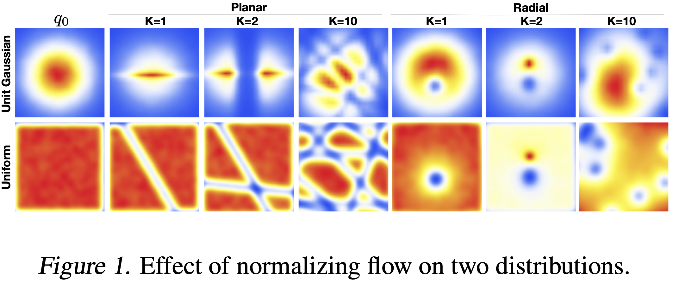
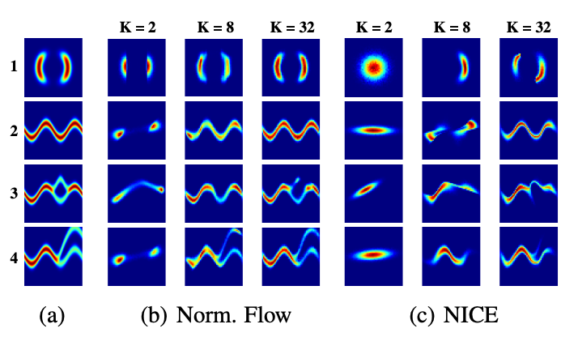

# MIT 6.S978 Reading 2.1 [Variational Inference with Normalizing Flows (Rezende & Mohamed, 2015)](https://arxiv.org/abs/1505.05770)

## 目录

- [1 动机：为什么需要归一化流？](#1-动机为什么需要归一化流)
  - [1.1 变分推断的核心困境](#11-变分推断的核心困境)
  - [1.2 Mean-Field近似的致命缺陷](#12-mean-field近似的致命缺陷)
  - [1.3 归一化流的解决方案](#13-归一化流的解决方案)
- [2 核心概念](#2-核心概念)
  - [2.1 变量变换的数学基础](#21-变量变换的数学基础)
    - [2.1.1 数学证明](#211-数学证明)
    - [2.1.2 几何直观理解](#212-几何直观理解)
  - [2.2 有限流（Finite Flows）](#22-有限流finite-flows)
    - [2.2.1 Planar Flow（平面流）](#221-planar-flow平面流)
    - [2.2.2 Radial Flow（径向流）](#222-radial-flow径向流)
    - [2.2.3 径向流雅可比行列式的详细推导](#223-径向流雅可比行列式的详细推导)
    - [2.2.4 直观理解：重力场类比](#224-直观理解重力场类比)
  - [2.3 无限小流（Infinitesimal Flows）：理论极限的力量](#23-无限小流infinitesimal-flows理论极限的力量)
    - [2.3.1 核心思想：从离散到连续](#231-核心思想从离散到连续)
    - [2.3.2 Langevin流：通往任意分布的桥梁](#232-langevin流通往任意分布的桥梁)
    - [2.3.3 Hamiltonian流：另一种视角](#233-hamiltonian流另一种视角)
    - [2.3.4 对实践者的关键要点](#234-对实践者的关键要点)
- [3 与变分推断的结合](#3-与变分推断的结合)
  - [3.1 从VAE到Flow-ELBO的完整推导](#31-从vae到flow-elbo的完整推导)
    - [3.1.1 步骤1：标准VAE的ELBO](#311-步骤1标准vae的elbo)
    - [3.1.2 步骤2：引入归一化流](#312-步骤2引入归一化流)
    - [3.1.3 步骤3：展开KL散度](#313-步骤3展开kl散度)
    - [3.1.4 步骤4：关键变换 - 合并为联合概率](#314-步骤4关键变换---合并为联合概率)
    - [3.1.5 步骤5：转换到基础分布 $q_0$](#315-步骤5转换到基础分布-q_0)
    - [3.1.6 步骤6：用变量变换公式表达 $q_K$](#316-步骤6用变量变换公式表达-q_k)
    - [3.1.7 步骤7：最终的Flow-ELBO](#317-步骤7最终的flow-elbo)
  - [3.2 理解三项的来源](#32-理解三项的来源)
  - [3.3 关键要点总结](#33-关键要点总结)
  - [3.4 $p(z_K)$的两种形式](#34-pz_k的两种形式)
  - [3.5 摊销推断（Amortized Inference）](#35-摊销推断amortized-inference)
- [4 实验结果分析](#4-实验结果分析)
- [5 关键贡献总结](#5-关键贡献总结)
  - [5.1 理论贡献](#51-理论贡献)
  - [5.2 实践贡献](#52-实践贡献)

## 1 动机：为什么需要归一化流？

### 1.1 变分推断的核心困境

变分推断通过优化证据下界（ELBO）来进行近似推断：

$$
\mathcal{L} = \mathbb{E}_{q_{\phi}(z|x)}[\log p(x|z)] - \text{KL}[q_{\phi}(z|x) \| p(z)]
$$

但这个方法的效果**严重依赖**于近似后验 $q_{\phi}(z|x)$ 与真实后验 $p(z|x)$ 的匹配程度。

### 1.2 Mean-Field近似的致命缺陷

**独立性假设的局限**：
传统的mean-field近似假设 $q_{\phi}(z|x) = \prod_{i=1}^d q_{\phi}(z_i|x)$，这导致：

**1. 无法捕获变量间相关性**

- 真实后验中的变量可能高度相关
- 强制独立假设会丢失重要的依赖关系

**2. 系统性低估后验方差**

- 独立假设倾向于产生过于"尖锐"的后验
- 这导致对不确定性的低估，影响模型的校准性

**3. 多峰后验的灾难性近似**

- Mean-field只能产生单峰分布
- 对于多峰真实后验，只能近似其中一个峰，丢失其他模式

**4. 参数估计偏差**

- 后验近似的偏差会传播到参数估计
- 导致最大似然估计的系统性偏差

### 1.3 归一化流的解决方案

**核心洞察**：通过可逆变换序列构造灵活的后验族

$$
q_K(z_K) = q_0(z_0) \prod_{k=1}^K \left| \det \frac{\partial f_k}{\partial z_{k-1}} \right|^{-1}
$$

这样：

- 可以从简单分布（如对角高斯）开始
- 通过变换逐渐增加复杂性
- 最终逼近任意复杂的真实后验

## 2 核心概念

### 2.1 变量变换的数学基础

**单个变换的几何直观**：

考虑可逆变换 $f: \mathbb{R}^d \to \mathbb{R}^d$，它将随机变量 $z$ 映射到 $z' = f(z)$。

**为什么需要雅可比行列式？**

想象一个小的"体积元素" $dz$ 围绕点 $z$，变换 $f$ 将其映射到 $f(z)$ 周围的体积元素 $dz'$。雅可比矩阵 $J_f = \frac{\partial f}{\partial z}$ 描述了这个局部线性近似，而其行列式 $|\det J_f|$ 就是体积缩放因子。

**概率密度的变换规则**：

$$
p_{z'}(z') = p_z(z) \left| \det \frac{\partial f^{-1}}{\partial z'} \right| = p_z(f^{-1}(z')) \left| \det \frac{\partial f}{\partial z} \right|^{-1}
$$

**多个变换的复合**：

对于变换链 $z_0 \xrightarrow{f_1} z_1 \xrightarrow{f_2} \cdots \xrightarrow{f_K} z_K$：

$$
\log p_K(z_K) = \log p_0(z_0) - \sum_{k=1}^K \log \left| \det \frac{\partial f_k}{\partial z_{k-1}} \right|
$$

**链式法则的威力**：每个变换的对数行列式相加，使得复杂变换的概率计算变得可行。

#### 2.1.1 数学证明

**定理（变量变换公式）**：设 $z \sim p_z(z)$ 为 $\mathbb{R}^d$ 上的随机变量, $f: \mathbb{R}^d \to \mathbb{R}^d$ 为可逆的可微变换, $x = f(z)$，则 $x$ 的概率密度函数为：

$$
p_x(x) = p_z(f^{-1}(x)) \left| \det \frac{\partial f^{-1}}{\partial x} \right|
$$

**证明**：

**步骤1：从积分的角度理解概率守恒**

概率的基本要求是，任意可测集合 $A$ 的概率在变换前后保持不变：

$$
P(x \in A) = P(z \in f^{-1}(A))
$$

用密度函数表示：

$$
\int_A p_x(x) dx = \int_{f^{-1}(A)} p_z(z) dz
$$

**步骤2：应用换元积分公式**

考虑从 $z$ 空间到 $x$ 空间的变换。令 $z = f^{-1}(x)$，则在 $z$ 空间上的积分可以变换为 $x$ 空间上的积分。

根据多元微积分的换元公式：

$$
\int_{f^{-1}(A)} p_z(z) dz = \int_A p_z(f^{-1}(x)) \left| \det \frac{\partial f^{-1}}{\partial x} \right| dx
$$

其中 $\left| \det \frac{\partial f^{-1}}{\partial x} \right|$ 是变换的雅可比行列式的绝对值。

**步骤3：比较两个积分**

现在我们有：

$$
\int_A p_x(x) dx = \int_A p_z(f^{-1}(x)) \left| \det \frac{\partial f^{-1}}{\partial x} \right| dx
$$

由于这对任意可测集合 $A$ 都成立，被积函数必须相等：

$$
p_x(x) = p_z(f^{-1}(x)) \left| \det \frac{\partial f^{-1}}{\partial x} \right|
$$

**步骤4：利用逆函数定理转换形式**

由逆函数定理（Inverse Function Theorem），有：

$$
\frac{\partial f^{-1}}{\partial x} = \left( \frac{\partial f}{\partial z} \right)^{-1}
$$

其中 $z = f^{-1}(x)$。

利用行列式的性质 $\det(A^{-1}) = \frac{1}{\det(A)}$：

$$
\det \frac{\partial f^{-1}}{\partial x} = \det \left[ \left( \frac{\partial f}{\partial z} \right)^{-1} \right] = \frac{1}{\det \frac{\partial f}{\partial z}}
$$

因此：

$$
\left| \det \frac{\partial f^{-1}}{\partial x} \right| = \left| \det \frac{\partial f}{\partial z} \right|^{-1}
$$

**最终形式**：

$$
p_x(x) = p_z(f^{-1}(x)) \left| \det \frac{\partial f}{\partial z} \right|^{-1}
$$

其中 $z = f^{-1}(x)$，即：

$$
p_x(f(z)) = p_z(z) \left| \det \frac{\partial f}{\partial z} \right|^{-1}
$$

□（证明完毕）

#### 2.1.2 几何直观理解

考虑一个微小的"体积元素" $dz$ 在 $z$ 空间中，变换 $f$ 将其映射到 $x$ 空间中的体积元素 $dx$。

雅可比矩阵 $J_f = \frac{\partial f}{\partial z}$ 描述了这个局部线性近似：

$$
dx \approx J_f \cdot dz
$$

体积的变化由行列式给出：

$$
|dx| = |\det(J_f)| \cdot |dz|
$$

**概率守恒**：概率质量必须守恒，即：

$$
p_x(x) \cdot |dx| = p_z(z) \cdot |dz|
$$

代入体积关系：

$$
p_x(x) \cdot |\det(J_f)| \cdot |dz| = p_z(z) \cdot |dz|
$$

两边消去 $|dz|$：

$$
p_x(x) = \frac{p_z(z)}{|\det(J_f)|} = p_z(z) \left| \det \frac{\partial f}{\partial z} \right|^{-1}
$$


### 2.2 有限流（Finite Flows）



#### 2.2.1 Planar Flow（平面流）

**变换形式**：

$$
f(z) = z + u h(w^T z + b)
$$

其中：

- $u, w \in \mathbb{R}^d$ 是参数向量
- $b \in \mathbb{R}$ 是偏置
- $h(\cdot)$ 是平滑的激活函数（如 $\tanh$）

**几何直观**：
Planar flow在垂直于超平面 $w^T z + b = 0$ 的方向上进行收缩或扩张。当 $h'(w^T z + b) > 0$ 时，点被推离超平面；当 $h'(w^T z + b) < 0$ 时，点被拉向超平面。

**雅可比矩阵**：

$$
\frac{\partial f}{\partial z} = I + u \psi(z)^T
$$

其中 $\psi(z) = h'(w^T z + b) w$。

**高效的对数行列式计算**：

这是一个秩1更新的形式！利用矩阵行列式引理（Matrix Determinant Lemma）：

$$
\det(I + uv^T) = 1 + u^T v
$$

因此：

$$
\log \left| \det \frac{\partial f}{\partial z} \right| = \log |1 + u^T \psi(z)|
$$

**复杂度优势**：从 $O(d^3)$（直接计算行列式）降到 $O(d)$（向量内积）！

#### 2.2.2 Radial Flow（径向流）

**变换形式**：

$$
f(z) = z + \beta h(\alpha, r)(z - z_0)
$$

其中：

- $z_0 \in \mathbb{R}^d$ 是参考点
- $r = \|z - z_0\|$ 是到参考点的距离
- $h(\alpha, r) = \frac{1}{\alpha + r}$
- $\alpha \in \mathbb{R}, \beta \in \mathbb{R}$ 是参数

**几何直观**：
Radial flow围绕参考点 $z_0$ 进行径向的收缩或扩张。当 $\beta > 0$ 时，点远离参考点；当 $\beta < 0$ 时，点向参考点收缩。

**对数行列式**：

$$
\log \left| \det \frac{\partial f}{\partial z} \right| = (d-1) \log |1 + \beta h(\alpha, r)| + \log |1 + \beta h(\alpha, r) + \beta h'(\alpha, r) r|
$$

**为什么有两项？**

- 第一项: $(d-1)$ 个切向方向的缩放
- 第二项：径向方向的缩放

#### 2.2.3 径向流雅可比行列式的详细推导

这个公式看起来很复杂，特别是 $(d-1)$ 因子的出现。让我们详细推导它的来源。

**步骤1：计算雅可比矩阵**

变换形式为 $f(z) = z + \beta h(\alpha, r)(z - z_0)$，我们需要计算 $\frac{\partial f_i}{\partial z_j}$。

首先注意到：

$$
f(z) = \underbrace{z}_{\text{恒等}} + \underbrace{\beta h(r)}_{\text{标量}} \cdot \underbrace{(z - z_0)}_{\text{向量}}
$$

使用乘积法则：

$$
\frac{\partial f_i}{\partial z_j} = \delta_{ij} + \beta \left[ \frac{\partial h(r)}{\partial z_j}(z_i - z_{0,i}) + h(r)\delta_{ij} \right]
$$

其中 $h(r) = \frac{1}{\alpha + r}$, $r = \|z - z_0\|$。

**步骤2：计算 $\frac{\partial r}{\partial z_j}$**

由于 $r = \sqrt{\sum_k (z_k - z_{0,k})^2}$：

$$
\frac{\partial r}{\partial z_j} = \frac{1}{2r}\cdot2(z_j-z_{0,j}) = \frac{z_j - z_{0,j}}{r}
$$

因此：

$$
h'(r) = -\frac{1}{(\alpha + r)^2}, \quad \frac{\partial h(r)}{\partial z_j} = h'(r) \frac{z_j - z_{0,j}}{r}
$$

**步骤3：雅可比矩阵的最终形式**

代入得到：

$$
\frac{\partial f_i}{\partial z_j} = (1 + \beta h(r))\delta_{ij} + \beta h'(r) \frac{(z_i - z_{0,i})(z_j - z_{0,j})}{r}
$$

这是一个**秩1更新**的形式！写成矩阵形式：

$$
J_f = (1 + \beta h) I + \beta h' \frac{(z - z_0)(z - z_0)^T}{r}
$$

定义 $v = \frac{z - z_0}{r}$（单位径向向量）, $a = 1 + \beta h$, $b = \beta h' r$，则：

$$
J_f = aI + bvv^T
$$

**步骤4：利用径向对称性计算行列式**

🎯 **关键洞察：径向对称性**

变换只依赖于距离 $r = \|z - z_0\|$，与具体方向无关。这意味着我们可以选择一个特殊的坐标系来简化计算。

**选择坐标系**：使得 $z - z_0$ 沿第一个坐标轴，即：

$$
v = \frac{z - z_0}{r} = \begin{bmatrix} 1 \\ 0 \\ \vdots \\ 0 \end{bmatrix}
$$

在这个坐标系下：

$$
vv^T = \begin{bmatrix}
1 & 0 & \cdots & 0 \\
0 & 0 & \cdots & 0 \\
\vdots & \vdots & \ddots & \vdots \\
0 & 0 & \cdots & 0
\end{bmatrix}
$$

因此雅可比矩阵变为：

$$
J_f = \begin{bmatrix}
a + b & 0 & 0 & \cdots & 0 \\
0 & a & 0 & \cdots & 0 \\
0 & 0 & a & \cdots & 0 \\
\vdots & \vdots & \vdots & \ddots & \vdots \\
0 & 0 & 0 & \cdots & a
\end{bmatrix}
$$

这是一个**对角矩阵**！行列式计算变得简单：

$$
\begin{aligned}
\det(J_f) &= (a + b) \cdot a^{d-1} = （1+\beta h)^{d-1}\left(1+\beta h+\beta h'r\right) \\ &= \left(1+\frac{\beta}{a+r}\right)^{d-1}\left[1+\frac{\alpha\beta}{(\alpha+r)^2}\right]\end{aligned}
$$

**步骤5：理解 $(d-1)$ 的几何意义**

🌟 **空间的维度分解**

在 $d$ 维空间中，任意点 $z$ 相对于参考点 $z_0$ 可以分解为：

- **径向分量**（1维）：沿 $v = \frac{z - z_0}{r}$ 方向
- **切向分量**($d-1$ 维)：垂直于 $v$ 的所有方向

**变换的不同效应**：

**径向方向**：

- 距离可能改变($r \to r'$)
- 受 $h(r)$ 及其导数 $h'(r)$ 影响
- 特征值: $a + b = 1 + \beta h + \beta h' r$

**切向方向**（共 $d-1$ 个）：

- 绕圆周"滑动"，但距离保持不变
- 只受 $h(r)$ 影响，**不受** $h'(r)$ 影响
- 特征值：都是 $a = 1 + \beta h$（相同！）

#### 2.2.4 直观理解：重力场类比

想象太阳的引力场：

```
↑ 
     ←  ☀  →  所有行星都被"拉向"或"推离"太阳中心
        ↓
```

**径向对称的特点**：

- 引力方向：总是指向/远离太阳（径向）
- 引力大小：只依赖于距离 $r$
- 与行星在哪个方向无关（前后左右受力相同）

**Radial Flow类似**：

- 变换方向：总是沿径向
- 变换强度: $h(\alpha, r) = \frac{1}{\alpha + r}$（类似引力衰减）
- 所有等距点受相同影响

**为什么是 $(d-1)$？**

- 一条直线（径向）：1个自由度
- 垂直于这条直线的超平面（切向）: $d-1$ 个自由度
- 切向的 $d-1$ 个方向具有**相同的缩放因子**
- 因此行列式中出现 $(1 + \beta h)^{d-1}$

### 2.3 无限小流（Infinitesimal Flows）：理论极限的力量

> 💡 **实用建议**：这部分主要是理论基础，从应用角度只需要理解核心结论，技术细节可以跳过。

#### 2.3.1 核心思想：从离散到连续

**有限流的局限**：

- 我们用有限个变换 $f_1, f_2, \ldots, f_K$
- 每个变换都是"离散"的一步
- $K$ 个变换能逼近多复杂的分布？

**无限小流的答案**：
当 $K \to \infty$（变换步数趋向无穷），同时每步变换趋向微小，我们得到**连续时间动力学**。这时归一化流变成了一个连续演化过程。

#### 2.3.2 Langevin流：通往任意分布的桥梁

**最重要的理论保证**：

对于适当设计的连续流（Langevin动力学），我们有：

$$
\boxed{\text{起始分布} \xrightarrow{t \to \infty} \text{目标分布（真实后验）}}
$$

**直观理解**：
想象一个粒子在能量地形上运动：

- 能量低的地方对应高概率区域
- 粒子会逐渐"滚落"到这些区域
- 经过足够长时间，粒子分布会收敛到目标分布

**实际意义**：

✅ **理论上**：归一化流可以逼近**任意复杂的分布**（只要流够长）

✅ **实践中**：有限步的流（如K=10-40）已经能很好地工作

❌ **不需要**：真的运行无穷步——这只是理论保证

#### 2.3.3 Hamiltonian流：另一种视角

**核心性质**：保持"体积"（相空间体积），即雅可比行列式恒为1。

**与MCMC的联系**：

- Hamiltonian Monte Carlo (HMC) 也基于类似的动力学
- 这建立了归一化流与传统采样方法的理论桥梁
- 后续的Hamiltonian Variational Inference就利用了这个联系

#### 2.3.4 对实践者的关键要点

**你需要记住的**：

1. **理论保证**：归一化流理论上可以逼近任意分布（通过无限长的流）
2. **有限即够用**：实践中10-40步变换就很有效
3. **为什么重要**：这个理论结果回答了"归一化流能力上限在哪里"的问题
4. **后续影响**：这个思想启发了后来的Neural ODE、连续归一化流等工作

**你不需要纠结的**：

- Fokker-Planck方程的具体形式
- Langevin SDE的技术细节
- 哈密顿动力学的数学推导

**类比理解**：
就像你知道"神经网络可以逼近任意连续函数"（万能逼近定理），但不需要知道证明细节。无限小流的理论告诉我们"归一化流可以建模任意分布"，这是一个重要的理论保证，但具体怎么证明的对使用者不重要。

## 3 与变分推断的结合

### 3.1 从VAE到Flow-ELBO的完整推导

这里我们详细推导如何将归一化流整合到变分推断框架中，特别解释为什么最终公式中出现了联合概率而不是条件概率。

#### 3.1.1 步骤1：标准VAE的ELBO

**原始ELBO**：

$$
\mathcal{L} = \mathbb{E}_{q_{\phi}(z|x)}[\log p(x|z)] - \text{KL}[q_{\phi}(z|x) \| p(z)]
$$

这包含两部分：

- **重构项**: $\mathbb{E}_{q(z|x)}[\log p(x|z)]$
- **KL正则项**: $\text{KL}[q(z|x) \| p(z)]$

#### 3.1.2 步骤2：引入归一化流

设我们用归一化流来参数化后验：

$$
z_0 \sim q_0(z_0|x) \quad \xrightarrow{f_1} \quad z_1 \quad \xrightarrow{f_2} \quad \cdots \quad \xrightarrow{f_K} \quad z_K
$$

这样，最终的后验分布是 $q_K(z_K|x)$，它通过变换从简单的 $q_0(z_0|x)$ 得到。

**重写ELBO**：

$$
\mathcal{L} = \mathbb{E}_{q_K(z_K|x)}[\log p(x|z_K)] - \text{KL}[q_K(z_K|x) \| p(z_K)]
$$

#### 3.1.3 步骤3：展开KL散度

$$
\begin{aligned}
\text{KL}[q_K(z_K|x) \| p(z_K)] &= \mathbb{E}_{q_K(z_K|x)}[\log q_K(z_K|x)] - \mathbb{E}_{q_K(z_K|x)}[\log p(z_K)]
\end{aligned}
$$

代入ELBO：

$$
\begin{aligned}
\mathcal{L} &= \mathbb{E}_{q_K}[\log p(x|z_K)] - \mathbb{E}_{q_K}[\log q_K(z_K|x)] + \mathbb{E}_{q_K}[\log p(z_K)] \\
&= \mathbb{E}_{q_K}[\log p(x|z_K) + \log p(z_K) - \log q_K(z_K|x)]
\end{aligned}
$$

#### 3.1.4 步骤4：关键变换 - 合并为联合概率

🎯 **核心洞察**：利用概率的乘法规则

$$
\log p(x|z_K) + \log p(z_K) = \log p(x, z_K)
$$

因此：

$$
\boxed{\mathcal{L} = \mathbb{E}_{q_K(z_K|x)}[\log p(x, z_K) - \log q_K(z_K|x)]}
$$

**💡 重要说明**：重构项并没有消失！它隐藏在联合概率中：

$$
\log p(x, z_K) = \underbrace{\log p(x|z_K)}_{\text{重构项}} + \underbrace{\log p(z_K)}_{\text{先验项}}
$$

#### 3.1.5 步骤5：转换到基础分布 $q_0$

利用"无意识统计学家定理"（LOTUS），我们可以将期望从 $q_K$ 转换到 $q_0$：

$$
\mathbb{E}_{q_K(z_K|x)}[h(z_K)] = \mathbb{E}_{q_0(z_0|x)}[h(f_K \circ \cdots \circ f_1(z_0))]
$$

因此：

$$
\mathcal{L} = \mathbb{E}_{q_0(z_0|x)}[\log p(x, z_K) - \log q_K(z_K|x)]
$$

其中 $z_K = f_K \circ \cdots \circ f_1(z_0)$。

#### 3.1.6 步骤6：用变量变换公式表达 $q_K$

根据归一化流的变量变换公式：

$$
q_K(z_K|x) = q_0(z_0|x) \prod_{k=1}^K \left| \det \frac{\partial f_k}{\partial z_{k-1}} \right|^{-1}
$$

取对数：

$$
\log q_K(z_K|x) = \log q_0(z_0|x) - \sum_{k=1}^K \log \left| \det \frac{\partial f_k}{\partial z_{k-1}} \right|
$$

#### 3.1.7 步骤7：最终的Flow-ELBO

代入步骤5的结果：

$$
\begin{aligned}
\mathcal{L} &= \mathbb{E}_{q_0(z_0|x)}\left[\log p(x, z_K) - \log q_0(z_0|x) + \sum_{k=1}^K \log \left| \det \frac{\partial f_k}{\partial z_{k-1}} \right|\right]
\end{aligned}
$$

**这就是最终的Flow-ELBO！**

### 3.2 理解三项的来源

让我们回顾这三项各自的来源：

**第一项** $\log p(x, z_K)$：

- 来自重构项 $\log p(x|z_K)$ 和先验项 $\log p(z_K)$ 的合并
- **包含了重构误差**，没有消失

**第二项** $-\log q_0(z_0|x)$：

- 来自KL散度展开的后验项
- 基础分布的负对数似然

**第三项** $+\sum \log|\det|$：

- 来自变量变换公式
- 流变换的"体积校正"项

### 3.3 关键要点总结

1. **重构项一直存在**：只是被合并进了 $\log p(x, z_K)$ 中
2. **KL散度被拆解**：

   - 原本: $\text{KL}[q_K \| p] = \mathbb{E}[\log q_K - \log p]$
   - 现在：分散到三项中的第二项和第三项
3. **变量变换的体现**：第三项的对数行列式和正是流变换的核心
4. **期望的基础分布**：虽然最终优化的是 $q_K$，但期望在 $q_0$ 下计算，这简化了采样过程

### 3.4 $p(z_K)$的两种形式

该论文的设定中，训练/推断时使用的 $p(z_K)$是不同的。
**训练/推断时的流程**:

$$
x \xrightarrow{\text{Encoder}}\mu(x),\sigma(x)\xrightarrow{\text{采样}}z_0\sim\mathcal{N}(\mu(x),\sigma^2(x))\xrightarrow{\text{flow变换}}z_K\xrightarrow{\text{Decoder}}\hat{x}
$$

**生成时的流程**: 从 $z_K$出发

- 先验: $p(x_K)=\mathcal{N}(0, I)$
- 似然: $p(x|z_K)$使用decoder

这里就导致，训练时使用的后验 $q_K(z_K|x)$与生成时使用的是不一样的，如果两者分布差异大，生成质量会受影响。这就是为什么后来的工作（如第二篇Glow的paper）更多采用“流作为生成模型”的设定，先验在 $z_0$ 空间（而不是 $z_K$空间），生成时从 $z_0\sim\mathcal{N}(0, I)$出发，通过流变换得到 $z_K$.

### 3.5 摊销推断（Amortized Inference）

**问题**：如何为每个数据点 $x$ 计算流的参数？

**解决方案**：使用推断网络（编码器） $\text{Enc}_{\phi}(x)$ 输出：

- 初始分布参数： $\mu_0(x), \sigma_0(x)$
- 流变换参数： $\{u_k(x), w_k(x), b_k(x)\}_{k=1}^K$

**摊销的优势**：

- 避免为每个数据点单独优化变分参数
- 训练时和测试时使用相同的推断过程
- 参数在数据集上共享，提高泛化能力

## 4 实验结果分析

论文测试了四种具有挑战性的2D分布：

**U1: 环形分布**

$$
U_1(z) = \frac{1}{2}(\|z\| - 2)^2
$$

**U2: 波形分布**

$$
U_2(z) = \frac{1}{2}(z_2 - w_1(z))^2 + \frac{1}{2}(z_1 - 2)^2
$$

其中 $w_1(z) = \sin(\frac{2\pi z_1}{4})$



**关键观察**：

- K=2（两个变换）已能捕获基本形状
- K=8时近似质量显著提升
- K=32时已接近真实分布

**Planar vs NICE对比**：

- Planar flow用更少参数达到相似效果
- NICE需要额外的混合机制（随机置换/正交变换）

## 5 关键贡献总结

### 5.1 理论贡献

**1. 统一框架**：建立了归一化流与变分推断的理论桥梁，提供了：

- 严格的数学基础
- 清晰的优化目标
- 可扩展的算法框架

**2. 线性时间变换**：设计了计算复杂度为 $O(d)$ 的变换类型：

- Planar flow：适合建模平面几何变换
- Radial flow：适合建模径向对称变换
- 突破了 $O(d^3)$ 的计算瓶颈

**3. 有限与无限流的统一**：连接了离散变换与连续动力学：

- 建立了与MCMC方法的理论联系
- 为后续的Neural ODE等工作奠定基础
- 提供了渐近收敛的理论保证

### 5.2 实践贡献

1. **可扩展算法**：复杂度 $O(LN^2) + O(Kd)$，在实际应用中可行
2. **改进效果**：在多个数据集上验证了方法的有效性
3. **开源影响**：为后续大量工作提供了基础框架

