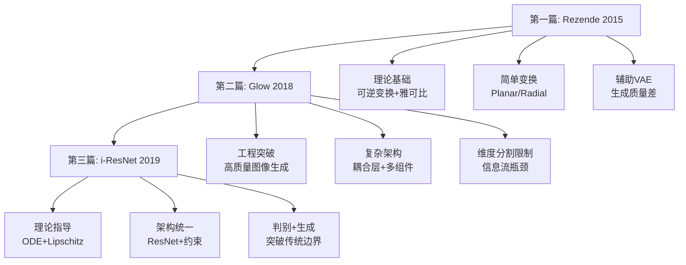

# Invertible Residual Networks (i-ResNet) 学习笔记

---

## 📑 目录 (Table of Contents)

### 1. [论文动机](#1-论文动机)

- 🎓 从课程设计者的角度：三篇论文的递进逻辑
- 🤔 Glow留下的"不完美"：维度分割的代价
- 🌟 i-ResNet的关键创新：从ODE理论获得启发
- 💪 i-ResNet相比Glow的核心优势
- 📊 三篇论文的技术进化轨迹
- 🎯 i-ResNet解决的核心问题

### 2. [数学基础](#2-数学基础)

#### 2.1 [Lipschitz常数](#21-lipschitz常数)

- 2.1.1 定义与上确界
- 2.1.2 复合函数的Lipschitz常数
- 2.1.3 可微函数的快速计算方法
- 2.1.4 神经网络激活函数的Lipschitz常数

#### 2.2 [矩阵的Lipschitz常数](#22-矩阵的lipschitz常数)

- 2.2.1 奇异值的定义
- 2.2.2 多维线性函数的Lipschitz常数
- 2.2.3 举例说明

#### 2.3 [Banach不动点定理](#23-banach不动点定理)

- 2.3.1 基础定义
- 2.3.2 定理内容
- 2.3.3 定理证明

### 3. [论文Section 2：可逆ResNet的理论基础](#3-论文section-2可逆resnet的理论基础)

- 3.1 [ResNet与ODE的相似性](#31-resnet与ode的相似性)
- 3.2 [i-ResNet可逆性定理](#32-i-resnet可逆性定理)
- 3.3 [双向Lipschitz常数引理](#33-双向lipschitz常数引理)
- 3.4 [如何构建满足定理的ResNet Block](#34-如何构建满足定理的resnet-block)

### 4. [论文Section 3：计算雅可比行列式](#4-论文section-3计算雅可比行列式)

- 4.1 [问题：为什么计算雅可比行列式很难？](#41-问题为什么计算雅可比行列式很难)
- 4.2 [解决方案：幂级数展开 + 随机估计](#42-解决方案幂级数展开--随机估计)
- 4.3 [Hutchinson's Trace Estimator](#43-hutchinsons-trace-estimator)
- 4.4 [组合方法：向量-雅可比乘积（VJP）](#44-组合方法向量-雅可比乘积vjp)
- 4.5 [完整算法](#45-完整算法)
- 4.6 [收敛性分析](#46-收敛性分析)
- 4.7 [与其他Flow方法的比较](#47-与其他flow方法的比较)
- 4.8 [小结：为什么这个方法可行？](#48-小结为什么这个方法可行)

### 5. [总结与展望](#5-总结与展望)

- 5.1 三篇论文的递进脉络
- 5.2 i-ResNet的影响
- 5.3 未来方向

---

## Invertible Residual Networks (Behrmann et al., 2019)

**论文链接**: [https://arxiv.org/abs/1811.00995](https://arxiv.org/abs/1811.00995)
**发表于**: ICML 2019
**项目主页**: [https://github.com/jhjacobsen/invertible-resnet](https://github.com/jhjacobsen/invertible-resnet)

### 1. 论文动机

#### 🎓 从课程设计者的角度：三篇论文的递进逻辑

让我们先回顾一下前两篇论文给我们留下了什么：

**第一篇（Rezende 2015）教会我们**：

- ✅ Flow的理论基础：可逆变换 + 雅可比行列式
- ✅ 为什么需要Flow：改进VAE的后验近似
- ✅ 基本构造方法：Planar/Radial Flow
- ❌ 但生成质量很差，只能做辅助工具

**第二篇（Glow 2018）教会我们**：

- ✅ 如何让Flow生成高质量图像
- ✅ 实用的工程技巧：ActNorm、1×1卷积、多尺度架构、仿射耦合层
- ✅ Flow可以达到GAN级别的视觉质量
- ❌ **但有一个根本性的设计限制**：必须对半分割维度

#### 🤔 Glow留下的"不完美"：维度分割的代价

**问题的本质**：

Glow（以及所有基于耦合层的Flow）都有一个**硬编码的架构限制**：

```python
# 耦合层的核心设计
z_a, z_b = split(z)  # 必须对半分
y_a = transform(z_a, conditioned_on=z_b)
y_b = z_b  # 一半必须保持不变
```

这个设计虽然巧妙（保证了可逆性和高效计算），但带来了**根本性的限制**：

**限制1：信息流的瓶颈**

每一层只能改变一半的信息：

```
Layer 1: 改变前50%，后50%不变
Layer 2: 改变后50%，前50%不变（需要额外的置换）
Layer 3: 改变前50%，后50%不变
...
```

- 要让所有维度充分混合，需要很多层
- 即使有1×1卷积帮助混合，本质上还是"间接"的
- 某些复杂的变换模式可能需要指数级的层数才能表达

**限制2：架构设计的"人工痕迹"**

```python
# Glow的一个flow step需要精心编排
def flow_step(x):
    x = actnorm(x)      # 1. 归一化
    x = invertible_conv(x)  # 2. 混合通道
    x = coupling_layer(x)   # 3. 仿射变换（对半分割）
    return x
```

这个设计是"手工制作"的结果：

- 为什么是这个顺序？
- 为什么需要这么多不同的组件？
- 有没有更"自然"的方式来设计可逆架构？

**限制3：表达能力的理论瓶颈**

数学上，耦合层的表达能力是**有界的**：

- 每层最多有一半的维度能被非线性变换
- 即使堆叠很多层，某些变换模式仍然无法表达
- 这导致模型可能无法学习到数据的某些复杂结构

#### 🌟 i-ResNet的关键创新：从ODE理论获得启发

面对Glow的这些限制，i-ResNet的作者们换了一个思路：

**核心洞察**：不要从"如何设计巧妙的可逆变换"入手，而要问"什么样的变换天然就是可逆的"？

**答案来自微分方程理论**：

如果我们有一个ODE（常微分方程）：

$$
\frac{dx}{dt} = f(x, t)
$$

在合适的条件下（比如$f$是Lipschitz连续的），这个ODE有**唯一解**，即从任何初始条件$x(0)$出发，都有唯一的轨迹$x(t)$。

**从连续到离散**：

ResNet的每一层可以看作是这个ODE的一个**离散时间步**：

$$
x_{t+1} = x_t + g_t(x_t) \quad \text{（ResNet层）}
$$

这就像欧拉法求解ODE：

$$
x_{t+1} = x_t + h \cdot f(x_t, t) \quad \text{（欧拉法）}
$$

**可逆性的理论保证**：

如果$g_t$满足某些条件（具体来说，如果$\text{Lip}(g_t) < 1$），那么变换$x_{t+1} = x_t + g_t(x_t)$就是**可逆的**！

**为什么这个洞察如此重要？**

1. **理论保证**：不是"碰运气"地设计可逆变换，而是有严格的数学理论支撑
2. **通用性**：$g_t$可以是任意神经网络，只要满足Lipschitz约束
3. **自然性**：不需要人工设计复杂的耦合结构，ResNet本身就是"天然可逆的"

#### 💪 i-ResNet相比Glow的核心优势

**优势1：每层都能变换所有维度**

```python
# Glow (耦合层)
def glow_step(z):
    z_a, z_b = split(z)  # 分割
    y_a = transform(z_a, z_b)  # 只变换一半
    y_b = z_b  # 另一半不变
    return concat(y_a, y_b)

# i-ResNet
def i_resnet_block(z):
    return z + g(z)  # 直接变换整个 z，没有分割！
```

**信息流对比**：

```
Glow:
  Layer 1  Layer 2  Layer 3  Layer 4
  [50%变]  [50%变]  [50%变]  [50%变]
  [50%不变][50%不变][50%不变][50%不变]

i-ResNet:
  Layer 1  Layer 2  Layer 3  Layer 4
  [100%变][100%变][100%变][100%变]
```

**优势2：更强的表达能力**

- **Glow**：受制于耦合层的结构限制，某些变换无法表达
- **i-ResNet**：只要满足Lipschitz约束，可以使用任意神经网络架构

**优势3：架构设计更自然**

- **Glow**：需要精心设计ActNorm、1×1卷积、耦合层的组合
- **i-ResNet**：就是标准的ResNet + 一个简单的Lipschitz约束

**优势4：统一判别和生成**

这是一个**巨大**的优势：

```python
# 同一个网络既能做分类，又能做生成
class iResNet(nn.Module):
    def forward(self, x):
        # 判别任务：前向传播
        for layer in self.layers:
            x = x + layer(x)  # 只要 Lip(layer) < 1
        return self.classifier(x)
  
    def inverse(self, y):
        # 生成任务：逆向传播
        x = y
        for layer in reversed(self.layers):
            x = self.fixed_point_solve(x, y, layer)  # 不动点迭代
        return x
```

**为什么这很重要？**

1. **参数效率**：一套参数，两种用途
2. **一致性**：判别和生成使用完全相同的表示
3. **新的可能性**：可以在判别任务上预训练，然后直接用于生成

#### 📊 三篇论文的技术进化轨迹

让我们回顾一下这个完整的进化过程：



**关键转变**：

| 维度                 | 第一篇         | 第二篇               | 第三篇              |
| -------------------- | -------------- | -------------------- | ------------------- |
| **理论基础**   | 变量变换公式   | 工程优化             | ODE理论             |
| **架构复杂度** | 简单（太简单） | 复杂（多组件）       | 自然（ResNet+约束） |
| **表达能力**   | 有限           | 中等（受耦合层限制） | 强（任意网络+约束） |
| **应用范围**   | 辅助VAE        | 独立生成模型         | 统一判别+生成       |
| **主要贡献**   | 奠定理论基础   | 证明实用性           | 统一架构范式        |

#### 🎯 i-ResNet解决的核心问题

回到最开始的问题：**如何设计既强大又可逆的神经网络架构？**

**前人的思路**：

- 第一篇：设计简单的可逆变换 → 表达能力不足
- 第二篇：设计巧妙的复杂可逆变换 → 架构限制多

**i-ResNet的思路**：

```
不要问"如何让变换可逆"
而要问"什么条件下变换天然可逆"
↓
数学理论给出答案：Lipschitz < 1
↓
在标准ResNet上加这个约束
↓
既保持了ResNet的强大表达能力
又获得了严格的可逆性保证
```

**核心哲学转变**：

- **从工程导向到理论导向**：不是靠巧妙设计，而是靠数学定理
- **从专门架构到通用框架**：不是为Flow专门设计，而是让标准架构可逆
- **从单一功能到多元统一**：不只是生成模型，还能做判别任务

这就是为什么i-ResNet被认为是Flow模型发展中的一个**范式转变**！

### 2. 数学基础

**重要原则**：这一部分只讲纯数学，不提及iResNet，不引入任何具体应用

#### 2.1 Lipschitz常数

##### 2.1.1 定义

Lipschitz常数的定义：

$$
\text{Lip}(g) = \sup_{x \neq y} \frac{\|g(x) - g(y)\|}{\|x - y\|}
$$

$\sup$ 的含义：

- 上确界 (supremum) 是"最小的上界"
- 如果 $\sup S \in S$，则 $\max S = \sup S$；否则只有 $\sup$ 存在，$\max$ 不存在
- 举例：$S = \{1 - \frac{1}{n} : n = 1, 2, 3, \ldots\}$，$\sup S = 1$，但 $\max S$ 不存在（$ 1 \notin S$）

##### 2.1.2 复合函数的Lipschitz常数

**定理**：如果 $\text{Lip}(f) = L_f$，$\text{Lip}(g) = L_g$，则：

$$
\text{Lip}(f \circ g) \leq L_f \cdot L_g
$$

**证明**：
对任意 $x_1, x_2$，设 $h = f \circ g$：

$$
\begin{aligned}
\|h(x_1) - h(x_2)\| &= \|f(g(x_1)) - f(g(x_2))\| \\
&\leq L_f \cdot \|g(x_1) - g(x_2)\| \\
&\leq L_f \cdot (L_g \cdot \|x_1 - x_2\|) \\
&= (L_f \cdot L_g) \cdot \|x_1 - x_2\|
\end{aligned}
$$

两边除以 $\|x_1 - x_2\|$ 并取上确界得证。□

**直观理解**：$g$ 最多把距离放大 $L_g$ 倍，$f$ 再最多放大 $L_f$ 倍，总共最多 $L_f \cdot L_g$ 倍。

##### 2.1.3 可微函数的快速计算方法

**拉格朗日中值定理的应用**：

对于可微函数 $g: D \to \mathbb{R}$（$D$ 是凸集），存在 $\xi \in (x_1, x_2)$ 使得：

$$
\frac{g(x_1) - g(x_2)}{x_1 - x_2} = g'(\xi)
$$

因此：

$$
\frac{|g(x_1) - g(x_2)|}{|x_1 - x_2|} = |g'(\xi)| \leq \sup_{x \in D} |g'(x)|
$$

**关键结论**：可微函数的Lipschitz常数 = 导数绝对值的上确界

$$
\boxed{\text{Lip}(g) = \sup_{x \in D} |g'(x)|}
$$

**常见可微函数的Lipschitz常数表**：

| 函数类型            | $g(x)$              | $g'(x)$                | 定义域$D$      | $\text{Lip}(g)$ | 收缩？       | 备注                       |
| ------------------- | --------------------- | ------------------------ | ---------------- | ----------------- | ------------ | -------------------------- |
| **多项式**    |                       |                          |                  |                   |              |                            |
|                     | $x^2$               | $2x$                     | $[-R, R]$      | $2R$              | 若$R<0.5$  | 全局：$\infty$           |
|                     | $x^3$               | $3x^2$                   | $[-R, R]$      | $3R^2$            | 若$R<0.58$ | 全局：$\infty$           |
|                     | $\frac{x^2}{1+x^2}$ | $\frac{2x}{(1+x^2)^2}$ | $\mathbb{R}$   | $0.5$             | ✅           | 全局收缩                   |
| **三角函数**  |                       |                          |                  |                   |              |                            |
|                     | $\sin(x)$           | $\cos(x)$              | $\mathbb{R}$   | $1$               | 边界         |                            |
|                     | $a\sin(x)$          | $a\cos(x)$             | $\mathbb{R}$   | $                 | a            | $                          |
|                     | $\arctan(x)$        | $\frac{1}{1+x^2}$      | $\mathbb{R}$   | $1$               | 边界         | 在$x=0$ 取到             |
| **指数/对数** |                       |                          |                  |                   |              |                            |
|                     | $e^x$               | $e^x$                  | $(-\infty, R]$ | $e^R$           | 若$R<0$    | $[0,\infty)$：$\infty$ |
|                     | $e^{-x}$            | $-e^{-x}$              | $[R, \infty)$  | $e^{-R}$        | 若$R>0$    |                            |
|                     | $\ln(x)$            | $\frac{1}{x}$          | $[a, \infty)$  | $\frac{1}{a}$   | 若$a>1$    | 接近0时：$\infty$        |

##### 2.1.4 神经网络激活函数的Lipschitz常数

**ReLU**：

$$
g(x) = \max(0, x), \quad \text{Lip}(g) = 1
$$

**Sigmoid**：

$$
g(x) = \frac{1}{1 + e^{-x}}, \quad g'(x) = \sigma(x)(1 - \sigma(x))
$$

最大值在 $x = 0$：$g'(0) = \frac{1}{4}$

$$
\text{Lip}(\sigma) = 0.25 < 1 \quad \text{✅ 全局收缩映射}
$$

**Tanh**：

$$
g(x) = \tanh(x), \quad g'(x) = 1 - \tanh^2(x)
$$

$$
\text{Lip}(\tanh) = 1 \quad \text{（边界情况）}
$$

**Softplus**：

$$
g(x) = \ln(1 + e^x), \quad g'(x) = \sigma(x)
$$

$$
\text{Lip}(g) = 1 \quad \text{（边界情况）}
$$

#### 2.2 矩阵的Lipschitz常数

##### 2.2.1 奇异值的定义

对于矩阵 $A \in \mathbb{R}^{m \times n}$，**奇异值分解（SVD）**为：

$$
A = U\Sigma V^T
$$

其中 $\Sigma$ 的对角元素 $\sigma_1 \geq \sigma_2 \geq \cdots \geq \sigma_{\min(m,n)} \geq 0$ 称为 $A$ 的**奇异值**。

**与特征值的区别**：

| 概念   | 定义                       | 适用矩阵 | 数量                 |
| ------ | -------------------------- | -------- | -------------------- |
| 特征值 | $Av = \lambda v$         | 方阵     | $n$ 个（可能复数） |
| 奇异值 | SVD中$\Sigma$ 的对角元素 | 任意矩阵 | $\min(m,n)$ 个     |

**数学关系**：

$$
\sigma_i = \sqrt{\lambda_i(A^T A)}
$$

**何时相等？** 只有当 $A$ 是对称矩阵时，$\sigma_i = |\lambda_i|$

##### 2.2.2 多维线性函数的Lipschitz常数

对于线性函数 $g(\mathbf{x}) = A\mathbf{x} + \mathbf{b}$：

$$
\frac{\|g(\mathbf{x}_1) - g(\mathbf{x}_2)\|}{\|\mathbf{x}_1 - \mathbf{x}_2\|} = \frac{\|A(\mathbf{x}_1 - \mathbf{x}_2)\|}{\|\mathbf{x}_1 - \mathbf{x}_2\|}
$$

**矩阵2-范数**的定义：

$$
\|A\|_2 = \sup_{\mathbf{v} \neq 0} \frac{\|A\mathbf{v}\|}{\|\mathbf{v}\|} = \sigma_{\max}(A)
$$

因此：

$$
\boxed{\text{Lip}(g) = \|A\|_2 = \sigma_{\max}(A)}
$$

**重要**：这里是**最大奇异值**，不是最大特征值！

##### 2.2.3 举例说明

**例1：对称矩阵**（奇异值 = 特征值绝对值）

$$
A = \begin{bmatrix} 4 & 1 \\ 1 & 3 \end{bmatrix}
$$

- 特征值：$\lambda_1 \approx 4.618$，$\lambda_2 \approx 2.382$
- 奇异值：$\sigma_1 \approx 4.618$，$\sigma_2 \approx 2.382$
- $\|A\|_2 = \sigma_{\max} = |\lambda_{\max}| \approx 4.618$ ✅

**例2：非对称矩阵**（奇异值 ≠ 特征值）

$$
A = \begin{bmatrix} 0.5 & 0.2 \\ 0.1 & 0.6 \end{bmatrix}
$$

- 特征值：$\lambda_1 \approx 0.724$，$\lambda_2 \approx 0.376$
- 最大奇异值：$\sigma_{\max} \approx 0.717$
- $\|A\|_2 = 0.717 \neq \lambda_{\max}$ ❌

**例3：旋转矩阵**（特征值是复数）

$$
R = \begin{bmatrix} \cos\theta & -\sin\theta \\ \sin\theta & \cos\theta \end{bmatrix}
$$

- 特征值：$\lambda = e^{\pm i\theta}$（复数，模为1）
- 奇异值：$\sigma_1 = \sigma_2 = 1$
- $\|R\|_2 = 1$

**为什么Lipschitz常数用奇异值而不是特征值？**

Lipschitz常数衡量的是**向量长度的最大增长倍数**：

$$
\|A\|_2 = \max_{\|v\|=1} \|Av\|
$$

- **奇异值的几何意义**：矩阵将单位球拉伸的最大倍数
- **特征值的几何意义**：特殊方向（特征向量方向）上的缩放因子

特征值无法描述任意方向的最大拉伸！

#### 2.3 Banach不动点定理

##### 2.3.1 基础定义

**完备度量空间**：

- 度量空间 $(X, d)$：集合 $X$ 配备距离函数 $d$，满足：
  - $d(x, y) \geq 0$，且 $d(x, y) = 0 \Leftrightarrow x = y$
  - $d(x, y) = d(y, x)$
  - $d(x, z) \leq d(x, y) + d(y, z)$
- 完备性：任何柯西序列都收敛（极限在空间内）
- 例子：$\mathbb{R}^d$ 配备欧几里得范数是完备的

**压缩映射**（收缩映射）：
映射 $T: X \to X$ 满足存在 $ 0 \leq L < 1$ 使得：

$$
d(T(x), T(y)) \leq L \cdot d(x, y), \quad \forall x, y \in X
$$

几何直观：$T$ 把任意两点"拉近"至少 $(1-L)$ 的比例。

**柯西序列**：
序列 $\{x_n\}$ 满足：对任意 $\epsilon > 0$，存在 $N$ 使得当 $m, n > N$ 时，$d(x_m, x_n) < \epsilon$。

直观含义：序列中的点越来越"挤在一起"，后面的项彼此距离可以任意小。

**⚠️ 重要澄清**：柯西序列**不一定有极限**！这取决于空间是否完备：

- ✅ **完备空间**：柯西序列 ⇒ 收敛（极限存在且在空间内）
- ❌ **非完备空间**：柯西序列可能不收敛

**反例**：在空间 $(0, 1)$（开区间，不含端点）中：

- 序列 $\left\{\frac{1}{n}\right\}$ 是柯西序列（点彼此越来越近）
- 但极限 $\lim_{n\to\infty} \frac{1}{n} = 0 \notin (0, 1)$（"逃出"了空间）

**这就是为什么Banach定理要求"完备度量空间"**：保证柯西序列一定收敛！

##### 2.3.2 定理内容

**定理（Banach不动点定理）**：

设 $(X, d)$ 是完备度量空间，$T: X \to X$ 是压缩映射，即存在 $ 0 \leq L < 1$ 使得：

$$
d(T(x), T(y)) \leq L \cdot d(x, y), \quad \forall x, y \in X
$$

则：

1. **存在性与唯一性**：$T$ 有唯一的不动点 $x^* \in X$，即 $T(x^*) = x^*$
2. **构造性**：从任意初始点 $x_0 \in X$ 出发，迭代 $x_{n+1} = T(x_n)$ 收敛到 $x^*$
3. **收敛速率**：误差以几何级数衰减
4. **先验误差估计**（a priori，事前）：开始迭代前就能预测误差

   $$
   d(x_n, x^*) \leq \frac{L^n}{1-L} d(x_1, x_0)
   $$

   - 依赖：初始误差和迭代次数
   - 用途：决定需要迭代多少次
5. **后验误差估计**（a posteriori，事后）：迭代过程中实时估计

   $$
   d(x_n, x^*) \leq \frac{L}{1-L} d(x_n, x_{n-1})
   $$

   - 依赖：最近两步的差
   - 用途：动态判断是否已收敛

##### 2.3.3 定理证明

**第一步：证明唯一性**

假设有两个不动点 $x^*, \tilde{x}^*$：

$$
d(x^*, \tilde{x}^*) = d(T(x^*), T(\tilde{x}^*)) \leq L \cdot d(x^*, \tilde{x}^*) < d(x^*, \tilde{x}^*)
$$

矛盾，除非 $d(x^*, \tilde{x}^*) = 0$，即 $x^* = \tilde{x}^*$。□

**第二步：构造序列**

从任意 $x_0 \in X$ 出发，定义：

$$
x_{n+1} = T(x_n), \quad n = 0, 1, 2, \ldots
$$

**第三步：证明是柯西序列**

估计 $d(x_{k+1}, x_k)$：

$$
d(x_{k+1}, x_k) = d(T(x_k), T(x_{k-1})) \leq L \cdot d(x_k, x_{k-1}) \leq L^k \cdot d(x_1, x_0)
$$

对任意 $m > n$：

$$
\begin{aligned}
d(x_m, x_n) &\leq \sum_{k=n}^{m-1} d(x_{k+1}, x_k) \\
&\leq \sum_{k=n}^{m-1} L^k \cdot d(x_1, x_0) \\
&= d(x_1, x_0) \cdot \frac{L^n}{1-L}
\end{aligned}
$$

当 $n \to \infty$ 时，$L^n \to 0$，所以 $\{x_n\}$ 是柯西序列。□

**第四步：极限是不动点**

由完备性，$\{x_n\}$ 收敛到 $x^* \in X$。由 $T$ 的连续性：

$$
x^* = \lim_{n \to \infty} x_{n+1} = \lim_{n \to \infty} T(x_n) = T(x^*)
$$

所以 $x^*$ 是不动点。□

**第五步：收敛速率**

从第三步，令 $m \to \infty$：

$$
d(x_n, x^*) \leq \frac{L^n}{1-L} d(x_1, x_0) \quad \text{（先验估计）}
$$

**后验估计的推导**：

利用三角不等式和压缩性质：

$$
\begin{aligned}
d(x_n, x^*) &\leq d(x_n, x_{n+1}) + d(x_{n+1}, x^*) \\
&= d(x_n, T(x_n)) + d(T(x_n), T(x^*)) \quad (\because x_{n+1} = T(x_n), x^* = T(x^*)) \\
&\leq d(x_n, x_{n+1}) + L \cdot d(x_n, x^*) \quad (\text{压缩性质})
\end{aligned}
$$

移项整理：

$$
\begin{aligned}
d(x_n, x^*) - L \cdot d(x_n, x^*) &\leq d(x_n, x_{n+1}) \\
(1 - L) \cdot d(x_n, x^*) &\leq d(x_n, x_{n+1}) \\
d(x_n, x^*) &\leq \frac{1}{1-L} d(x_n, x_{n+1})
\end{aligned}
$$

因此：

$$
\boxed{d(x_n, x^*) \leq \frac{L}{1-L} d(x_n, x_{n-1})} \quad \text{（后验估计）}
$$

（注意：最终形式用的是 $d(x_n, x_{n-1})$ 而不是 $d(x_n, x_{n+1})$，因为我们通常在已知前一步的情况下估计当前误差）

### 3. 论文Section 2：可逆ResNet的理论基础

#### 3.1 ResNet与ODE的相似性

**ResNet的基本形式**：

$$
x_{t+1} = x_t + g_{\theta_t}(x_t)
$$

其中 $x_t \in \mathbb{R}^d$ 是第 $t$ 层的激活值，$g_{\theta_t}$ 是残差块。

**Euler方法求解ODE**：

对于常微分方程（ODE）：

$$
\frac{dx}{dt} = f(x, t)
$$

**欧拉法**（Euler's method）的离散化：

$$
x_{t+1} = x_t + h \cdot f(x_t, t)
$$

其中 $h$ 是步长（step size）。

**对应关系**：

| 概念      | ODE（连续）                 | ResNet（离散）                    |
| --------- | --------------------------- | --------------------------------- |
| 状态      | $x(t)$                    | $x_t$（第$t$层激活）          |
| 时间/深度 | $t \in [0, T]$            | $t = 0, 1, \ldots, L$（层索引） |
| 动力学    | $\frac{dx}{dt} = f(x, t)$ | $x_{t+1} = x_t + g_t(x_t)$      |
| 步长      | $h$（离散化精度）         | 隐含为1                           |

**关系**：$g_{\theta_t}(x_t) = h \cdot f_{\theta_t}(x_t)$（ResNet中 $h=1$）

**为什么引入ODE视角？**

ODE视角不是为了"装逼"，而是提供实际工具：

1. **启发可逆性条件**：ODE数值分析中已知"小步长 + Lipschitz约束 → 可逆"
2. **形式化问题**：逆向传播 = 求解隐式欧拉方程
3. **计算技巧**：雅可比行列式的幂级数展开来自ODE数值方法
4. **理论工具箱**：借用成熟的ODE稳定性理论

**但注意**：ODE只是提供直觉和计算技巧，**可逆性的严格证明来自Banach定理**！

---

#### 3.2 i-ResNet可逆性定理

**定理2.1（论文核心定理）**：

设 $F(x) = x + g(x)$，其中 $g: \mathbb{R}^d \to \mathbb{R}^d$。如果 $\text{Lip}(g) < 1$，则：

1. $F$ 是**单射**（injective）：不同的输入映射到不同的输出
2. $F$ 的逆映射 $F^{-1}$ 存在且可以通过**不动点迭代**计算
3. $F$ 和 $F^{-1}$ 都是**Lipschitz连续**的

**证明**（使用Banach不动点定理）：

**第一步：证明单射性**

假设 $F(x_1) = F(x_2)$，即：

$$
x_1 + g(x_1) = x_2 + g(x_2)
$$

则：

$$
\|x_1 - x_2\| = \|g(x_2) - g(x_1)\| \leq \text{Lip}(g) \|x_2 - x_1\| < \|x_2 - x_1\|
$$

这意味着 $\|x_1 - x_2\| < \|x_1 - x_2\|$，矛盾！除非 $x_1 = x_2$。因此 $F$ 是单射。□

**第二步：构造逆映射**

给定 $y = F(x) = x + g(x)$，我们要求 $x = F^{-1}(y)$。

重写为：

$$
x = y - g(x)
$$

定义映射 $T_y(x) = y - g(x)$。我们需要找 $T_y$ 的不动点。

**第三步：验证 $T_y$ 是压缩映射**

$$
\begin{aligned}
\|T_y(x_1) - T_y(x_2)\| &= \|(y - g(x_1)) - (y - g(x_2))\| \\
&= \|g(x_2) - g(x_1)\| \\
&\leq \text{Lip}(g) \|x_2 - x_1\| \\
&< \|x_2 - x_1\| \quad (\because \text{Lip}(g) < 1)
\end{aligned}
$$

所以 $\text{Lip}(T_y) = \text{Lip}(g) < 1$，$T_y$ 是压缩映射。□

**第四步：应用Banach定理**

由Banach不动点定理：

- $T_y$ 有唯一不动点 $x^*$
- $T_y(x^*) = x^* \Rightarrow x^* = y - g(x^*) \Rightarrow y = x^* + g(x^*) = F(x^*)$
- 从任意 $x_0$ 出发，迭代 $x_{n+1} = T_y(x_n) = y - g(x_n)$ 收敛到 $x^*$

因此 $F^{-1}(y) = x^*$ 存在且可通过不动点迭代计算。□

**第五步：Lipschitz连续性**

由于 $F(x) = x + g(x)$：

$$
\|F(x_1) - F(x_2)\| = \|x_1 - x_2 + g(x_1) - g(x_2)\| \leq (1 + \text{Lip}(g)) \|x_1 - x_2\|
$$

所以 $\text{Lip}(F) \leq 1 + \text{Lip}(g)$。

类似地，由于 $F^{-1}$ 是 $T_y$ 的不动点，可以证明 $\text{Lip}(F^{-1}) \leq \frac{1}{1 - \text{Lip}(g)}$。□

**定理证明完毕**。

**关键洞察**：

- **ODE视角**：启发我们考虑这个问题
- **Banach定理**：提供严格的数学证明
- **不动点迭代**：提供实际的计算算法

---

#### 3.3 双向Lipschitz常数引理

**引理2（论文Lemma 2）**：

设 $F(x) = x + g(x)$，其中 $\text{Lip}(g) = L < 1$。则：

$$
\text{Lip}(F) \leq 1 + L \quad \text{且} \quad \text{Lip}(F^{-1}) \leq \frac{1}{1-L}
$$

**等价形式**（双向Lipschitz界）：

$$
(1-L) \|x_1 - x_2\| \leq \|F(x_1) - F(x_2)\| \leq (1+L) \|x_1 - x_2\|
$$

或写成：

$$
\frac{1}{1+L} \|y_1 - y_2\| \leq \|F^{-1}(y_1) - F^{-1}(y_2)\| \leq \frac{1}{1-L} \|y_1 - y_2\|
$$

---

**证明**：

**第一部分：证明 $\text{Lip}(F) \leq 1 + L$（上界）**

对任意 $x_1, x_2$：

$$
\begin{aligned}
\|F(x_1) - F(x_2)\| &= \|(x_1 + g(x_1)) - (x_2 + g(x_2))\| \\
&= \|(x_1 - x_2) + (g(x_1) - g(x_2))\| \\
&\leq \|x_1 - x_2\| + \|g(x_1) - g(x_2)\| \quad \text{(三角不等式)} \\
&\leq \|x_1 - x_2\| + L \|x_1 - x_2\| \quad \text{(Lipschitz性质)} \\
&= (1 + L) \|x_1 - x_2\|
\end{aligned}
$$

因此 $\text{Lip}(F) \leq 1 + L$。□

**第二部分：证明下界 $(1-L)$**

利用逆三角不等式：$\|a + b\| \geq |\|a\| - \|b\||$

$$
\begin{aligned}
\|F(x_1) - F(x_2)\| &= \|(x_1 - x_2) + (g(x_1) - g(x_2))\| \\
&\geq \left| \|x_1 - x_2\| - \|g(x_1) - g(x_2)\| \right| \\
&\geq \|x_1 - x_2\| - \|g(x_1) - g(x_2)\| \\
&\geq \|x_1 - x_2\| - L \|x_1 - x_2\| \\
&= (1 - L) \|x_1 - x_2\|
\end{aligned}
$$

因此：

$$
\|F(x_1) - F(x_2)\| \geq (1-L) \|x_1 - x_2\|
$$

重排得：

$$
\|x_1 - x_2\| \leq \frac{1}{1-L} \|F(x_1) - F(x_2)\|
$$

这意味着 $\text{Lip}(F^{-1}) \leq \frac{1}{1-L}$。□

---

**引理的意义**：

**1. 双向稳定性保证**

| 方向           | Lipschitz常数                             | 几何意义                     |
| -------------- | ----------------------------------------- | ---------------------------- |
| 前向$F$      | $\text{Lip}(F) \leq 1 + L$              | 最多拉伸$(1+L)$ 倍         |
| 逆向$F^{-1}$ | $\text{Lip}(F^{-1}) \leq \frac{1}{1-L}$ | 最多拉伸$\frac{1}{1-L}$ 倍 |

**2. 训练稳定性**

- **前向传播**：梯度不会爆炸（上界控制）
- **反向传播**（逆向推理）：梯度也不会爆炸（逆的Lipschitz常数有界）

**3. 具体数值示例**

假设 $L = 0.9$：

- $\text{Lip}(F) \leq 1.9$
- $\text{Lip}(F^{-1}) \leq 10$

假设 $L = 0.5$：

- $\text{Lip}(F) \leq 1.5$
- $\text{Lip}(F^{-1}) \leq 2$

**关键观察**：$L$ 越小，$F^{-1}$ 越稳定！

**4. 为什么这对i-ResNet至关重要？**

在Normalizing Flow中，我们需要：

1. **前向（生成）**：$x = F^{-1}(z)$
2. **逆向（推理）**：$z = F(x)$

这个引理保证了**两个方向都是数值稳定的**，不会出现梯度消失或爆炸。

---

#### 3.4 如何构建满足定理的ResNet Block

**问题**：如何保证 $\text{Lip}(g) < 1$？

神经网络残差块通常是多层组合：

$$
g(x) = \sigma_K(W_K \sigma_{K-1}(W_{K-1} \cdots \sigma_1(W_1 x + b_1) \cdots + b_{K-1}) + b_K)
$$

**利用复合函数的Lipschitz性质**：

$$
\text{Lip}(g) \leq \prod_{k=1}^K \text{Lip}(\sigma_k) \cdot \prod_{k=1}^K \|W_k\|_2
$$

**策略1：约束权重矩阵的谱范数**

使用**谱归一化**（Spectral Normalization）：

$$
\bar{W}_k = \frac{W_k}{\sigma_{\max}(W_k)}
$$

使得 $\|\bar{W}_k\|_2 = 1$。

**但问题**：如果所有 $\|W_k\|_2 = 1$ 且激活函数 Lip = 1（如ReLU），则：

$$
\text{Lip}(g) \leq 1 \cdot 1 \cdot \cdots \cdot 1 = 1
$$

不满足 $< 1$ 的严格要求！

**策略2：使用缩放因子**

$$
\bar{g}(x) = \alpha \cdot g(x), \quad \alpha < 1
$$

例如 $\alpha = 0.9$：

$$
\text{Lip}(\bar{g}) = \alpha \cdot \text{Lip}(g) < 1
$$

**策略3：软约束（论文实际使用）**

在训练过程中，通过谱归一化保持 $\|W_k\|_2 \leq 1$，并选择合适的激活函数（如Lipschitz < 1的函数）。

**论文2.1节的详细方法**：

**方法1：幂迭代法计算谱范数**

对于权重矩阵 $W$，其谱范数 $\sigma_{\max}(W)$ 可以通过幂迭代估计：

```python
def spectral_norm(W, num_iters=1):
    u = torch.randn(W.shape[0], 1)  # 随机初始化
    for _ in range(num_iters):
        v = W.T @ u
        v = v / torch.norm(v)
        u = W @ v
        u = u / torch.norm(u)
    sigma = (u.T @ W @ v).item()
    return sigma

# 归一化
W_normalized = W / spectral_norm(W)
```

**方法2：在前向传播中应用归一化**

```python
class SpectralNormLinear(nn.Module):
    def __init__(self, in_features, out_features):
        super().__init__()
        self.weight = nn.Parameter(torch.randn(out_features, in_features))
        self.register_buffer('u', torch.randn(out_features, 1))
  
    def forward(self, x):
        # 每次前向传播时更新谱范数估计
        with torch.no_grad():
            v = self.weight.T @ self.u
            v = v / v.norm()
            self.u = self.weight @ v
            self.u = self.u / self.u.norm()
  
        sigma = (self.u.T @ self.weight @ v).item()
        w_normalized = self.weight / sigma
        return F.linear(x, w_normalized)
```

**方法3：Björck正交化（更精确的方法）**

论文还提到了Björck正交化算法，它可以更精确地将矩阵正交化（谱范数=1）：

迭代格式：

$$
W_{k+1} = \frac{1}{2}W_k(3I - W_k^T W_k)
$$

几次迭代后 $W_k^T W_k \approx I$，即 $W_k$ 接近正交矩阵。

**权衡**：

- **幂迭代**：快速但近似
- **Björck正交化**：精确但计算代价高
- **实际应用**：通常幂迭代1-2次足够

**小结**：

- 理论要求：$\text{Lip}(g) < 1$
- 实际做法：谱归一化 + 合适的缩放/激活函数
- 计算方法：幂迭代估计谱范数

---

### 4. 论文Section 3：计算雅可比行列式

#### 4.1 问题：为什么计算雅可比行列式很难？

**回顾Flow的基本公式**：

$$
\log p_x(x) = \log p_z(F^{-1}(x)) - \log \left| \det \frac{\partial F}{\partial x} \right|
$$

对于 $F(x) = x + g(x)$：

$$
\frac{\partial F}{\partial x} = I + J_g
$$

其中 $J_g = \frac{\partial g}{\partial x}$ 是 $g$ 的雅可比矩阵。

**问题**：如何计算 $\det(I + J_g)$？

**直接计算的困难**：

- $J_g \in \mathbb{R}^{d \times d}$（对于图像，$d$ 可能是 $28 \times 28 \times 3 \approx 2352$）
- 直接计算行列式：$O(d^3)$ 复杂度
- 对于高维数据**完全不可行**

**其他Flow方法的解决方案**：

- **耦合层（Glow）**：雅可比是分块三角矩阵，行列式是对角元素之积，$O(d)$
- **自回归（MAF/IAF）**：雅可比是三角矩阵，$O(d)$

**i-ResNet的挑战**：

- $I + J_g$ 是**稠密矩阵**（没有特殊结构）
- 必须找到新方法！

---

#### 4.2 解决方案：幂级数展开 + 随机估计

**关键观察**：由于 $\text{Lip}(g) < 1$，雅可比矩阵 $J_g$ 的谱范数 $\|J_g\|_2 < 1$。

**幂级数展开**：

对于谱范数 $< 1$ 的矩阵 $A$，有：

$$
\log \det(I + A) = \text{tr}(\log(I + A)) = \text{tr}\left(\sum_{k=1}^{\infty} \frac{(-1)^{k+1}}{k} A^k\right)
$$

证明（简要）：

- $\log(I + A)$ 的幂级数：$\log(I + A) = \sum_{k=1}^{\infty} \frac{(-1)^{k+1}}{k} A^k$（当 $\|A\| < 1$）
- $\log \det(I + A) = \det(\log(I + A)) = \text{tr}(\log(I + A))$
- 代入得证

**截断近似**：

$$
\log \det(I + J_g) \approx \sum_{k=1}^{n} \frac{(-1)^{k+1}}{k} \text{tr}(J_g^k)
$$

**但问题仍然存在**：如何计算 $\text{tr}(J_g^k)$？

**直接计算** $J_g^k$ 仍然是 $O(d^3)$！

---

#### 4.3 Hutchinson's Trace Estimator

**Hutchinson估计量**（1990）：

对于任意矩阵 $A$：

$$
\text{tr}(A) = \mathbb{E}_{\epsilon \sim \mathcal{N}(0, I)} [\epsilon^T A \epsilon]
$$

**证明**：

$$
\begin{aligned}
\mathbb{E}[\epsilon^T A \epsilon] &= \mathbb{E}\left[\sum_{i,j} \epsilon_i A_{ij} \epsilon_j\right] \\
&= \sum_{i,j} A_{ij} \mathbb{E}[\epsilon_i \epsilon_j] \\
&= \sum_{i,j} A_{ij} \delta_{ij} \quad (\text{因为 } \mathbb{E}[\epsilon_i \epsilon_j] = \delta_{ij}) \\
&= \sum_i A_{ii} = \text{tr}(A)
\end{aligned}
$$

**随机估计**：

$$
\text{tr}(A) \approx \frac{1}{S} \sum_{s=1}^S \epsilon_s^T A \epsilon_s
$$

其中 $\epsilon_s \sim \mathcal{N}(0, I)$ 是独立采样。

**关键优势**：计算 $\epsilon^T A \epsilon$ 只需要**矩阵-向量乘法**，不需要构造整个矩阵 $A$！

---

#### 4.4 组合方法：向量-雅可比乘积（VJP）

**问题**：如何计算 $\epsilon^T J_g^k \epsilon$ 而不构造 $J_g$？

**答案**：使用自动微分的**向量-雅可比乘积**（Vector-Jacobian Product, VJP）。

**VJP的定义**：

给定函数 $g: \mathbb{R}^d \to \mathbb{R}^d$ 和向量 $v \in \mathbb{R}^d$：

$$
\text{VJP}(g, x, v) = v^T \frac{\partial g}{\partial x} = v^T J_g
$$

**JVP（Jacobian-Vector Product）的定义**：

$$
\text{JVP}(g, x, v) = \frac{\partial g}{\partial x} v = J_g v
$$

**自动微分支持**：

- **前向模式AD**：高效计算 JVP
- **反向模式AD**：高效计算 VJP

**计算 $\epsilon^T J_g^k \epsilon$**：

1. 初始化 $v = \epsilon$
2. 循环 $k$ 次：
   - 计算 $v = J_g v$（使用JVP）
3. 返回 $\epsilon^T v$

**复杂度**：

- 每次JVP：$O(d)$（与前向传播相同）
- $k$ 次JVP：$O(kd)$
- $n$ 项求和：$O(nkd)$
- $S$ 个随机样本：$O(Snkd)$

**实际参数**：

- $n \approx 5-10$（幂级数项数）
- $S \approx 1$（随机样本数，常常1个就够！）
- 总复杂度：$O(nkd) \approx O(d)$（相对于前向传播）

---

#### 4.5 完整算法

```python
def log_det_jacobian(g, x, n_terms=10, n_samples=1):
    """
    估计 log|det(I + J_g)|
  
    Args:
        g: 残差函数
        x: 输入
        n_terms: 幂级数项数
        n_samples: 随机样本数
  
    Returns:
        log|det(I + J_g)| 的估计值
    """
    log_det = 0.0
  
    for _ in range(n_samples):
        # 采样随机向量
        epsilon = torch.randn_like(x)
  
        # 初始化 v = epsilon
        v = epsilon
  
        for k in range(1, n_terms + 1):
            # v = J_g @ v （使用JVP）
            v = jvp(g, x, v)
  
            # 计算 tr(J_g^k) ≈ epsilon^T @ J_g^k @ epsilon
            trace_term = torch.sum(epsilon * v)
  
            # 累加到幂级数
            log_det += ((-1)**(k+1) / k) * trace_term
  
    return log_det / n_samples
```

**PyTorch中的JVP实现**：

```python
from torch.autograd.functional import jvp

def compute_jvp(g, x, v):
    """计算 J_g @ v"""
    # jvp 返回 (g(x), J_g @ v)
    _, jvp_result = jvp(g, x, v, create_graph=True)
    return jvp_result
```

---

#### 4.6 收敛性分析

**幂级数截断误差**：

由于 $\|J_g\|_2 \leq \text{Lip}(g) = c < 1$：

$$
\left| \log \det(I + J_g) - \sum_{k=1}^n \frac{(-1)^{k+1}}{k} \text{tr}(J_g^k) \right| \leq \sum_{k=n+1}^{\infty} \frac{c^k}{k} = O(c^{n+1})
$$

**随机估计误差**：

Hutchinson估计的方差：

$$
\text{Var}[\epsilon^T A \epsilon] = 2 \|A\|_F^2
$$

其中 $\|A\|_F$ 是Frobenius范数。

对于 $S$ 个样本，标准差 $\propto 1/\sqrt{S}$。

**实际选择**：

- $c \approx 0.7$：$n = 5$ 时误差 $\approx 0.7^6 / 6 \approx 0.02$
- $S = 1$：单个样本通常足够（因为在大批量训练中会平均）

---

#### 4.7 与其他Flow方法的比较

| 方法                       | 雅可比结构 | log-det复杂度   | 逆向复杂度       | 表达能力         |
| -------------------------- | ---------- | --------------- | ---------------- | ---------------- |
| **Coupling（Glow）** | 分块三角   | $O(d)$ 精确   | $O(d)$ 精确    | 中等（维度分割） |
| **Autoregressive**   | 三角       | $O(d)$ 精确   | $O(d^2)$ 序列  | 强               |
| **i-ResNet**         | 稠密       | $O(nSd)$ 近似 | $O(md^2)$ 迭代 | 强（无分割）     |

**i-ResNet的权衡**：

- ✅ 表达能力强（无维度分割，每层变换全部维度）
- ✅ 架构灵活（标准ResNet结构）
- ❌ log-det是近似的（但实践中足够准确）
- ❌ 逆向需要迭代（但收敛快，通常5-10步）

---

#### 4.8 小结：为什么这个方法可行？

**数学保证**：

1. **Lipschitz约束**（$\text{Lip}(g) < 1$）保证：
   - 可逆性（Banach定理）
   - 幂级数收敛（$\|J_g\| < 1$）
2. **幂级数展开**：将行列式转化为迹
3. **Hutchinson估计**：将迹转化为向量内积
4. **自动微分**：高效计算JVP

**工程优势**：

- 可以使用任意ResNet架构（只需满足Lipschitz约束）
- 计算复杂度与前向传播相当
- 易于实现（PyTorch/TensorFlow内置支持）

**理论优势**：

- 统一了判别模型和生成模型
- 无需手工设计特殊结构
- 可以应用到各种领域（图像、音频、序列数据）

---

### 5. 总结与展望

#### 5.1 三篇论文的递进脉络

| 论文                    | 核心创新       | 关键技术                  | 遗留问题     |
| ----------------------- | -------------- | ------------------------- | ------------ |
| **Rezende 2015**  | Flow的理论基础 | Planar/Radial Flow        | 生成质量差   |
| **Glow 2018**     | 高质量图像生成 | 仿射耦合层、多尺度        | 维度分割限制 |
| **i-ResNet 2019** | 通用可逆架构   | Lipschitz约束、不动点迭代 | 计算代价较高 |

#### 5.2 i-ResNet的影响

**理论贡献**：

- 连接了ResNet、ODE和Flow
- 证明了简单的Lipschitz约束足以保证可逆性
- 提供了计算高维雅可比行列式的实用方法

**技术传承**：

- 谱归一化成为标准工具
- 启发了Neural ODE（Chen et al., 2018）
- 影响了后续的连续Flow研究

**实际应用**：

- 统一判别和生成模型
- 密度估计和异常检测
- 可逆神经网络的通用框架

#### 5.3 未来方向

**理论改进**：

- 更精确的雅可比估计
- 更快的逆向迭代算法
- 放松Lipschitz约束的可能性

**应用拓展**：

- 时间序列建模
- 3D点云生成
- 多模态数据融合

**架构创新**：

- 与Transformer结合
- 条件生成模型
- 大规模预训练模型

---

至此，三篇论文的学习笔记完成。我们从简单的Planar Flow出发，经过Glow的实用化，最终到达i-ResNet的理论与实践统一，完整地理解了Normalizing Flow的发展脉络。