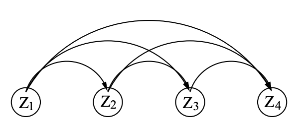
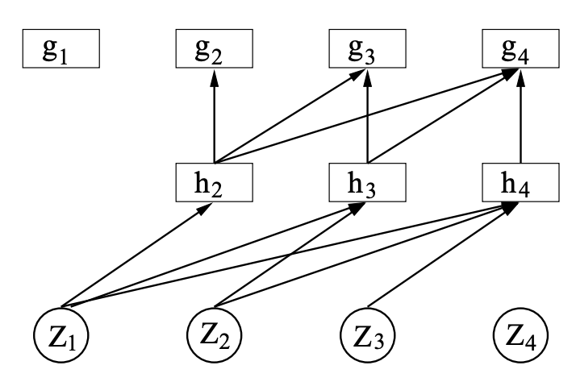

# Reading 3.1: [Modeling High-Dimensional Discrete Data with Multi-Layer Neural Networks](https://www.iro.umontreal.ca/~lisa/pointeurs/bb_2000_nips.pdf)

**作者**：Yoshua Bengio, Samy Bengio
**会议**：NIPS 1999

---

## 目录 (Table of Contents)

1. [论文的动机 (Motivation)](#1-论文的动机-motivation)

   - 1.1. [核心问题](#11-核心问题)
     - 1.1.1. [什么是"维度灾难"？—— 通俗例子](#111-什么是维度灾难--通俗例子)
     - 1.1.2. [为什么是"灾难"？](#112-为什么是灾难)
     - 1.1.3. [本文的解决思路预览](#113-本文的解决思路预览)
   - 1.2. [已有方法的局限](#12-已有方法的局限)
   - 1.3. [与前序工作的联系](#13-与前序工作的联系)
2. [论文的数学基础](#2-论文的数学基础)

   - 2.1. [概率论基础](#21-概率论基础)
     - 2.1.1. [条件概率与联合概率](#211-条件概率与联合概率)
     - 2.1.2. [概率链式法则](#212-概率链式法则)
   - 2.2. [图模型与贝叶斯网络](#22-图模型与贝叶斯网络)
     - 2.2.1. [图模型定义](#221-图模型定义)
     - 2.2.2. [完全连接的左到右图模型](#222-完全连接的左到右图模型)
   - 2.3. [多项分布](#23-多项分布)
   - 2.4. [最大后验估计 (MAP)](#24-最大后验估计-map)
     - 2.4.1. [Dirichlet先验与平滑](#241-dirichlet先验与平滑)
   - 2.5. [Jacobian矩阵与行列式](#25-jacobian矩阵与行列式)
     - 2.5.1. [Jacobian矩阵](#251-jacobian矩阵)
     - 2.5.2. [下三角矩阵的行列式](#252-下三角矩阵的行列式)
3. [论文的主要逻辑](#3-论文的主要逻辑)

   - 3.1. [模型架构](#31-模型架构)
     - 3.1.1. [整体框架与网络结构](#311-整体框架与网络结构)
     - 3.1.2. [参数复杂度分析](#312-参数复杂度分析)
     - 3.1.3. [与LARC的关系](#313-与larc的关系)
   - 3.2. [训练方法](#32-训练方法)
     - 3.2.1. [优化目标](#321-优化目标)
     - 3.2.2. [其他工程细节](#322-其他工程细节)
4. [总结](#3-总结)

   - 4.1. [论文解决的核心问题](#31-论文解决的核心问题)
   - 4.2. [与后续工作的联系](#32-与后续工作的联系)
   - 4.3. [局限与未来方向](#33-局限与未来方向)

---

## 1. 论文的动机 (Motivation)

### 1.1. 核心问题

本论文旨在解决高维离散数据建模中的"维度灾难"（curse of dimensionality）问题。在高维离散数据中，变量可能取值的组合数量呈指数级增长。例如，对于 $n$ 个二值变量，可能的组合数为 $2^n$ ，即使是中等规模的数据集也无法覆盖所有可能的组合。

传统的多项式最大似然模型会对训练集中未出现的组合赋予零概率，这导致模型在测试集上表现极差。简单的平滑方法（如对所有未观察组合赋予相同的非零概率）也无法提供有效的泛化能力。

#### 1.1.1. 什么是"维度灾难"？—— 通俗例子

**例子1：简单的二值问卷调查**

假设你在做一个只有10个问题的调查，每个问题只能回答"是"或"否"（用1和0表示）。

- **可能的组合数**： $2^{10} = 1024$ 种不同的回答方式
- **如果你只收集了100份问卷**：你只观察到了100种组合，还有924种组合你从未见过！
- **问题来了**：当新来一个人，他的回答组合恰好是那924种之一，你的模型该如何估计这种组合出现的概率？

传统的频率统计方法会说："我从没见过这种组合，所以它的概率是0"。但这显然不合理！

**例子2：基因序列分析（论文中的DNA数据集）**

论文用的DNA数据集有**180个二值特征**：

- **理论上的组合数**： $2^{180} \approx 1.5 \times 10^{54}$ （这是一个天文数字！）
- **实际的训练样本数**：只有2000个样本
- **对比**： $2000 \div 10^{54} \approx 0$ （几乎为0）

你能想象吗？宇宙中的原子数量大约是 $10^{80}$ 个，而这里的组合数是 $10^{54}$ 。即使你用地球上所有的计算机收集数据一百年，也不可能见到所有可能的组合！

**例子3：更直观的类比——餐厅菜单**

想象一个餐厅有20道菜，每道菜你可以选择"要"或"不要"：

- **可能的点餐组合**： $2^{20} = 1,048,576$ 种
- **如果餐厅只记录了1000个顾客的点餐记录**：
  - 你只见过1000种点餐方式
  - 还有超过104万种方式你从未见过
- **新顾客来了**：他点了一个独特的组合（比如"只要偶数编号的菜"），你的模型该如何预测这个组合的"合理性"或"出现概率"？

#### 1.1.2. 为什么是"灾难"？

这种现象被称为"灾难"是因为：

1. **数据永远不够**：

   - 变量数量 $n$ 线性增长
   - 组合数量 $2^n$ 指数级爆炸
   - 即使数据量很大，也只能覆盖极小一部分组合
2. **传统方法失效**：

   - **查表法（频率统计）**：对未见过的组合赋予零概率 → 测试集上完全失败
   - **均匀平滑**：给所有未见组合相同的小概率 → 无法区分"合理但未见过"和"完全不合理"的组合
3. **需要智能泛化**：

   - 模型必须从见过的组合中**学习规律**
   - 对未见过的组合做出**合理推断**
   - 例如：如果见过"爱吃披萨+爱吃汉堡"，没见过"爱吃披萨+爱吃热狗"，模型应该能推断后者也是合理的（因为都是快餐）

#### 1.1.3. 本文的解决思路预览

本文用**神经网络**来解决这个问题：

- **不是记住每种组合的概率**（这需要 $2^n$ 个参数）
- **而是学习变量之间的依赖关系**（只需要 $O(n^2)$ 个参数）
- **通过隐藏层捕捉高阶模式**，例如"爱吃披萨的人往往也爱吃其他快餐"

简单来说：不是死记硬背每种情况，而是理解背后的规律！

### 1.2. 已有方法的局限

已有的解决方案主要有两类：

1. **限制依赖关系**：如传统的贝叶斯网络/图模型，通过限制变量之间的依赖关系来减少需要估计的参数数量。但这需要先验知识 (a priori human expert knowledge) 或学习依赖结构。作者提到的参考工作中，限制 $Parents_i$ 仅包含最多1个元素。
2. **近似联合分布的数学形式**：如多项式展开（Rademacher-Walsh展开、multi-binomial模型），使用低阶多项式来近似完整的联合分布。但这些方法只能捕捉低阶（通常是二阶）依赖关系。

这里我们解释下第二类办法。针对 **二值变量** (Binomial Variables, 0 或 1)，以两个变量的情况为例，其联合概率可以表示为：

$$
P(Z_1, Z_2) = w_0 + w_1 Z_1 + w_2 Z_2 + w_{12} Z_1 Z_2
$$

请注意，这就是一个**多项式**。

* 当 $Z_1=0, Z_2=0$ 时: $P = w_0$ (都不发生的概率)
* 当 $Z_1=1, Z_2=0$ 时: $P = w_0 + w_1$
* 当 $Z_1=1, Z_2=1$ 时: $P = w_0 + w_1 + w_2 + w_{12}$

对于 0/1 变量，**任何复杂的概率表，都可以无损地转换成这种“多项式”形式**。

* 如果有 $N$ 个变量，这个多项式最高次项就是 $N$ 次项 $\prod_{i=1}^N Z_i$
* 项的数量是 $2^N$ 个，也就意味着有这么多参数
* 第二类方法就是通过截断近似，忽略高阶项，做到多项式级别的参数数量，只保留二阶项时参数量就是 $O(N^2)$
* 相比之下，本文中的方法没有做截断近似，参数量就是 $O(N^2)$，体现出极大优势

### 1.3. 与前序工作的联系

本文扩展了Frey [4]提出的逻辑自回归贝叶斯网络（Logistic Autoregressive Bayesian Network, LARC）。LARC使用逻辑回归来表示每个条件分布：

$$
P(Z_i = 1|Z_1...Z_{i-1}) = \frac{1}{1 + \exp(-w_0 - \sum_{j \lt i} w_j Z_j)}=\sigma\left(w_0+\sum_{j \lt i}w_jZ_j\right)
$$

其中 $\sigma$是sigmoid函数。这只能捕捉一阶依赖关系（因为没有二阶以上的项）。本文的核心创新是引入隐藏层，允许模型捕捉高阶依赖关系，同时保持 $O(N^2)$ 的参数复杂度。

---

## 2. 论文的数学基础

本节介绍论文涉及的高等数学基础知识，不涉及论文的具体应用。

### 2.1. 概率论基础

#### 2.1.1. 条件概率与联合概率

对于随机变量 $X$ 和 $Y$ ，条件概率定义为：

$$
P(X|Y) = \frac{P(X, Y)}{P(Y)}
$$

其中 $P(X, Y)$ 是联合概率分布， $P(Y)$ 是边缘概率。

#### 2.1.2. 概率链式法则

对于 $n$ 个随机变量 $Z_1, Z_2, ..., Z_n$ ，联合概率可以分解为：

$$
P(Z_1, Z_2, ..., Z_n) = P(Z_1) \cdot P(Z_2|Z_1) \cdot P(Z_3|Z_1, Z_2) \cdots P(Z_n|Z_1, ..., Z_{n-1})
$$

更紧凑地表示为：

$$
P(Z_1, ..., Z_n) = \prod_{i=1}^{n} P(Z_i | Z_1, ..., Z_{i-1})
$$

这是自回归模型的理论基础。

### 2.2. 图模型与贝叶斯网络

#### 2.2.1. 图模型定义

图模型（Graphical Model）或贝叶斯网络用有向无环图（DAG）表示随机变量之间的条件独立性。对于变量 $Z_1, ..., Z_n$ ，联合分布表示为：

$$
P(Z_1, ..., Z_n) = \prod_{i=1}^{n} P(Z_i | \text{Parents}_i)
$$

其中 $\text{Parents}_i$ 是图中直接指向 $Z_i$ 的节点集合。在Bengio发表这篇paper的年代，图模型是学术界的主流。

#### 2.2.2. 完全连接的左到右图模型

当采用完全连接的"左到右"结构时, $Z_i$的parents是 $\{Z_1, ..., Z_{i-1}\}$，此时联合分布等价于链式法则的完全展开。Bengio在这里完成了图模型与AR模型的关联。



### 2.3. 多项分布

对于离散随机变量 $Z$ ，若其可取 $k$ 个可能的值 $\{1, 2, ..., k\}$ ，多项分布（Multinomial Distribution）定义为：

$$
P(Z = i) = p_i, \quad \sum_{i=1}^{k} p_i = 1
$$

**注意**：这里的 $k$ 是**单个变量**的取值数（如骰子有6个面, $k=6$），不要与1.1节中 $n$ 个变量的联合组合数 $2^n$ 混淆——多项分布本身不会引起维度灾难。

在神经网络中，通常使用softmax函数来保证输出满足概率约束：

$$
p_i = \frac{\exp(a_i)}{\sum_{j=1}^{k} \exp(a_j)}
$$

其中 $a_i$ 是网络的未归一化输出（logits）。

### 2.4. 最大后验估计 (MAP)

给定观测数据 $D$ 和模型参数 $\theta$ ，最大后验估计寻找使后验概率最大的参数：

$$
\hat{\theta}_{MAP} = \arg\max_{\theta} P(\theta | D) = \arg\max_{\theta} P(D | \theta) P(\theta)
$$

在对数空间中：

$$
\hat{\theta}_{MAP} = \arg\max_{\theta} [\log P(D | \theta) + \log P(\theta)]
$$

其中 $\log P(D | \theta)$ 是对数似然， $\log P(\theta)$ 是对数先验。

#### 2.4.1. Dirichlet先验与平滑

对于 $k$ 个类别的多项分布参数 $\theta = (\theta_1, ..., \theta_k)$ （满足 $\sum_i \theta_i = 1$ ），Dirichlet先验定义为：

$$
P(\theta) = \text{Dir}(\alpha_1, ..., \alpha_k) \propto \prod_{i=1}^{k} \theta_i^{\alpha_i - 1}
$$

其中 $\alpha_i > 0$ 是超参数（伪计数）。假设观测数据中类别 $i$ 出现了 $n_i$ 次，总样本数 $N = \sum_i n_i$ 。

Dirichlet分布是多项分布参数的共轭先验。这里**共轭**指的是代数结构的封闭性Closure，由于后验=似然*先验，多项分布的似然 $P(X|\theta) \propto \theta_1^{x_1} \cdot \theta_2^{x_2} \cdots \theta_k^{x_k}$，在Dirichlet先验下得到的后验也是同样的形式，只是指数变了。

- **最大似然估计（MLE）**：

$$
\hat{\theta}_i^{MLE} = \frac{n_i}{N}
$$

这意味着没有见过的组合的概率为0.

- **MAP估计（使用Dirichlet先验）**：

根据MAP的定义：

$$
\hat{\theta}^{MAP} = \arg\max_{\theta} [\log P(D | \theta) + \log P(\theta)]
$$

代入似然和Dirichlet先验：

$$
\hat{\theta}^{MAP} = \arg\max_{\theta} \left[ \sum_i n_i \log \theta_i + \sum_i (\alpha_i - 1) \log \theta_i \right]
$$

合并同类项：

$$
\arg\max_{\theta} \sum_i (n_i + \alpha_i - 1) \log \theta_i
$$

**求解过程**（使用拉格朗日乘数法）：

由于约束条件 $\sum_i \theta_i = 1$，构造拉格朗日函数：

$$
\mathcal{L}(\theta, \lambda) = \sum_i (n_i + \alpha_i - 1) \log \theta_i - \lambda \left( \sum_i \theta_i - 1 \right)
$$

对 $\theta_i$ 求偏导并令其为0：

$$
\frac{\partial \mathcal{L}}{\partial \theta_i} = \frac{n_i + \alpha_i - 1}{\theta_i} - \lambda = 0
$$

解得：

$$
\theta_i = \frac{n_i + \alpha_i - 1}{\lambda}
$$

将此代入约束条件 $\sum_i \theta_i = 1$：

$$
\sum_i \frac{n_i + \alpha_i - 1}{\lambda} = 1 \quad \Rightarrow \quad \lambda = \sum_i (n_i + \alpha_i - 1) = N + \sum_i (\alpha_i - 1)
$$

因此：

$$
\hat{\theta}_i^{MAP} = \frac{n_i + \alpha_i - 1}{N + \sum_j (\alpha_j - 1)}
$$

**近似形式**：当所有 $\alpha_i$ 都不太小（如 $\alpha_i = 1$ 或更大）时，可以忽略"-1"项，得到：

$$
\hat{\theta}_i^{MAP} \approx \frac{n_i + \alpha_i}{N + \sum_j \alpha_j}
$$

**平滑的直观理解**：

- 相当于在实际计数 $n_i$ 上**加上伪计数** $\alpha_i$
- 当 $\alpha_i = 1$ （均匀先验）时，给每个类别"额外增加1次观测"，这就是**加1平滑**（Laplace平滑）
- 即使 $n_i = 0$ （训练集中未见过），MAP估计仍给出非零概率 $\frac{\alpha_i}{N + \sum_j \alpha_j}$
- 当 $\alpha_i$均为0时，就得到了上述MLE的解，对应概率的频率解释

**例子**：投掷硬币

- 观测: 10次正面，0次反面
- MLE: $P(\text{正}) = 1.0, P(\text{反}) = 0$（不合理！）
- MAP ($\alpha_1 = \alpha_2 = 1$): $P(\text{正}) = \frac{10+1}{10+0+2} = \frac{11}{12} \approx 0.917, P(\text{反}) = \frac{0+1}{12} = \frac{1}{12} \approx 0.083$

这就是Dirichlet先验提供的"平滑"作用：防止零概率，使模型对未见数据更鲁棒。

### 2.5. Jacobian矩阵与行列式

#### 2.5.1. Jacobian矩阵

对于映射 $f: \mathbb{R}^n \to \mathbb{R}^m$ ， $f(x) = (f_1(x), ..., f_m(x))$ ，Jacobian矩阵定义为：

$$
J = \begin{bmatrix}
\frac{\partial f_1}{\partial x_1} & \cdots & \frac{\partial f_1}{\partial x_n} \\
\vdots & \ddots & \vdots \\
\frac{\partial f_m}{\partial x_1} & \cdots & \frac{\partial f_m}{\partial x_n}
\end{bmatrix}
$$

#### 2.5.2. 下三角矩阵的行列式

下三角矩阵 $L$ 的形式为：

$$
L = \begin{bmatrix}
l_{11} & 0 & \cdots & 0 \\
l_{21} & l_{22} & \cdots & 0 \\
\vdots & \vdots & \ddots & \vdots \\
l_{n1} & l_{n2} & \cdots & l_{nn}
\end{bmatrix}
$$

其行列式等于对角线元素的乘积: $\det(L) = \prod_{i=1}^{n} l_{ii}$

这一性质在自回归模型中具有重要意义，因为自回归结构天然产生下三角Jacobian矩阵。

---

## 3. 论文的主要逻辑

### 3.1. 模型架构

#### 3.1.1. 整体框架与网络结构



本文提出的神经网络架构将图模型的思想与神经网络的表达能力相结合。使用神经网络参数化联合概率函数的对数，并通过链式法则分解为条件对数概率之和：

$$
\begin{aligned} f_\theta(z_1, ..., z_n) &= \log P_\theta(Z_1 = z_1, ..., Z_n = z_n)  \\
&=\sum_{i=1}^{n} \log P(Z_i = z_i | g_i(z_1, ..., z_{i-1})) \end{aligned}
$$

**网络结构**：站在2026年的视角看，这就是一个简单的**三层MLP**：

- **输入层**: $Z_i$ 的one-hot编码（二值变量用单个节点，多项变量用one-hot向量）
- **隐藏层**: tanh激活函数
- **输出层**: softmax激活函数，输出条件概率分布 $g_i = P(Z_i | Z_1, ..., Z_{i-1})$

**核心创新：因果掩码（Causal Masking）**

论文的关键贡献是引入**因果约束**，确保自回归特性：

1. **隐藏层约束**：第 $j$ 组隐藏单元 $h_j$ 只接收来自 $k \lt j$ 的输入（即 $z_1, ..., z_{j-1}$）
2. **输出层约束**：第 $i$ 组输出 $g_i$ 只依赖于 $h_1, ..., h_i$（进而只依赖于 $z_1, ..., z_{i-1}$）

数学上表示为：

$$
\begin{aligned}h_{j,j'} &= \tanh(c_{j,j'} + \sum_{k\lt j} \sum_{k'=1}^{n_k} v_{j,j',k,k'} \cdot z_{k,k'}) & \text{中间层的激活值} \\
g'_{i,i'} &= b_{i,i'} + \sum_{j \leq i} \sum_{j'=1}^{m_j} w_{i,i',j,j'} \cdot h_{j,j'} & \text{输出层的logits} \\
g_{i,i'} &= \frac{\exp(g'_{i,i'})}{\sum_{i''} \exp(g'_{i,i''})} & \text{softmax输出}
\end{aligned}
$$

这种掩码连接保证了 $g_i$ 只依赖于过去的变量，实现了自回归模型的因果性。

**两种推理场景**：

1. **采样/生成任务**（自回归逐步生成）：

   - 初始输入空向量 → 采样 $Z_1 \sim P(Z_1)$
   - 输入 $z_1$ → 采样 $Z_2 \sim P(Z_2|z_1)$
   - 输入 $z_1, z_2$ → 采样 $Z_3 \sim P(Z_3|z_1, z_2)$
   - ⋯ 最终生成完整样本 $(z_1, ..., z_n)$
2. **概率估计/打分任务**（一次性前向传播）：

   - 输入完整序列 $(z_1, ..., z_n)$
   - 计算对数似然: $\log P(z) = \sum_{i=1}^{n} \log(g_i)$
   - 用于异常检测、分类等任务（**论文主要场景**）

**PyTorch实现**：

下面是一个简化的PyTorch实现，展示核心思想（假设所有变量都是二值的，便于演示）：

```python
import torch
import torch.nn as nn

class AutoregressiveMLP(nn.Module):
    """
    Bengio 1999年提出的自回归神经网络
    - 输入：n个二值变量的序列
    - 输出：每个位置的条件概率分布
    """
    def __init__(self, n_vars, hidden_size):
        super().__init__()
        self.n_vars = n_vars
  
        # 为每个变量创建独立的隐藏层和输出层
        self.hidden_layers = nn.ModuleList([
            nn.Linear(i, hidden_size) for i in range(n_vars)
        ])
        self.output_layers = nn.ModuleList([
            nn.Linear(hidden_size, 2) for _ in range(n_vars)  # 2个类别（0/1）
        ])
  
    def forward(self, z):
        """
        Args:
            z: [batch_size, n_vars] 输入序列
        Returns:
            log_probs: [batch_size, n_vars, 2] 每个位置的对数概率
        """
        batch_size = z.size(0)
        log_probs = []
  
        for i in range(self.n_vars):
            if i == 0:
                # 第一个变量：无条件分布
                h = torch.zeros(batch_size, self.hidden_layers[0].in_features)
            else:
                # 后续变量：只依赖于前面的变量（因果掩码）
                h = torch.tanh(self.hidden_layers[i](z[:, :i]))
  
            # 输出层：softmax得到条件概率
            logits = self.output_layers[i](h)
            log_prob = torch.log_softmax(logits, dim=-1)
            log_probs.append(log_prob)
  
        return torch.stack(log_probs, dim=1)  # [batch_size, n_vars, 2]
  
    def sample(self, batch_size=1):
        """自回归采样生成新样本"""
        samples = torch.zeros(batch_size, self.n_vars)
  
        for i in range(self.n_vars):
            if i == 0:
                h = torch.zeros(batch_size, self.hidden_layers[0].in_features)
            else:
                h = torch.tanh(self.hidden_layers[i](samples[:, :i]))
  
            logits = self.output_layers[i](h)
            probs = torch.softmax(logits, dim=-1)
            samples[:, i] = torch.multinomial(probs, 1).squeeze()
  
        return samples
  
    def log_likelihood(self, z):
        """计算样本的对数似然"""
        log_probs = self.forward(z)  # [batch_size, n_vars, 2]
        # 选择每个位置实际取值的概率
        ll = torch.gather(log_probs, 2, z.long().unsqueeze(-1)).squeeze(-1)
        return ll.sum(dim=1)  # [batch_size]

# 使用示例
model = AutoregressiveMLP(n_vars=10, hidden_size=50)
z = torch.randint(0, 2, (32, 10)).float()  # 批量大小32，10个二值变量

# 计算对数似然（用于训练/异常检测）
log_likelihood = model.log_likelihood(z)
loss = -log_likelihood.mean()  # 负对数似然损失

# 生成新样本
new_samples = model.sample(batch_size=5)
print(f"Generated samples shape: {new_samples.shape}")
```

**代码说明**：

1. **因果掩码的实现**：通过 `z[:, :i]` 只取前 $i-1$ 个变量作为输入，天然保证因果性
2. **与现代架构的对比**：
   - 论文用的是**位置相关的权重矩阵**（每个位置独立的参数）
   - 现代Transformer用的是**位置无关的共享权重 + 位置编码**
   - 本质思想一致：都是通过掩码实现自回归
3. **1999年的局限**：
   - 固定变量数 $n$（context长度固定）
   - 参数不共享（每个位置独立），导致参数量大
   - 没有注意力机制（Attention）

这个模型是现代自回归架构（如GPT、PixelCNN）的鼻祖，核心思想一脉相承！

#### 3.1.2. 参数复杂度分析

模型的自由参数数量为：

- 隐藏层权重： $O(n^2 H)$ ，其中 $H = \max_i m_i$，所有中间层hidden units数量的最大值
- 输出层权重： $O(n^2 H)$
- 总计： $O(n^2 H)$

这与multi-binomial模型的 $O(n^2)$ 复杂度相当，但通过增加 $H$ 可以捕捉更高阶的依赖关系。

**神经网络的"尚方宝剑"：通用近似定理**

论文原文提到："*However, as H is increased, representation theorems for neural networks suggest that we should be able to approximate with arbitrary precision the true joint distribution.*"（随着 $H$ 增大，神经网络的表示定理表明我们能够以任意精度逼近真实的联合分布。）

这里指的是**通用近似定理（Universal Approximation Theorem）**，它是神经网络的理论基石，也是Bengio在1999年向学术界推销神经网络时的核心论据。

**定理陈述（Cybenko 1989, Hornik 1991）**：

对于任意连续函数 $f: [0,1]^d \to \mathbb{R}$ 和任意精度 $\epsilon > 0$，存在一个**单隐藏层**神经网络：

$$
\hat{f}(x) = \sum_{i=1}^{H} w_i \sigma(v_i^T x + b_i)
$$

使得对所有 $x \in [0,1]^d$ 都有 $|f(x) - \hat{f}(x)| \lt\epsilon$。

其中 $\sigma$ 是非线性激活函数（如sigmoid、tanh）, $H$ 是隐藏单元数量（可能非常大）。

**直观理解**：

1. **任意函数都可以用"分段线性"逼近**：

   - 想象你要画一条复杂的曲线
   - 你可以用很多很多条短直线段拼接（折线逼近）
   - 隐藏单元越多($H$ 越大)，折线段越多，逼近越精确
2. **神经网络的"隐藏单元=基函数"**：

   - 每个隐藏单元 $\sigma(v_i^T x + b_i)$ 相当于一个"特征探测器"
   - 输出层的权重 $w_i$ 将这些特征线性组合
   - 足够多的特征探测器($H \to \infty$)可以表示任何函数
3. **对本文的意义**：

   - Multi-binomial模型只能捕捉二阶依赖($Z_i Z_j$ 项)
   - 如果真实分布需要高阶项（如 $Z_1 Z_2 Z_3$ 三阶依赖），multi-binomial无能为力
   - 神经网络通过增加 $H$，理论上可以逼近包含任意高阶依赖的真实联合分布 $P(Z_1, ..., Z_n)$

**历史背景的趣味**：

读1999年的论文确实有种"考古"的乐趣——你能感受到Bengio在小心翼翼地向当时主流的图模型社区（Graphical Models, Bayesian Networks）推销神经网络：

- **1990年代的学术氛围**：图模型是主流，神经网络被认为"黑箱、慢、难训练"
- **Bengio的论证策略**：
  1. 先承认图模型的优点（概率解释清晰、有理论基础）
  2. 然后说："我的模型**也是**图模型啊！"（完全连接的左到右贝叶斯网络）
  3. 接着亮出**通用近似定理**："而且神经网络理论上能逼近任何分布！"
  4. 最后用实验证明："你看，真的比你们的模型好！"
- **对比2026年**：现在Transformer已经是"自古以来的标准架构"，大家默认神经网络就是最强的，反而是概率图模型需要费力解释自己的优势😂

**通用近似定理的"陷阱"**：

虽然这个定理是神经网络的"理论保证"，但它也有局限：

1. **只保证存在性，不保证可学习性**：

   - 定理说"存在一个网络能逼近"，但没说你能不能通过梯度下降找到它
   - 可能需要天文数字的隐藏单元 $H$（论文中也承认"may be astronomically large"）
2. **样本复杂度**：

   - 即使网络能表示真实分布，你也需要足够的训练数据
   - 参数越多($H$ 越大)，需要的数据也越多（仍然受维度灾难影响）
3. **优化困难**：

   - 1999年的训练技术远不如现在（没有Adam、BatchNorm、Residual Connection等）
   - 这也是Bengio需要费力证明"神经网络真的能训练好"的原因

**Bengio的远见**：

回头看，Bengio在这篇论文中的坚持是有先见之明的：

- 他相信神经网络的表达能力终将胜过手工设计的模型
- 虽然1999年计算资源有限（论文中还在讨论剪枝来减少计算量），但他押注未来算力会提升
- 20多年后的今天，Transformer（本质上也是参数共享的自回归模型）统治了AI，证明了他的判断

这种"耐心推销"的姿态确实很有趣——就像在说："我知道现在神经网络又慢又难用，但数学保证它能行，你们信我！" 😄

#### 3.1.3. 与LARC的关系

当 $H = 0$ （没有隐藏单元）且只有直接的输入到输出连接时，模型退化为Frey的LARC模型。本文的贡献在于引入隐藏层来增强表达能力。

### 3.2. 训练方法

#### 3.2.1. 优化目标

训练目标是最大化对数似然：

$$
\mathcal{L}(\theta) = \sum_{i=1}^{N} f_\theta(x^{(i)}_1, ..., x^{(i)}_n)
$$

其中 $N$ 是训练样本数量。

#### 3.2.2. 其他工程细节

这里需要考虑论文的时代背景，1999年并没有今天这么好用的GPU集群，训练框架和方法也比现在落后很多，**这里的大部分工程细节今天已经没有意义了，可以忽略。**

##### 3.2.2.1. 梯度优化

论文使用梯度优化方法：

1. **共轭梯度法**（Conjugate Gradient）：适用于批量优化
2. **随机梯度下降**（Stochastic Gradient Descent, SGD）：在线更新参数

由于模型没有隐藏随机变量，似然函数可以直接计算和求导，训练过程简单直接。

##### 3.2.2.2. 正则化：Weight Decay

受Frey [4]分析的启发，论文使用weight decay正则化，惩罚项与输入到某个神经元的权重数量成比例。具体形式为：

$$
\mathcal{L}_{reg}(\theta) = \mathcal{L}(\theta) - \lambda \sum_{i} \frac{1}{n_i} \|w_i\|^2
$$

其中 $n_i$ 是第 $i$ 个神经元的输入权重数量， $\lambda$ 是正则化系数。

##### 3.2.2.3. 网络剪枝

为了减少参数数量并提高泛化能力，论文提出使用非参数统计检验来剪枝网络连接。

**Kolmogorov-Smirnov统计量**：对于变量 $X$ 和 $Y$ ，K-S统计量定义为：

$$
s = \sqrt{l} \sup_{i} |P(X \leq X_i, Y \leq Y_i) - P(X \leq X_i) P(Y \leq Y_i)|
$$

其中 $l$ 是样本数量, $P$ 是经验分布。如果两个变量独立, $s$显然为0，所以 $s$越大，两个变量的关系越需要关注。这里的剪枝策略就是计算所有变量对 $(Z_i, Z_j)$ 的K-S统计量，按统计量值排序，选择统计量高于阈值的变量，只保留这些依赖关系对应的网络连接。

## 4. 总结

### 4.1. 论文解决的核心问题

本文提出了一种新的神经网络架构，成功解决了高维离散数据建模中的维度灾难问题。通过以下创新：

1. **参数共享**：通过隐藏层将不同条件分布的参数绑定（tied），将参数复杂度从指数级降低到 $O(n^2)$
2. **灵活表达**：相比多项式展开（如multi-binomial），神经网络可以通过增加隐藏单元数量 $H$ 来捕捉任意高阶依赖
3. **简单训练**：无隐藏随机变量，可直接使用梯度优化，无需复杂的推断算法
4. **有效剪枝**：通过非参数统计检验去除冗余连接，进一步提升泛化能力

### 4.2. 与后续工作的联系

本文在自回归模型（Autoregressive Models）的发展中具有承前启后的重要地位：

**承前**：

- 扩展了Frey的LARC模型，从一阶逻辑回归扩展到多层神经网络
- 继承了图模型的概率分解思想，但用神经网络增强了表达能力

**启后**：

- 为后续的神经自回归模型（如NADE、PixelRNN）奠定了理论和架构基础
- 本文提出的"通过掩码连接保证因果顺序"的思想直接影响了：
  - **NADE**（Neural Autoregressive Distribution Estimator）：Larochelle & Murray 2011
  - **PixelRNN/PixelCNN**（Van den Oord et al. 2016）：将相同思想应用于图像生成
  - **WaveNet**：将自回归模型应用于音频生成
- 证明了离散分布建模（而非连续密度估计）的有效性，这一思想被PixelRNN等模型继承

**在本次Reading的脉络中**：

- 第一篇论文（本文）：提出神经自回归模型的基本架构和训练方法
- 第二篇论文（PixelRNN）：将自回归思想扩展到图像这样的高维空间数据，引入2D LSTM和掩码卷积
- 第三篇论文（IAF）：将自回归变换的"逆"用于变分推断，展示了自回归结构在生成模型中的另一种应用

### 4.3. 局限与未来方向

论文也指出了一些局限性和未来研究方向：

1. **边缘化困难**：计算边缘概率需要对所有可能的变量取值求和，计算量大
2. **变量顺序**：模型性能依赖于变量顺序，但论文没有系统研究如何选择最优顺序
3. **剪枝策略**：使用的成对依赖性检验是启发式的，可能忽略高阶依赖关系
4. **缺失数据**：虽然论文提到可以处理缺失数据，但没有详细实验验证

这些问题在后续的研究中逐步得到解决和改进。

---

**参考文献**：

- [1] R.R. Bahadur. A representation of the joint distribution of responses to n dichotomous items. Studies in Item Analysis and Prediction, 1961.
- [2] C.K. Chow. A recognition method using neighbor dependence. IRE Trans. Elec. Comp., 1962.
- [3] R.O. Duda and P.E. Hart. Pattern Classification and Scene Analysis. Wiley, 1973.
- [4] B. Frey. Graphical models for machine learning and digital communication. MIT Press, 1998.
- [5] S.L. Lauritzen. The EM algorithm for graphical association models with missing data. Computational Statistics and Data Analysis, 1995.
- [6] J. Pearl. Probabilistic Reasoning in Intelligent Systems. Morgan Kaufmann, 1988.