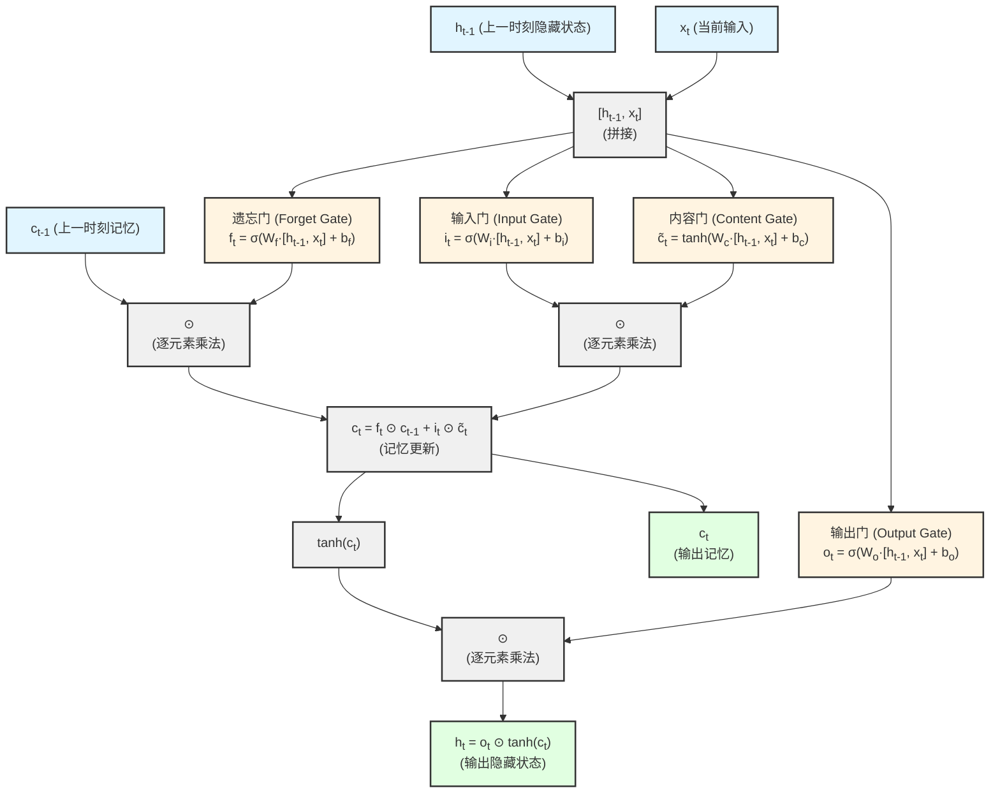
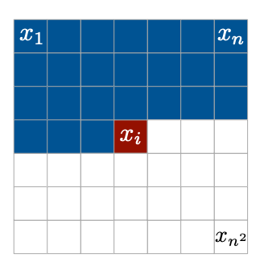
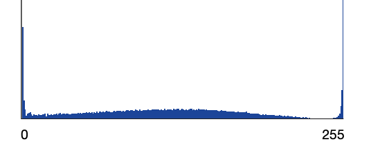
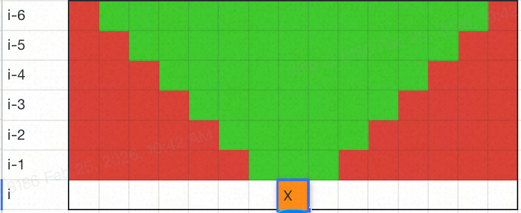
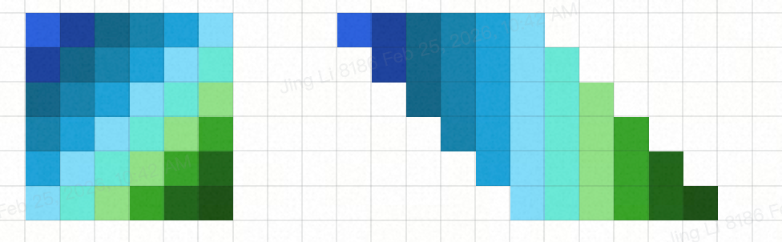
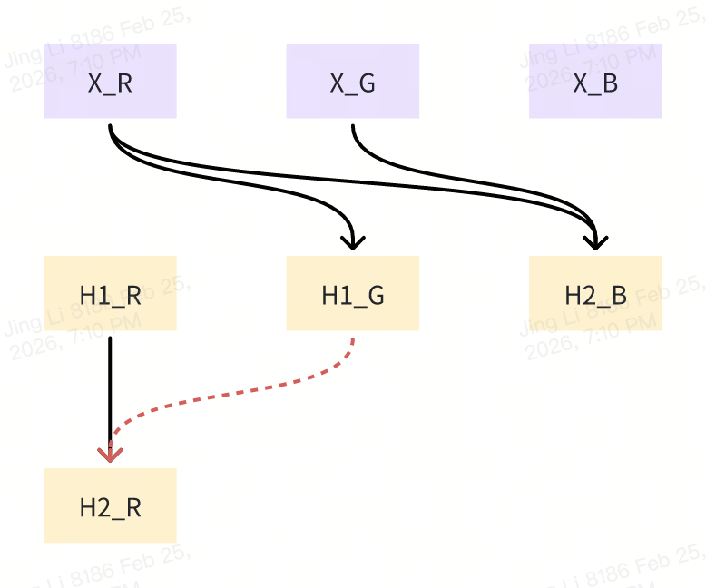
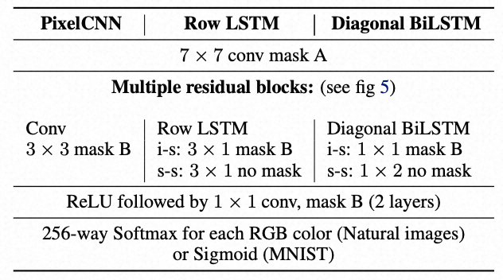
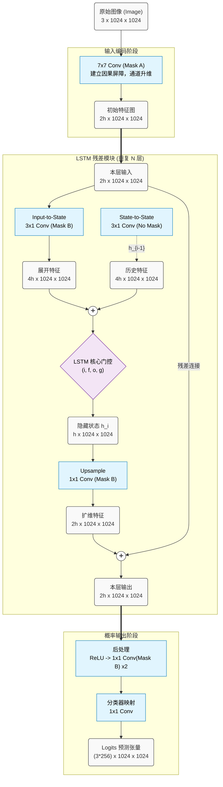

# MIT 6.S978 Reading 3.2 [Pixel Recurrent Neural Networks (2016, ICML)](https://arxiv.org/pdf/1601.06759)

## 1. 论文的动机 (Motivation)

### 1.1 生成式图像建模的挑战

- 自然图像建模是无监督学习中的核心问题
- 图像是高维且高度结构化的数据
- 需要一个既可表达、又可计算的模型
- 传统VAE等隐变量模型存在不可解的推断步骤

### 1.2 将图像建模问题转化为序列问题

- 通过将联合分布转化为条件分布的乘积来实现可计算性
- 自回归模型(如NADE, FVSBN)采用了这种方法
- 问题转化为：学习预测下一个像素，给定所有之前生成的像素

### 1.3 与Bengio 1999论文的联系

- **延续思想**：Bengio 1999提出用神经网络建模高维离散数据的条件分布： $P(Z_1...Z_n) = \prod_{i=1}^{n} P(Z_i|Z_1...Z_{i-1})$
- **应用到图像**：PixelRNN将这个思想应用到图像像素建模，像素值也是离散的(0-255)
- **架构升级**：从全连接网络升级到二维LSTM，更适合空间数据
- **共同点**：都使用神经网络来表示条件分布，都通过共享参数来处理维度爆炸问题

## 2. 论文的数学基础

### 2.1 自回归模型 (Autoregressive Models)

自回归模型将联合概率分解为条件概率的乘积。对于序列 $y = \{y_i\}_{i=1}^{D}$ ，有：

$$
p(y) = \prod_{i=1}^{D} p(y_i | y_1, ..., y_{i-1})
$$

每个 $y_i$ 只依赖于之前的元素。这种因果结构保证了模型的可计算性。

### 2.2 LSTM (Long Short-Term Memory) 的数学原理

LSTM通过门控机制处理长期依赖。标准LSTM单元包含：

**输入变量**：

- $x_t$：当前时刻的输入。在PixelRNN中，$x_t$ 不是原始像素值，而是通过 **input-to-state卷积** ($k \times 1$ 卷积核)处理后的特征向量。这个纵向卷积捕获当前位置**上方**的空间依赖关系（三角形感受野的垂直部分），而同一行**左侧**像素的依赖则通过LSTM的递归连接（$h_{t-1}, c_{t-1}$）来传递。
- $h_{t-1}$：上一时刻的隐藏状态（短期记忆），对应同一行左侧一个位置的输出，携带左侧像素的信息
- $c_{t-1}$：上一时刻的细胞状态（长期记忆），对应同一行左侧一个位置的记忆，携带左侧像素的长期依赖

**四个门**（都基于 $[h_{t-1}, x_t]$ 计算，对应四组参数 $W, b$）：

- **遗忘门** (Forget gate)： $f_t = \sigma(W_f \cdot [h_{t-1}, x_t] + b_f)$ （决定丢弃多少旧记忆）
- **输入门** (Input gate)： $i_t = \sigma(W_i \cdot [h_{t-1}, x_t] + b_i)$ （决定接受多少新信息）
- **输出门** (Output gate)： $o_t = \sigma(W_o \cdot [h_{t-1}, x_t] + b_o)$ （决定输出多少记忆）
- **内容门** (Content gate)： $\tilde{c}_t = \tanh(W_c \cdot [h_{t-1}, x_t] + b_c)$ （生成候选的新信息）

**记忆更新过程**：

1. **生成候选记忆** $\tilde{c}_t$ （通过内容门计算新信息）
2. **细胞状态更新** $c_t = f_t \odot c_{t-1} + i_t \odot \tilde{c}_t$ （保留部分旧记忆 + 加入部分新记忆）
3. **隐藏状态输出** $h_t = o_t \odot \tanh(c_t)$ （基于更新后的记忆生成输出）

**输出变量**：

- $h_t$：当前时刻的隐藏状态（传递给下一时刻和当前层输出）
- $c_t$：当前时刻的细胞状态（传递给下一时刻，仅在LSTM内部流动）

其中 $\sigma$ 是sigmoid函数（输出0-1，作为门控比例）， $\odot$ 表示逐元素乘法。

**为什么 $c$ 是"长期记忆"，$h$ 是"短期记忆"？**

这种区别体现在网络的信息流动设计上：

1. **细胞状态 $c_t$ 的"长期"特性**：

   - **直通路径**：$c_t = f_t \odot c_{t-1} + i_t \odot \tilde{c}_t$，旧记忆 $c_{t-1}$ 通过简单的逐元素乘法直接流入 $c_t$
   - **梯度通畅**：反向传播时梯度可以近乎无损地通过这条路径传播（只要遗忘门 $f_t$ 接近1）
   - **选择性保留**：遗忘门 $f_t$ 控制保留多少旧记忆，可以让重要信息长期保存（例如图像中的全局结构信息）
2. **隐藏状态 $h_t$ 的"短期"特性**：

   - **非线性变换**：$h_t = o_t \odot \tanh(c_t)$，经过tanh激活后再被输出门过滤
   - **每步更新**：$h_t$ 每个时刻都会被完全重新计算，反映当前时刻的即时状态
   - **对外接口**：$h_t$ 被用于当前时刻的预测和传递给下一时刻的输入，携带"当前最需要的信息"
3. **对比普通RNN**：

   - 普通RNN：$h_t = \tanh(W_h h_{t-1} + W_x x_t)$，信息每步都经过非线性变换，容易**梯度消失**
   - LSTM：$c_t$ 提供了一条**跳过非线性变换的直通路径**，使得梯度可以流经数百个时间步而不衰减

**直观比喻**：

- $c_t$ 像是"笔记本"（长期存储），记录所有重要信息，遗忘门决定擦除什么
- $h_t$ 像是"工作台"（短期工作记忆），基于笔记本内容生成当前需要的输出



### 2.3 二维卷积与因果卷积

#### 2.3.1 什么是二维卷积

这里的二维卷积就是CNN中的卷积操作，"二维"指的是**在二维空间(图像的高度和宽度方向)上进行卷积**。

**标准2D卷积的完整形式**：对于输入图像 $X$ 和卷积核 $K$ (大小为 $k_h \times k_w$)，输出为：

$$
(K * X)_{i,j} = \sum_{m=0}^{k_h-1} \sum_{n=0}^{k_w-1} K_{m,n} \cdot X_{i-m, j-n}
$$

其中：

- $(i,j)$ 是输出位置的坐标(第 $i$ 行，第 $j$ 列)
- $(m,n)$ 是卷积核内的相对位置
- $X_{i-m, j-n}$ 是输入图像在对应位置的像素值

#### 2.3.2 二维卷积可视化

对于图像上的3×3卷积：

```
输入图像 X:              卷积核 K (3×3):
┌─────────────┐         ┌─────────────┐
│ • • • • • • │         │ k₀₀ k₀₁ k₀₂ │
│ • • • • • • │         │ k₁₀ k₁₁ k₁₂ │
│ • • ⊗ • • • │  <===   │ k₂₀ k₂₁ k₂₂ │
│ • • • • • • │         └─────────────┘
│ • • • • • • │
└─────────────┘
    ⊗ 表示当前计算位置 (i,j)
```

计算位置(i,j)的输出：

$$
y_{i,j} = \sum_{m=0}^{2} \sum_{n=0}^{2} K_{m,n} \cdot X_{i-m, j-n}
$$

卷积核会"覆盖"当前位置及其左上方的像素。

#### 2.3.3 因果卷积 (Causal Convolution)

**因果卷积**：确保输出 $y_i$ 只依赖于 $x_1, ..., x_{i-1}$ ，**不依赖于当前和未来的像素** $x_i, ..., x_n$ 。

在图像中实现因果性：

- 当前像素只能看到**左边**和**上面**的像素
- 不能看到**右边**和**下面**的像素
- 这需要通过**Masked Convolution**(遮罩卷积)实现，即将卷积核中对应"未来"位置的权重置零

**示例：** 对于预测位置(i,j)的像素，标准3×3卷积核需要mask成：

```
✓ ✓ ✓   (上一行：全部可见)
✓ ✗ ✗   (当前行：只能看到左边，不能看到当前和右边)
✗ ✗ ✗   (下一行：全部不可见)
```

这就是PixelCNN中**Mask A**和**Mask B**的基础原理。

### 2.4 Jacobian 矩阵的下三角结构

对于自回归变换 $y_i = f_i(y_1, ..., y_{i-1})$ ，Jacobian矩阵 $J = \frac{\partial y}{\partial x}$ 是下三角矩阵：

$$
J_{ij} = \frac{\partial y_i}{\partial x_j} = 0, \quad \text{当} \, j > i
$$

下三角矩阵的行列式等于对角元素的乘积：

$$
\det(J) = \prod_{i=1}^{n} J_{ii}
$$

这使得 log-determinant 的计算变得高效： $\log|\det(J)| = \sum_{i=1}^{n} \log|J_{ii}|$

### 2.5 残差连接 (Residual Connections)

残差连接通过跳跃连接缓解梯度消失问题：

$$
h_{l+1} = h_l + \mathcal{F}(h_l)
$$

其中 $\mathcal{F}$ 是残差函数(如卷积层)。梯度回传时：

$$
\frac{\partial \mathcal{L}}{\partial h_l} = \frac{\partial \mathcal{L}}{\partial h_{l+1}} \left(1 + \frac{\partial \mathcal{F}(h_l)}{\partial h_l}\right)
$$

即使 $\frac{\partial \mathcal{F}}{\partial h_l}$ 很小，梯度仍可通过恒等映射流动。

## 3. 论文的主要逻辑

### 3.1 像素生成的自回归分解

#### 3.1.1 联合分布分解

将 $n \times n$ 图像 $x$ 展开为一维序列 $x_1, ..., x_{n^2}$ (逐行扫描)，联合分布为：

$$
p(x) = \prod_{i=1}^{n^2} p(x_i | x_1, ..., x_{i-1})
$$

生成过程逐行、逐像素进行，严格按照从左到右、从上到下的顺序。



#### 3.1.2 RGB通道的条件依赖

每个像素 $x_i$ 由三个颜色通道(R, G, B)决定，它们之间也存在条件依赖：

$$
p(x_i | x_{\lt i}) = p(x_{i,R} | x_{\lt i}) \cdot p(x_{i,G} | x_{\lt i}, x_{i,R}) \cdot p(x_{i,B} | x_{\lt i}, x_{i,R}, x_{i,G})
$$

这意味着：

- 红色通道只依赖于之前的所有像素
- 绿色通道还依赖于当前像素的红色通道
- 蓝色通道还依赖于当前像素的红色和绿色通道

#### 3.1.3 256-way Softmax建模离散像素值

每个颜色通道 $x_{i,c} \in \{0, 1, ..., 255\}$ 用256路softmax建模：

$$
p(x_{i,c} = k | \text{context}) = \frac{\exp(o_{i,c,k})}{\sum_{k'=0}^{255} \exp(o_{i,c,k'})}
$$

其中 $o_{i,c}$ 是神经网络的输出logits。

- 对像素值的连续分布建模会引入对分布形状的假设 (prior on shape)，比如高斯分布一定是“中间高，两边低”，这与像素值的实际分布不符 比如下图，第一个pixel的Red通道的分布是在0和255处有尖峰，中间平坦，无法用高斯分布描述
  
- 离散建模则避免了这一问题，分布本身更简单，完全不引入分布形状假设
- 离散建模的实际表现也确实更好

### 3.2 Row LSTM架构

#### 3.2.1 核心思想：从"逐像素"到"逐行"的建模

**问题背景**：自回归模型需要每个像素能"看到"所有过去的像素信息。

**朴素方案**：用标准LSTM逐像素处理

- 把图像展开成 $n^2$ 个像素的序列
- 用 $n^2$ 个LSTM节点，每个节点处理一个像素
- 通过 $h_{t-1}$ 和 $c_{t-1}$ 传递之前所有像素的信息
- **问题**：完全忽略了图像的二维空间结构

**Row LSTM的创新**：基于行的LSTM架构

- 只建立 $n$ 个LSTM节点，每个节点代表**一整行**（而不是一个像素）
- **纵向依赖**（行与行之间）：通过LSTM的递归连接 $h_{t-1}, c_{t-1}$ 传递上方所有行的信息
- **横向依赖**（行内像素之间）：通过卷积操作捕获当前行内的空间依赖 $x_t$
- **好处**：既利用了LSTM处理序列依赖的能力，又利用了卷积捕获空间依赖的能力
- 逐行的LSTM建模如何用于逐像素的生成推理？后续章节说明

具体实现：

- LSTM的时间步对应图像的行
  - 第t步处理第t行，完成一次$h_{t-1} + x_t \rightarrow h_t$的推理，从初始（零向量）的$h_0$一直到最终的$h_n$
  - $h_{t-1}$ 编码了第1行到第t-1行的信息
  - $x_t$ 是第t行经过卷积处理后的特征
- $h_t$和 $c_t$的维度都是 $h\times n$，h是通道数（就是传统CNN那个通道数），n是图像宽度，从而给可以每个像素分配一个h通道的特征
- 与标准LSTM不同的是，四个gate的计算使用的不是矩阵乘法，而是卷积操作！

#### 3.2.2 Input-to-state 和 State-to-state 卷积

Row LSTM使用两种卷积操作来计算LSTM的四个门：

$$
[o_i, f_i, i_i, g_i] = \sigma(K_{ss} * h_{i-1} + K_{is} * x_i)
$$

**Input-to-state卷积** ($K_{is}$，卷积核 $k \times 1$)：

- 作用：将第 $i$ 行的**原始像素** $x_i$ 转换为LSTM输入特征
- 卷积核大小：$k \times 1$（纵向 $k$ 个像素，横向 1 个像素）
- 这是LSTM的"输入门路径"

**State-to-state卷积** ($K_{ss}$)：

- 作用：对上一行的隐藏状态 $h_{i-1}$ 应用卷积，提取空间局部特征
- 与input-to-state卷积的结果相加，共同决定四个门的值
- 这是LSTM的"递归路径"

**为什么需要对 $h_{i-1}$ 也做卷积？**

- 标准LSTM只是简单地用 $W_h \cdot h_{i-1}$（全连接的矩阵乘法）
- 但图像的 $h_{i-1}$ 是一个二维feature map（一整行的隐藏状态，维度 $h \times n$）
- 用卷积可以更好地提取空间局部模式，保持平移不变性

#### 3.2.3 三角形感受野的形成

**感受野的真实形状**（以 $k=3$ 为例）：



**感受野分析**：

- **橙色 X**：当前预测的像素位置 (i, j)
- **绿色区域**：可见像素（感受野内）
- **红色区域**：不可见像素（感受野外）
- State-to-state 卷积虽然能扩展横向感受野，但扩展速度有限（每层只能扩展卷积核大小的范围）
- Input-to-state只使用了原始像素值，没有记忆信息，因此无法扩展感受野
- 对于深度较浅的网络，上方行的两侧像素永远在感受野之外

**这个问题如何解决？**

- **Diagonal BiLSTM**（3.3节）通过对角线扫描解决这个问题，能够捕获完整的上下文
- **PixelCNN**（3.4节）通过更深的卷积网络和 masked convolution 来扩大感受野

#### 3.2.4 并行化优化

**四个门的并行计算**：标准LSTM分别计算四个门，Row LSTM的优化：

- 将四个卷积核 $K_{ss}^{(f)}, K_{ss}^{(i)}, K_{ss}^{(o)}, K_{ss}^{(c)}$ 合并成一个大卷积核
- 一次卷积操作产生4h个通道的输出，然后分割成四个部分，分别对应四个门
- **好处**：减少了卷积操作的次数，提高了GPU利用率

**Input-to-state的并行化**：

- Input-to-state卷积 ($K_{is} * x_i$) 对**整张图**同时计算
- 因为这是标准的卷积操作，不依赖于像素的生成顺序
- 输入是原始像素图像，可以一次性对所有位置并行卷积

**State-to-state的序列性**：

- State-to-state卷积 ($K_{ss} * h_{i-1}$) 必须逐行计算
- 因为 $h_i$ 依赖于 $h_{i-1}$，必须等待上一行的LSTM计算完成

### 3.3 Diagonal BiLSTM架构

#### 3.3.1 三角形感受野问题成因

三角形感受野来自state-to-state一维卷积的局限性：只提取了上一行k个像素的记忆信息，没有左侧像素的记忆信息，因此感受野只能沿纵向有限扩展。很容易想到两个方案：

**暴力提升感受野扩展速度，即增大k：**

- 计算复杂度随k提升，达到完整感受野需要k=n，$O(n)\rightarrow O(n^2)$
- k=n时退化为全连接，失去卷积的平移不变形
- 全连接情况下，如何“智能、动态”地识别使用上一行哪个像素的记忆信息：这就是Transformer！

**把左侧和上方的记忆信息都传给当前像素：**

$$
h_{i,j}=f\left(h_{i,j-1}, h_{i-1,j}, x_{i,j}\right)
$$

这可以看作沿着从左上到右下的对角线方向，一层一层地扫描原图。作者随后提出的Diagonal BiLSTM架构就是这一思路的工程实现。

#### 3.3.2 Skewing操作



对原图进行**skewing**(倾斜)，可以更方便地进行对角线方向的卷积操作：

- 每一行相对于上一行向右偏移1个位置，这样原图中的对角线在skewed map中变成了列
- 将大小为 $n \times n$ 的输入map变换为 $n \times (2n-1)$
- 数学表示：

$$
\text{skewed}[i, j] = \text{input}[i, j - i], \quad \text{if } 0 \leq j-i < n
$$

- 除了更直观的可视化外，skewing操作对于GPU并行计算是必须的：特殊的对角线卷积变成了常见的单列卷积。代价是大量的padding

卷积核：

- state-to-state: 每个像素需要左侧和上方两个像素的state，skewing后在同一列，是一个简单的2*1卷积
- input-to-state: 只需要一个像素，1*1卷积

#### 3.3.3 双向处理与因果性

通过基于上述skewing的卷积操作，三角形感受野缺失的左侧部分被解决，还需要解决右侧，因此还需要一组沿另一个方向对角线的LSTM，也就是：

$$
h_{i,j}^{backward} = f(h_{i-1, j}^{backward},h_{i,j+1}^{backward}, x_{i-1,j})
$$

注意这里使用的是上一行的像素值 $x_{i-1,j}$，而非当前行的。这保证了第i行的记忆不依赖第i行的像素值，即 $h_{i,j}^{backward}$对 $x_{i,j'}$没有依赖，不会破坏因果性。

#### 3.3.4 PixelCNN架构

PixelRNN效果虽好，但由于RNN的序列性，训练时存在一个不得不逐层进行的for循环。随着图像增大，像素的感受野可以认为是无限的，但序列性的代价也越来越大。一个自然的性能提升思路就是对感受野进行截断，使用完全的**卷积架构**而非递归层，这就是PixelCNN。

PixelCNN中每个像素获取“历史”像素的信息不再依赖基于LSTM隐藏状态的state-to-state卷积，而是基于原始像素值卷积层的堆叠（原文中用了15层）。对于3*3卷积，每次卷积能引入上方三个像素和左侧一个像素的信息，N层叠加后，就引入了最远N个像素外的信息。其感受野显然是小于PixelRNN的，评测指标也自然存在差距，在原文中仅仅简单介绍了一下。

#### 3.3.5 MultiScale PixelRNN

随着RNN层数变多，对历史的记忆也会衰退，因此即使是感受野理论上无限的PixelRNN，在图像很大时能力也受到限制。为了让模型能够捕获更大范围的全局结构和长程依赖，论文提出了**MultiScale PixelRNN**架构。

**核心思路**：分层生成，先生成低分辨率图像，再条件生成高分辨率图像

**具体实现**：

- 首先训练一个PixelRNN生成 $s \times s$ 的小图像（如 16×16）
- 然后训练第二个PixelRNN，以小图为条件，生成 $n \times n$ 的大图像（如 32×32）
- 条件信息通过上采样（upsampling）小图并concatenate到大图的特征中传递

**优势**：

- 小图捕获全局结构和语义信息（如物体的大致形状、位置）
- 大图在全局结构的指导下填充细节（如纹理、边缘）
- 有效扩展了模型的"有效感受野"，使其能够建模更长程的依赖关系

**性能提升**：

- 实验表明MultiScale架构在CIFAR-10等数据集上进一步提升了性能
- 特别是对于需要全局一致性的图像生成任务效果更明显

### 3.4 Masked Convolution

#### 3.4.1 引入Mask的原因

论文中介绍了训练时使用的Mask，但没有详细讲引入Mask的目的，只是笼统地说是为了避免破坏因果性。这里我们从训练速度的角度出发详细分析。

使用自回归模型建模图像生成时，每一步推理生成一个像素，那每一步训练时用的单个样本是什么？

- 最简单的思路，也用生成一个像素的过程做为一个训练样本，这个样本带来的Loss就是预测的像素值与真实像素值的差：

  $$
  \begin{aligned}x_1,x_2,\cdots,x_{i-1} &\rightarrow x_i^{pred} \\
  \mathrm{Loss}&=\left(x_i^{\mathrm{pred}}-x_i\right)^2
  \end{aligned}
  $$
- 这样得到的训练集是巨大的：对于一张1024*1024的图像，就有100多万个训练样本
- 基于同一张图像的不同训练样本，在通过网络时有大量计算是重复的，这显然是不可接受的
- 我们希望，一个训练样本就是一张图像，训练阶段能够直接输入整张图并计算Loss

  $$
  \begin{aligned}
  x_1,x_2,\cdots,x_{n^2} &\rightarrow x_1^{pred},x_2^{pred},\cdots,x_{n^2}^{pred} \\
  \mathrm{Loss}&=\sum_{j=1}^{n^2}\left(x_j^{\mathrm{pred}}-x_j\right)^2
  \end{aligned}
  $$
- 使用整张图作为训练样本如何与朴素建模得到一致的结果？Mask就是为了解决这个问题
- 如果直接推理，模型就会看到“不该看到”的当前和未来像素，造成信息泄露Information Leakage，模型会变成输入的“复读机”，学不到任何图像特征
- Mask保证了计算每一个像素值时，只使用“该使用”的像素值

#### 3.4.2 Mask 定义

我们将每个像素的特征平分为三部分，分别对应原始像素的RGB值。在此基础上定义两种 Mask：

* **Mask A（严格因果掩码）：**

  * **应用场景**：仅应用于网络的第一层卷积层（即直接接触原始图像输入特征的层）。
  * **空间与通道约束**：不仅限制卷积核只能连接到当前像素左侧和上方的已生成像素，更在当前像素位置（中心位置）实施**严格的通道截断**。具体而言，它仅允许连接到当前像素中“已经预测完毕”的颜色通道。
  * **连通性规则**：
    * 预测 **R 通道**时：中心位置权重全为 0（无法获取当前像素的任何真实颜色信息）。
    * 预测 **G 通道**时：中心位置仅允许连接到 R 通道。
    * 预测 **B 通道**时：中心位置仅允许连接到 R 和 G 通道。
  * **核心目的**：绝对禁止特征通道在输入层与其自身建立连接（无 Self-connection），从物理层面杜绝网络直接“抄袭”原始输入中的目标像素值，防止信息泄露（Information Leakage）。
* **Mask B（放宽的上下文掩码）：**

  * **应用场景**：应用于除第一层外的所有后续卷积层（包括 `input-to-state` 卷积层以及其他的纯卷积层，如 1x1卷积）。
  * **规则放宽**：在完全保留 Mask A 空间因果约束和跨通道顺序 (RGB)的前提下，**允许颜色通道连接到其自身（Connection from a color to itself）**。
  * **连通性规则**：
    * 计算深层 **R 特征**时：除了左上方的历史信息，还允许连接上一层的 **R 特征**。
    * 计算深层 **G 特征**时：允许连接上一层的 **R、G 特征**。
    * 计算深层 **B 特征**时：允许连接上一层的 **R、G、B 特征**。
  * **核心目的**：由于第一层的 Mask A 已经彻底隔离了真实的未预测像素值，深层特征中的通道数据仅代表合法的“历史上下文汇总”。因此，Mask B 允许同色通道间的自连接，以确保深层特征能够无损地向下传递并累积表达能力，而不会破坏全局的因果性。
* 两种Mask的必要性：

  * Mask A：保证生成的因果性，只能依赖历史像素和当前像素的历史通道
  * Mask B：需要从两个角度考虑。如下图，$X_{R|G|B}$为原始像素相应通道的值，$H^i_{R|G|B}$为第i层相应通道的特征
    * Mask的必要性（为什么 $H^2_R$不能看 $H_G^1$）。由于$H_G^1$计算过程中是看过$X_R$的，如果允许 $H^2_R$看 $H_G^1$，就会间接看到 $X_R$，从而破坏因果性。
      
    * 放开的必要性（为什么要允许 $H_R^2$看 $H_R^1$）：如果不允许，多层模型的深度就失去了意义，每一层都是在重新基于历史像素生成当前像素

#### 3.4.3 网络的整体结构

原文给出了三种网络的架构参数：


我们以Row LSTM为例分析。



## 4. 总结

### 4.1 论文的主要贡献

1. **Row LSTM**：单向逐行处理，三角形感受野，计算高效
2. **Diagonal BiLSTM**：对角线双向处理，完整全局感受野，最佳性能
3. **PixelCNN**：纯卷积架构，训练并行化，15层深度
4. **离散建模**：使用256-way softmax而非连续分布，提升性能和灵活性
5. **架构创新**：
   - 新的二维LSTM层(Row和Diagonal)
   - Masked convolutions保证因果性
   - 残差连接支持深度网络(12层)
   - Multi-scale架构(先生成小图，再条件生成大图)

### 4.2 相比Bengio 1999的进步

| 方面               | Bengio 1999                   | PixelRNN 2016          |
| ------------------ | ----------------------------- | ---------------------- |
| **应用领域** | 一般离散数据(DNA, Mushroom等) | 自然图像               |
| **架构**     | 全连接神经网络 + 隐藏层       | 二维LSTM / 卷积网络    |
| **空间结构** | 无特殊处理                    | 显式建模二维空间依赖   |
| **参数共享** | 变量间共享隐藏单元            | 空间位置间共享卷积权重 |
| **深度**     | 较浅(实验中未超过12层)        | 深度网络(12层LSTM)     |
| **训练**     | 梯度下降                      | RMSProp + 残差连接     |
| **性能**     | 相比Naive Bayes显著提升       | SOTA on MNIST/CIFAR-10 |

**核心延续**：

- 都使用条件分布的乘积来分解联合分布
- 都用神经网络表示条件分布
- 都通过参数共享来解决维度爆炸

**关键创新**：

- 从一维序列扩展到二维图像
- 引入LSTM处理长程依赖
- 利用图像的空间拓扑结构

### 4.3 引出与第三篇论文(IAF)的联系

#### 4.3.1 PixelRNN的局限性

- **采样速度慢**：生成一张图像需要 $n^2$ 次顺序前向传播
  - CIFAR-10 (32×32): 1024次前向传播/图像
  - 实验中生成速度：~52秒/图像(Titan X GPU)
- **无法并行生成**：每个像素必须等待之前所有像素生成完毕

#### 4.3.2 为什么自回归模型采样慢

自回归模型在**生成时**是严格序列的：
$x_i = \text{Sample}(p(x_i | x_1, ..., x_{i-1}))$

这与**训练时**形成对比(训练时所有 $p(x_i | x_{<i})$ 可并行计算)。

#### 4.3.3 这为IAF提供了Motivation

IAF (Inverse Autoregressive Flow) 的核心思想：

- **逆转自回归方向**：不是用 $x_{<i}$ 预测 $x_i$ ，而是用 $x_{<i}$ 变换 $x_i$
- **并行化采样**：逆向变换可以并行计算所有维度
- **利用PixelRNN的表示能力**：IAF使用类似PixelCNN的autoregressive NN作为变换函数

**数学对比**：

- PixelRNN (forward)： $x_i = \mu_i(x_{<i}) + \sigma_i(x_{<i}) \cdot \epsilon_i$ (顺序采样)
- IAF (inverse)： $\epsilon_i = \frac{x_i - \mu_i(x_{<i})}{\sigma_i(x_{<i})}$ (并行计算)

#### 4.3.4 总结联系

- **PixelRNN的优势**：强大的表示能力，SOTA的log-likelihood
- **PixelRNN的劣势**：生成速度慢(~52秒/图像)
- **IAF的创新**：利用PixelRNN的架构(autoregressive NN)，但用于变分推断的normalizing flow
- **IAF的优势**：保持表示能力的同时，大幅提升采样速度(0.05秒/图像，提速1000倍)

这种联系体现了深度生成模型研究的演进路径：

1. **Bengio 1999**：建立自回归条件分布的神经网络建模框架
2. **PixelRNN 2016**：将框架应用到图像，引入二维LSTM和深度架构
3. **IAF 2016**：认识到自回归模型的采样瓶颈，提出逆自回归流来加速生成，同时保持模型灵活性