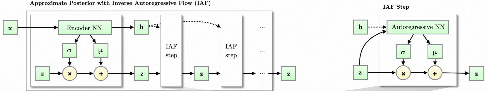

# MIT 6.S978 Reading 3.3 [Improved Variational Inference with Inverse Autoregressive Flow](https://arxiv.org/pdf/1606.04934)

**作者**: Diederik P. Kingma, Tim Salimans, Rafal Jozefowicz, Xi Chen, Ilya Sutskever, Max Welling

**会议**: NIPS 2016

**关键词**: 变分推断、Normalizing Flow、自回归模型、VAE

---

## 目录

- [1. 论文的动机](#1-论文的动机)
- [2. 论文的数学基础](#2-论文的数学基础)
  - [2.1 复习：变分推断与ELBO](#21-复习变分推断与elbo)
    - [2.1.1 ELBO的推导](#211-elbo的推导)
    - [2.1.2 ELBO的训练与重参数化](#212-elbo的训练与重参数化)
  - [2.2 复习：Normalizing Flow的数学原理](#22-复习normalizing-flow的数学原理)
    - [2.2.1 基本思想](#221-基本思想)
    - [2.2.2 变量变换公式与Jacobian行列式](#222-变量变换公式与jacobian行列式)
  - [2.3 连续自回归模型](#23-连续自回归模型)
    - [2.3.1 从离散自回归到连续自回归](#231-从离散自回归到连续自回归)
    - [2.3.2 连续自回归用于VAE-Flow](#232-连续自回归用于vae-flow)
    - [2.3.3 Jacobian矩阵](#233-jacobian矩阵)
  - [2.4 反向自回归变换的关键性质](#24-反向自回归变换的关键性质)
    - [2.4.1 反向变换](#241-反向变换)
    - [2.4.2 并行性](#242-并行性)
    - [2.4.3 Jacobian行列式](#243-jacobian行列式)
- [3. IAF算法详解](#3-iaf算法详解)
  - [3.1 完整算法流程](#31-完整算法流程)
  - [3.2 什么是AutoRegressive NN](#32-什么是autoregressive-nn)
  - [3.3 为什么是逆向](#33-为什么是逆向)
  - [3.4 数值稳定性](#34-数值稳定性)
  - [3.5 变量顺序反转的工程技巧](#35-变量顺序反转的工程技巧)
- [4. 总结](#4-总结)
  - [4.1 论文的核心贡献](#41-论文的核心贡献)
  - [4.2 与Bengio 1999和PixelRNN 2016的关系](#42-与bengio-1999和pixelrnn-2016的关系)
    - [4.2.1 Bengio 1999](#421-bengio-1999)
    - [4.2.2 PixelRNN 2016](#422-pixelrnn-2016)
    - [4.2.4 IAF 2016](#424-iaf-2016)
  - [4.3 自回归模型的统一视角](#43-自回归模型的统一视角)
  - [4.4 后续影响与发展方向](#44-后续影响与发展方向)
  - [4.5 关键启示](#45-关键启示)

## 1. 论文的动机

- **传统VAE的问题**：使用对角高斯分布作为近似后验 $q(z|x) = \mathcal{N}(\mu(x), \text{diag}(\sigma^2(x)))$ ，表达能力有限。
- **Normalizing Flow的提出**：Rezende & Mohamed (2015) 提出了normalizing flow框架来解决这个问题，通过一系列可逆变换增强后验灵活性。
- **已有flow方法的瓶颈**：已有的normalizing flow（如planar flow / radial flow）存在严重的扩展性问题，在**高维潜在空间**中表达能力不足，需要非常长的flow链才能捕获复杂依赖，计算代价高；NICE每次只能更新一半变量，高维表达能力也不好
- **核心问题**：设计一种能更好地扩展到**高维潜在空间**的flow。这篇文章早于前面阅读的Glow(2018)和i-ResNet(2019)，其实是在做一样的事，只是用了AutoRegressive方法，因此放在这里，是Normalizing Flow方法和AR方法的结合点。

### 2. 论文的数学基础

### 2.1 复习：变分推断与ELBO

#### 2.1.1 ELBO的推导

给定观测数据 $x$ 和潜在变量 $z$ ，我们希望最大化边缘对数似然: $\log p(x) = \log \int p(x, z) dz$. 这通常是不可处理的。

变分推断引入近似后验 $q(z|x)$ ，推导出ELBO：

$$
\begin{aligned}
\log p(x) &= \mathbb{E}_{q(z|x)}[\log p(x)] = \mathbb{E}_{q(z|x)}\left[\log \frac{p(x, z)}{p(z|x)}\right] \\
&= \mathbb{E}_{q(z|x)}\left[\log \frac{p(x, z) q(z|x)}{q(z|x) p(z|x)}\right] \\
&= \mathbb{E}_{q(z|x)}\left[\log \frac{p(x, z)}{q(z|x)}\right] + \mathbb{E}_{q(z|x)}\left[\log \frac{q(z|x)}{p(z|x)}\right] \\
&= \mathcal{L}(x; \theta) + D_{KL}(q(z|x) \| p(z|x))
\end{aligned}
$$

- $\mathcal{L}(x; \theta) = \mathbb{E}_{q(z|x)}[\log p(x, z) - \log q(z|x)]$ 是ELBO
- $D_{KL}(q(z|x) \| p(z|x)) \geq 0$ 是KL散度，因此 $\log p(x) \geq \mathcal{L}(x; \theta)$
- VAE的训练过程就是在**最大化ELBO**，等价于最大化 $\log p(x)$ （提高生成模型质量）和最小化 $D_{KL}(q(z|x) \| p(z|x))$ （改善后验逼近）

#### 2.1.2 ELBO的训练与重参数化

原生的VAE使用对角高斯分布作为后验分布 $q(z|x)$，使用神经网络计算其参数($\mu,\sigma$)，然后采样、解码. 如果直接从高斯分布采样，则梯度无法回传，因此设计了重参数化技巧:

$$
z=\mu+\sigma\cdot\epsilon,\quad \epsilon\sim\mathcal{N}(0,1)
$$

得到如下forward pass过程：

$$
x \xrightarrow{\mathrm{Encoder}}\mu,\sigma\xrightarrow{\epsilon\sim\mathcal{N}(0,1)}z\xrightarrow{\mathrm{decoder}} x'
$$

优化VAE的入手点，就是使用更复杂的后验分布 $q(z|x)$，提升表征能力，尽可能推高ELBO.

$$
x\xrightarrow{\mathrm{Encoder}}\boxed{\mathrm{distribution\; paras}}\xrightarrow{\epsilon\sim\mathcal{N}(0,1)}z\xrightarrow{\mathrm{decoder}}x'
$$

### 2.2 复习：Normalizing Flow的数学原理

#### 2.2.1 基本思想

从一个简单的基础分布 $z_0 \sim q(z_0|x)$ （如标准正态分布）开始，通过一系列可逆变换 $f_t$ 来构造复杂分布：

$$
\begin{aligned}
z_0 &\sim q(z_0|x) \\ z_t &= f_t(z_{t-1}, x), \quad t = 1, ..., T
\end{aligned}
$$

#### 2.2.2 变量变换公式与Jacobian行列式

对于可逆变换 $z' = f(z)$ ，新旧分布之间的关系由变量变换公式给出：

$$
q(z') = q(z) \left| \det \frac{\partial f^{-1}(z')}{\partial z'} \right| = q(z) \left| \det \frac{\partial f(z)}{\partial z} \right|^{-1}
$$

取对数：

$$
\log q(z') = \log q(z) - \log \left| \det \frac{\partial f(z)}{\partial z} \right|
$$

对于T步flow：

$$
\log q(z_T|x) = \log q(z_0|x) - \sum_{t=1}^{T} \log \left| \det \frac{\partial z_t}{\partial z_{t-1}} \right|
$$

**关键要求**：

1. 变换 $f_t$ 必须可逆
2. Jacobian矩阵 $\frac{\partial z_t}{\partial z_{t-1}}$ 的行列式必须易于计算

### 2.3 连续自回归模型

#### 2.3.1 从离散自回归到连续自回归

之前两篇文章考虑的都是离散变量，其分布建模为多项分布：

$$
y_i\sim\mathrm{softmax}(h_i(y_{1,i-1})）
$$

- 神经网络输入当前已有的变量 $y_{1:i-1}$，输出多项分布的参数 $h_i$（需要由softmax处理为概率）
- 从多项分布中离散采样：这是一个不可导操作，虽然也能进行重参数化，但比连续版本的重参数化复杂得多

这里我们考虑连续变量的自回归。其分布建模为高斯分布：

$$
y_i = \mu_i(y_{1:i-1}) + \sigma_i(y_{1:i-1}) \cdot \epsilon_i, \quad \epsilon_i \sim \mathcal{N}(0, 1)
$$

- 神经网络输入当前已有的变量 $y_{1:i-1}$，输出高斯分布的参数 $\mu_i$ 和 $\sigma_i$
- 重参数化：从标准高斯分布中采样，计算得到 $y_i$

#### 2.3.2 连续自回归用于VAE-Flow

我们尝试使用连续版本的自回归构建一个Flow，其中 $\mathbf{z_i}=\mathbf{y_j^{(i)}}=[y_1^{(i)}, y_2^{(i)}, \cdots, y_{D}^{(i)}]$，即我们用上角标 $(i)$ 代表Flow的轮数，用下角标 $j$ 代表向量的维度（也就是一轮flow中AR的轮数）

$$
\begin{aligned}
\mathbf{x}\xrightarrow{\mathrm{BaseEncoder}}\mathbf{z_0}\xrightarrow{\mathrm{Flow\;1}}\mathbf{z_1}\xrightarrow{\mathrm{Flow\;2}}\cdots\xrightarrow{\mathrm{Flow\;K-1}}\mathbf{z_{K-1}}\xrightarrow{\mathrm{Flow\;K}}\mathbf{z_K}\xrightarrow{\mathrm{Decoder}}\mathbf{x'}
\end{aligned}
$$

每一步Flow的内部遵循连续自回归：

$$
\begin{aligned}
y_j^{(i)}=\mu^{(i)}\left(y_{0:j-1}^{(i)}\right)+\sigma^{(i)}\left(y_{0:j-1}^{(i)}\right)
\end{aligned}\cdot y^{(i-1)}_j
$$

- 不再引入额外的标准高斯采样，上一轮Flow的结果 $y^{(i-1)}_j$代替了 $\epsilon$ 的作用，因此将自回归用于Flow时，需要分析的Jacobian矩阵就是 $y$ 对 $\epsilon$ 的Jacobian矩阵（参见2.3.3）
- 每一轮flow有自己的 $\mu^{(i)}, \sigma^{(i)}$网络，一轮flow内部权重共享，通过Mask满足因果性
- 一轮Flow内部需要按照自回归顺序依次采样每个维度，**采样无法并行**，不适合用于Flow-VAE训练

#### 2.3.3 Jacobian矩阵

我们计算 $y$ 对 $\epsilon$ 的Jacobian矩阵

- 当 $j > i$ 时： $\frac{\partial y_i}{\partial \epsilon_j} = 0$ （因为 $y_i$ 不依赖于 $\epsilon_j$ ）
- 当 $j = i$ 时： $\frac{\partial y_i}{\partial \epsilon_i} = \sigma_i$
- 当 $j < i$ 时：需要链式法则计算，但不影响行列式

因此Jacobian矩阵是**下三角矩阵**：

$$
\frac{\partial y}{\partial \epsilon} = \begin{pmatrix}
\sigma_1 & 0 & 0 & \cdots & 0 \\
\ast & \sigma_2 & 0 & \cdots & 0 \\
\ast & \ast & \sigma_3 & \cdots & 0 \\
\vdots & \vdots & \vdots & \ddots & \vdots \\
\ast & \ast & \ast & \cdots & \sigma_D
\end{pmatrix}
$$

其行列式等于对角元素的乘积，计算复杂度为 $O(D)$：

$$
\begin{aligned}\det \frac{\partial y}{\partial \epsilon} &= \prod_{i=1}^{D} \sigma_i \\
\log \left| \det \frac{\partial y}{\partial \epsilon} \right| &= \sum_{i=1}^{D} \log \sigma_i
\end{aligned}
$$

### 2.4 反向自回归变换的关键性质

#### 2.4.1 反向变换

给定 $y$ , 我们可以反向计算 $\epsilon$ ：

$$
\epsilon_i = \frac{y_i - \mu_i(y_{1:i-1})}{\sigma_i(y_{1:i-1})}
$$

向量化形式：

$$
\epsilon = (y - \mu(y)) \oslash \sigma(y)
$$

其中 $\oslash$ 表示逐元素除法。

#### 2.4.2 并行性

虽然 $\mu_i$ 和 $\sigma_i$ 的计算是自回归的（依赖 $y_{1:i-1}$ ），但给定完整的 $y$ 后，所有 $\epsilon_i$ 可以**并行**计算，这是因为 $\mu(y)$ 和 $\sigma(y)$ 的计算可以一次性完成（通过MADE或PixelCNN等）。2.3.2 讨论的最大的问题被解决了，有希望用于VAE-Flow训练。

#### 2.4.3 Jacobian行列式

类似的，反向变换的Jacobian矩阵($\epsilon$ 对 $y$) 也可以以 $O(D)$ 的复杂度算出来，满足Flow的需求。

- 当 $j > i$ 时： $\frac{\partial \epsilon_i}{\partial y_j} = 0$ （因为 $\epsilon_i$ 不依赖于 $y_j$ ）
- 当 $j = i$ 时： $\frac{\partial\epsilon_i}{\partial y_i} = \frac{1}{\sigma_i(y_{1:i-1})}$
- 当 $j < i$ 时：需要链式法则计算，但不影响行列式

因此：

$$
\log \left| \det \frac{\partial \epsilon}{\partial y} \right| = \sum_{i=1}^{D} \log \frac{1}{\sigma_i(y_{1:i-1})} = -\sum_{i=1}^{D} \log \sigma_i(y_{1:i-1})
$$

## 3. IAF算法详解

### 3.1 完整算法流程

**初始编码器**：将数据点 $\mathbf{x}$ 编码为初始高斯分布参数 $\mathbf{\mu_0, \sigma_0}$ 和 后续每一步的额外输入 $\mathbf{h}$

$$
[\mathbf{\mu_0, \sigma_0, h}] \leftarrow \mathrm{EncoderNN}(\mathbf{x}; \theta)
$$

**初始采样**：从标准高斯分布采样 $\epsilon$，构建Flow的初始输入 $\mathbf{z_0}$

$$
\mathbf{z_0} = \mathbf{\sigma_0 \odot \epsilon + \mu_0},\:\epsilon \sim \mathcal{N}(0, I)
$$

**T个Flow步骤 (IAF Step)**: 每个步骤通过一个 Autoregressive NN 获取这一步的高斯分布参数 $\mathbf{\mu_t, \sigma_t}$, 然后执行变换 ($t=1,2,\cdots,T$)

$$
\begin{aligned}
[\mathbf{\mu_t, \sigma_t}] &\leftarrow \mathrm{AutoRegressiveNN}(\mathbf{z_{t-1}, h};\theta)\\
\mathbf{z_t}&=\mathbf{\mu_t+\sigma_t\odot z_{t-1}}
\end{aligned}
$$

**最终概率密度**：

$$
\log q(z_T|x) = \log q(z_0|x) - \sum_{t=1}^{T} \sum_{i=1}^{D} \log \sigma_{t,i}
$$

$q(z_0|x)$ 作为对角高斯分布，每个分量

$$
q(z_{0,i}|x) = \frac{1}{\sqrt{2\pi}\sigma_{0,i}}\exp\left[-\frac{(x-\mu_{0,i})^2}{2\sigma_{0,i}^2}\right]=\frac{1}{\sqrt{2\pi}\sigma_{0,i}}\exp\left[-\frac{\epsilon_{i}^2}{2}\right]
$$

各分量独立，对数可直接相加：

$$
\log q(z_0|x) = \sum_{i=1}^D\log q(z_{0,i}|x) = -\sum_{i=1}^{D} \left( \frac{1}{2}\epsilon_i^2 + \frac{1}{2}\log(2\pi) + \log \sigma_{0,i} \right)
$$

最终得到

$$
\boxed{\log q(z_T|x) = -\sum_{i=1}^{D} \left( \frac{1}{2}\epsilon_i^2 + \frac{1}{2}\log(2\pi) + \sum_{t=0}^{T} \log \sigma_{t,i} \right)}
$$

### 3.2 什么是AutoRegressive NN

这里的 AutoRegressive NN 指的是 MADE, PixelCNN 这样满足自回归掩码限制的网络，尽管这里并不是严格的自回归：输入和输出并不是同一个向量。考虑上述IAF Step网络的Jacobian:

$$
\frac{\partial z_{t,i}}{\partial z_{t-1,j}} = \frac{\partial\mu_{t,i}}{\partial z_{t-1,j}}+\frac{\partial\sigma_{t,i}}{\partial z_{t-1,j}}\cdot z_{t-1,i}+\sigma_{t,j}\cdot\delta_{ij}
$$

为了保证这个Jacobian行列式易于计算，需要保证 $\mu,\;\sigma$ 与 $z_{t-1}$ 的关系与自回归中相同，从而得到上三角Jacobian行列式：

- $j\gt i$ 时没有依赖关系：AR NN 的结构保证，通过掩码实现。偏导数整体为0
- $j=i$ 时没有依赖关系：AR NN 的结构保证，通过掩码实现。偏导数值为 $\sigma_{t,i}$
- $j\lt i$ 时有依赖关系：偏导数非0，但不影响行列式计算

最终IAF Step 的Jacobian行列式的值就是 $\prod_{i=1}^{D}\sigma_i$.

### 3.3 为什么是逆向

我们把传统的AR NN和IAF的AR NN写成相似的模式，便能看出来为什么IAF是“逆向”的。

- 传统AR:

$$
z_{t,i} = \mu_i(z_{t,1:i-1}) + \sigma_i(z_{t,1:i-1}) \cdot \epsilon_i
$$

- 传统AR的逆变换:

$$
\epsilon_i=\frac{z_{t,i}-\mu_i(z_{t,1:i-1})}{\sigma_i(z_{t,1:i-1})}=\mu\prime_i(z_{t,1:i-1})+\sigma\prime_i(z_{t,1:i-1})\cdot z_{t,i}
$$

- IAF的AR变换:

$$
z_{t,i}=\mu_i(z_{t-1,1:i-1})+\sigma_i(z_{t-1,1:i-1})\cdot z_{t-1,i}
$$

传统AR逆变换与IAF变换的共同点是：神经网络的输入不是 $\mu,\sigma$ 表征的高斯分布变量本身，在计算 $\mu,\sigma$ 时可以拿到完整的值。传统AR的逆变换是从 $\mathbf{z_t}$ 反推回 $\mathbf{\epsilon}$ 的变换，而IAF的变换在Flow背景下含义更加清晰: 是从 $\mathbf{z_{t-1}}$ 到 $\mathbf{z_{t}}$ 的变换，神经网络的输入正是 $\mathbf{z_{t-1}}$. $\mu,\sigma$ 的所有分量可以直接并行计算，解决了AR用于Flow的最大问题。

### 3.4 数值稳定性

**$\sigma$ 溢出风险**: 由于我们需要对 $\sigma$ 求对数，它必须是正数，这通常通过在 ARNN 的输出上求一次指数函数实现。随着Flow的层层嵌套，这些指数函数的结果会相乘，很可能造成溢出。

**LSTM风格的门控**：

作者的实现中，受LSTM门控机制启发，ARNN没有直接输出 $\mu,\sigma$，而是做了一步变换：

$$
\begin{aligned}
[\mathbf{m}_t, \mathbf{s}_t] &= \mathrm{AutoRegressiveNN}_t(\mathbf{z}_{t-1},\mathbf{h};\theta) \\
\sigma_t &= \mathrm{sigmoid}(\mathbf{s}_t) \\
\mathbf{z}_t&=\sigma_t\odot \mathbf{z}_{t-1} + (1-\sigma_t)\cdot\mathbf{m}_t
\end{aligned}
$$

上述变换保证了 $\sigma_t\in(0,1)$, $\mathbf{z}\_t$ 是 $\mathbf{z}\_{t-1}$ 和 $\mathbf{m}_t$ 的插值，保证了数值稳定性。

**遗忘门偏置初始化**：

初始化网络时给 $s_t$ 一个比较大的bias， 使其在训练初期接近 +1 或 +2 ，这样：

- $\sigma_t \approx \text{sigmoid}(1) \approx 0.73$ 或 $\text{sigmoid}(2) \approx 0.88$
- 初期更新较慢，帮助稳定训练（类似LSTM的遗忘门偏置）

### 3.5 变量顺序反转的工程技巧

由于网络内部的 Mask 矩阵会导致索引靠前的特征维度（如 $z_0$）始终无法接收其他维度的信息（成为“信息孤岛”），IAF 在相邻的 Flow 层之间加入了一个简单的数组倒序操作（如 `z = z[::-1]`）。

- 目的： 打破 Mask 造成的特征阶级固化，让所有特征维度在多层 Flow 中轮流获得全局感受野。
- 数学代价为零： 数组反转本质是乘以一个置换矩阵，其雅可比行列式的绝对值永远为 1，对数为0，这保证了特征的高效融合在计算 ELBO 损失时不需要增加任何额外的算力开销。

## 4. 总结

### 4.1 论文的核心贡献

1. **Inverse Autoregressive Flow (IAF)**

- 提出了一种新的normalizing flow类型
- 核心创新：反转自回归变换，实现并行采样
- Jacobian行列式易于计算： $O(D)$ 复杂度

2. **高维扩展性**：

- 首次将normalizing flow成功应用于高维潜在空间（如CIFAR-10）
- 使用PixelCNN风格的卷积自回归网络
- 多层潜在变量 + 层次化IAF

### 4.2 与Bengio 1999和PixelRNN 2016的关系

三篇论文的核心共性：**自回归分解** $p(z_1, ..., z_n) = \prod_{i=1}^{n} p(z_i | z_{<i})$

#### 4.2.1 Bengio 1999

- 首次提出用神经网络建模高维离散数据的自回归分解
- 通过隐层共享参数，避免维度灾难
- 奠定了神经自回归模型的基础

**与IAF的联系**：

- IAF继承了自回归建模的核心思想
- 但将其从**建模数据分布**推广到**构造灵活变换**

#### 4.2.2 PixelRNN 2016

- 将自回归扩展到图像生成（连续/离散像素值）
- 提出Row LSTM和Diagonal BiLSTM捕获全局依赖
- 使用残差连接和masked卷积
- 达到当时图像生成的最优似然

**与IAF的联系**：

- IAF直接借鉴PixelRNN的网络架构（PixelCNN）
- **关键区别**：
  - PixelRNN：正向自回归，用于建模 $p(x)$ ，采样慢
  - IAF：反向自回归，用于变分推断 $q(z|x)$ ，采样快

**互补关系**：

- PixelRNN：生成模型（prior或likelihood）
- IAF：推断模型（posterior）
- 可以结合：PixelRNN作为VAE的prior，IAF作为posterior，参见[Variational Lossy Autoencoder](https://arxiv.org/abs/1611.02731)

#### 4.2.4 IAF 2016

- 创新性地"反转"自回归过程
- 实现了高维normalizing flow
- 在VAE中显著提升后验灵活性
- 在保持高似然的同时，采样速度快1000倍

**在三篇论文中的定位**：

- **理论创新**：从自回归建模到自回归变换（normalizing flow）
- **应用创新**：从生成模型到推断模型
- **工程创新**：从顺序计算到并行计算

### 4.3 自回归模型的统一视角

三篇论文展示了自回归建模的三种应用模式：

| 论文          | 应用场景     | 自回归方向 | 计算方式 | 目标               |
| ------------- | ------------ | ---------- | -------- | ------------------ |
| Bengio 1999   | 离散数据建模 | 正向       | 顺序     | 联合分布 $p(x)$    |
| PixelRNN 2016 | 图像生成     | 正向       | 顺序     | 联合分布 $p(x)$    |
| IAF 2016      | 变分推断     | **反向**   | **并行** | 后验分布 $q(z\|x)$ |

### 4.4 后续影响与发展方向

**IAF的影响**：

1. **Normalizing flow的发展**：
   - 激发了更多flow架构（MAF, Neural Spline Flow等）
   - 启发了bidirectional flow的设计

2. **VAE的改进**：
   - 灵活后验成为标配
   - 层次化VAE的普及

3. **采样效率的重要性**：
   - 强调了inference speed的价值
   - 平衡likelihood和采样速度的trade-off

**未来方向**：

1. 更强大的自回归网络（Transformer-based IAF）
2. 连续normalizing flow（Neural ODE）
3. Flow与diffusion model的结合

### 4.5 关键启示

从这三篇论文的演进中，我们可以总结出深度生成模型发展的几个关键启示：

1. **核心思想的延续性**：自回归分解是一个强大且持久的思想
2. **应用场景的多样性**：同一数学框架可以用于不同目的（建模vs推断）
3. **计算效率的重要性**：理论优雅性需要与实践可行性平衡
4. **架构创新的价值**：小的架构改变（正向→反向）带来大的性能提升

这些论文共同展示了深度生成模型领域的研究方法论：从理论出发，借鉴前人成果，创新性地改造应用，最终在实验中验证。
