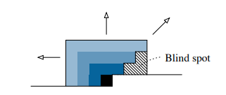
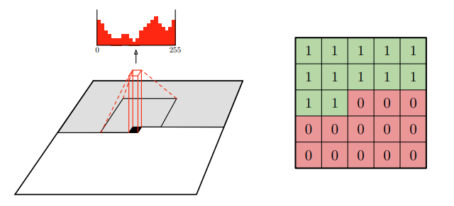
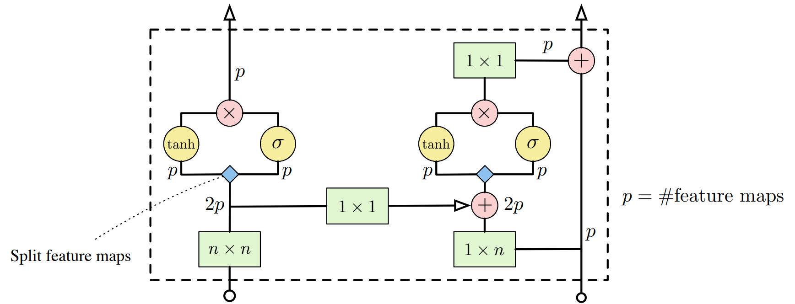

# MIT 6.S978 Reading 3.4 [Conditional Image Generation with PixelCNN Decoders](https://arxiv.org/pdf/1606.05328)

**van den Oord, Kalchbrenner, Espeholt, Vinyals, Graves et al. (2016) | arXiv:1606.05328**

## 1. 论文的动机

### 1.1 自回归图像生成的历史背景

在 2016 年之前，图像生成模型主要分为两大路线：**隐变量模型**（如 VAE）和**自回归模型**（如 PixelRNN/PixelCNN）。自回归路线的核心思想源自 van den Oord 等人的前序工作，将图像的联合分布分解为逐像素的条件乘积：

$$p(x) = \prod_{i=1}^{n^2} p(x_i \mid x_1, x_2, \ldots, x_{i-1})$$

**PixelRNN**（Row LSTM / Diagonal BiLSTM）凭借 LSTM 的长程依赖能力，取得了当时 ImageNet 的 SOTA 对数似然（log-likelihood），但其顺序计算特性使训练极慢。**原始 PixelCNN** 则用掩码卷积实现了并行训练，速度大幅提升，但代价是性能明显低于 PixelRNN——两者之间存在明显的 **质量-效率 tradeoff**。

### 1.2 原始 PixelCNN 的核心缺陷

本文的出发点正是要解决原始 PixelCNN 存在的几个根本性问题：

**缺陷一：无法条件生成 (conditional generation)**

原始 PixelRNN 和 PixelCNN 都只能做**无条件生成（unconditional generation）**，无法根据类别标签、文字描述或隐向量来控制生成的图像内容，极大地限制了实用价值。

本文引入**条件向量 $h$**，使模型能够根据类别标签、潜在嵌入或空间特征图来控制生成内容，实现多样化的条件图像生成。

**缺陷二：感受野的"盲点"问题（Blind Spot）**

原始 PixelCNN 使用掩码（Masked）卷积来保证当前像素只能看到之前的像素。然而，掩码的实现方式使得感受野存在系统性缺失：对于当前位置 $(i, j)$，在当前行 $i$ 中，位于 $(i, j)$ 右侧的像素会被掩盖，但这同时也造成**来自右上方区域的信息被完全阻断**——即感受野中存在一块永远看不到的"盲点（blind spot）"。随着网络层数的增加，这个盲点并不会消失，导致模型无法利用全部的上下文信息。

本文提出 **双栈结构（Dual-Stack Architecture）**，通过水平栈与垂直栈的分离设计，从根本上消除盲点问题。

**缺陷二：激活单元表达能力弱（Weak Activation）**

原始 PixelCNN 使用标准的 ReLU 激活函数，而在 PixelRNN 中，LSTM 的**乘法门控单元（multiplicative gating）** 被认为是其强表达能力的关键。两者激活函数的不对等，部分解释了 PixelCNN 性能落后的原因。

本文提出 **Gated PixelCNN**，引入受 LSTM 启发的门控激活单元，弥补 PixelCNN 与 PixelRNN 的性能差距，同时保留 CNN 的并行训练优势。

## 2. 论文的数学基础

### 2.1 自回归图像建模

图像 $x$ 被视为一个 $n \times n$ 的像素序列（以光栅扫描顺序排列，即从左到右、从上到下）。模型建模的目标是联合分布：

$$p(x) = \prod_{i=1}^{n^2} p(x_i \mid x_1, \ldots, x_{i-1})$$

每个 $p(x_i \mid x_1, \ldots, x_{i-1})$ 均被参数化为一个 256 维的 **Softmax 分类分布**（对应 0-255 的像素值）。这与连续似然（如高斯分布）相比具有更强的表达能力，可以建模多峰分布。

对于 RGB 图像，每个像素有三个通道，进一步分解为：

$$p(x_i \mid x_{\lt i}) = p(x_{i,R} \mid x_{\lt i}) \cdot p(x_{i,G} \mid x_{i,R}, x_{\lt i}) \cdot p(x_{i,B} \mid x_{i,R}, x_{i,G}, x_{\lt i})$$

即红通道先生成，然后绿通道以红通道为条件，最后蓝通道以红和绿为条件。

### 2.2 掩码卷积（Masked Convolution）

为保证自回归特性，PixelCNN 使用**掩码卷积（Masked Convolution）**，分为两类：

- **Type A（仅用于第一层）**：当前像素不能 attend 到自身，即卷积核中心位置被掩盖（中心像素掩码值为0）
- **Type B（用于后续层）**：当前像素可以 attend 到自身（已通过前一层处理），中心保留（中心像素掩码值为1）

掩码的数学形式可以表示为卷积核 $W$ 逐元素乘以二值掩码矩阵 $M$：

$$\tilde{W} = W \odot M, \quad M_{ij} = \begin{cases} 1 & \mathrm{if } (i < k/2) \mathrm{ or } (i = k/2 \mathrm{ and } j \leq k/2) \\ 0 & \mathrm{otherwise} \end{cases}$$

其中 $k$ 为卷积核大小, $M_{ij}$ 中 $j \leq k/2$ 对应 Type B, $j < k/2$ 对应 Type A。

### 2.3 门控激活单元（Gated Activation Unit）

原始 PixelCNN 的每层输出经过 ReLU 激活: $y = \mathrm{ReLU}(W * x)$。本文将其替换为受 LSTM 门控机制启发的**门控激活单元**：

$$y = \tanh(W_{k,f} * x) \odot \sigma(W_{k,g} * x)$$

其中：

- $*$ 表示掩码卷积操作, $\odot$ 为逐元素乘积（element-wise product）
- $W_{k,f}$ 和 $W_{k,g}$ 是两组独立的卷积权重（输出通道数各为原来的一半，再合并）
- $\tanh(\cdot)$ 作为"内容门"，输出范围 $(-1, 1)$
- $\sigma(\cdot)$ 是 Sigmoid 函数，作为"特征选择门"，控制哪些信息通过，输出范围 $(0, 1)$

这与 LSTM 中 cell state 更新 $c_t = f_t \odot c_{t-1} + i_t \odot \tilde{c}_t$ 的乘性门控逻辑完全类似。门控机制的优势在于：

1. **非线性更丰富**：乘法组合比加法+ReLU 的表达能力更强
2. **梯度流动更顺畅**：Sigmoid 门在梯度接近 0.5 时保留接近完整的梯度，减缓梯度消失

## 3. 论文的主要逻辑

### 3.1 消除盲点：双栈卷积架构

本文提出将卷积操作**分解为两个独立的栈（Stack）**：

**垂直栈（Vertical Stack）**(左侧)：

- 使用 k x k 卷积，但只访问当前行**以上**的所有行（无左右偏置）
- 即感受野是完整的"上方矩形"，建模上方所有行的像素对当前像素的影响
- 这通过在 k x k 卷积核中将下半部分（包括中间行）置零来实现
- 垂直栈可以完整捕捉上方区域的全局信息，**不存在盲点**

**水平栈（Horizontal Stack）**(右侧)：

- 使用 1 x k 卷积，只访问当前行中当前像素左侧（含当前像素）的部分
- 水平栈自身只能看到当前行的左侧像素
- 包含残差连接 (Residual Connection)

**垂直栈与水平栈的连接**：

- 每层垂直栈的输出（经过1x1卷积变换后）**被叠加到同层水平栈的输入**（但水平栈的输出不反馈给垂直栈，以保持因果性）。这样：

$$
h^{(l)}_{\mathrm{horiz}} = f\!\left(W^{(l)}_{\mathrm{horiz}} * h^{(l-1)}_{\mathrm{horiz}} + V^{(l)} \cdot h^{(l)}_{\mathrm{vert}}\right)
$$

- 水平栈通过接收垂直栈的信息，间接获得了来自右上方区域的信息，从而**完全消除了盲点**。

### 3.2 门控 PixelCNN 的完整计算流程

在第 $l$ 层，门控 PixelCNN 的计算如下（以**无条件**版本为例）：

**垂直栈**：
$$[\mathbf{p}, \mathbf{q}] = W_{\mathrm{vert}}^{(l)} * h_{\mathrm{vert}}^{(l-1)}$$
$$h_{\mathrm{vert}}^{(l)} = \tanh(\mathbf{p}) \odot \sigma(\mathbf{q})$$

**垂直到水平的桥接**：
$$[\mathbf{p}', \mathbf{q}'] = W_{1 \times 1}^{(l)} \cdot h_{\mathrm{vert}}^{(l)} + W_{\mathrm{horiz}}^{(l)} * h_{\mathrm{horiz}}^{(l-1)}$$
$$h_{\mathrm{horiz\_gated}}^{(l)} = \tanh(\mathbf{p}') \odot \sigma(\mathbf{q}')$$

**水平栈残差更新**：
$$h_{\mathrm{horiz}}^{(l)} = h_{\mathrm{horiz}}^{(l-1)} + W_{1 \times 1}^{\mathrm{res}(l)} \cdot h_{\mathrm{horiz\_gated}}^{(l)}$$

其中 $[\cdot, \cdot]$ 表示沿通道维度拆分。残差连接使得网络可以堆叠到约 15-20 层而不出现梯度消失。

### 3.3 Conditional PixelCNN 的条件注入机制

将条件向量注入门控激活的方式：

**全局条件**（如 ImageNet 1000 类的 one-hot embedding）：

$$
y = \tanh(W_{k,f}* x + V_{k,f}^{\top} h)\odot\sigma(W_{k,g}* x + V_{k,g}^{\top}* h)
$$

条件向量 $h$ 通过**可学习的线性变换** $V_f, V_g$ 映射为与特征图匹配的向量，然后**在每一层、每个空间位置广播叠加**。这相当于给整张图像一个"全局偏置"，引导模型生成与条件对应的内容。

**局部条件**（如脸部特征嵌入后接 Deconv）：

$$
y = \tanh(W_{k,f}* x + V_{k,f}*\hat{s})\odot\sigma(W_{k,g}* x + V_{k,g}* \hat{s})
$$

其中 $\hat{s}$ 是经过转置卷积上采样至图像分辨率的条件特征图, $V_f, V_g$ 是 1 x 1 无掩码卷积。

一个条件是全局还是局部，是先验知识，按需使用上述两种计算方法。

### 3.4 PixelCNN 作为自编码器解码器

本文还探索了将 Conditional PixelCNN 作为自编码器（Autoencoder）解码器的可能性。由于 PixelCNN 有着不错的无条件生成效果，作者预期将已有NN架构（如auto encoder）中的decoder替换为 Conditional PixelCNN 将会提升其效果。此外，鉴于PixelCNN在处理low-level像素统计信息上的能力很强，作者预期encoder学到的表示也会改变：encoder可以专心学习high-level的抽象信息，把low-level像素信息的处理交给PixelCNN.

## 4. 总结

### 4.1 与动机的呼应

本文精准解决了原始 PixelCNN 的两大缺陷：

- **盲点问题** → 双栈（垂直栈 + 水平栈）架构通过分离"上方感受野"和"左侧感受野"，再将垂直栈信息注入水平栈，从根本上消除了感受野的空洞
- **表达能力弱** → 门控激活单元 $\tanh(\cdot) \odot \sigma(\cdot)$ 模仿 LSTM 的乘性门控，显著提升了每层的特征提取能力

最终，Gated PixelCNN 在 CIFAR-10（3.03 bits/dim）和 ImageNet（3.83 bits/dim）上追平甚至超越了 PixelRNN，同时将训练时间缩减一半以上。

### 4.2 Conditional PixelCNN 的贡献

通过**全局条件**（类别标签嵌入）和**局部条件**（空间特征图）两种机制，本文将 PixelCNN 从纯无条件密度估计器升级为**通用条件生成框架**：

- **全局条件**适用于类别指导生成、身份保持的人脸生成等
- **局部条件**适用于图像翻译、超分辨率、图像修复等需要空间对齐的任务
- **作为解码器**的应用则表明，任何下游任务只需提供合适的条件向量，即可驱动 PixelCNN 生成高质量图像

### 4.3 局限性与后续影响

**局限性**：

1. **采样速度慢**：自回归生成仍然是序列性的——生成一张 $32 \times 32$ 图像需要 $1024$ 次 forward pass，无法实时生成高分辨率图像
2. **分辨率限制**：计算量随图像分辨率平方增长，实验仅限于 $32 \times 32$ 和 $64 \times 64$
3. **感受野依赖**：即使修复了盲点，卷积感受野仍受限于网络深度，超远距离像素依赖建模有限

**后续影响**：

- 本文的条件生成框架直接启发了 **WaveNet**（van den Oord 2016，使用局部条件的语音合成）和 **PixelShuffle/PixelSnail** 等后续工作
- 门控激活单元被广泛应用于后续的自回归模型
- **DALL-E** 中的图像 token 自回归生成阶段，在概念层面直接继承了 Conditional PixelCNN 的条件建模思想——只是将 CNN 替换为 Transformer，像素 token 替换为 VQ-VAE token
