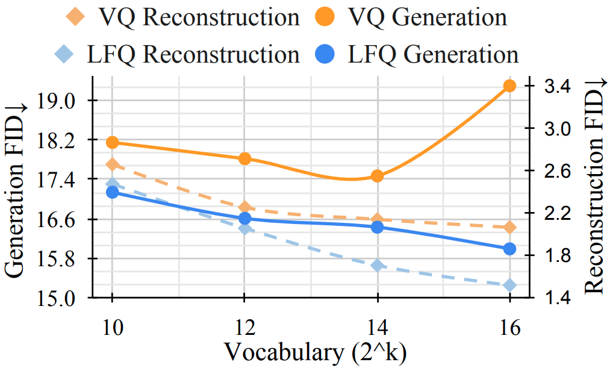
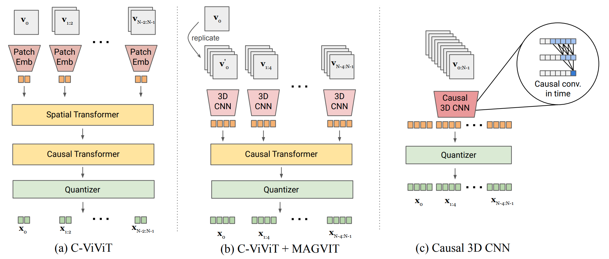

# MIT 6.S978 Reading 4.2 [Language Model Beats Diffusion — Tokenizer is Key to Visual Generation](https://arxiv.org/abs/2310.05737)

## 目录

- [1. 论文的动机](#1-论文的动机)
- [2. 论文的前序知识](#2-论文的前序知识)
  - [2.1 VQ-VAE 与视觉 Tokenizer](#21-vq-vae-与视觉-tokenizer)
  - [2.2 Masked Language Model (MLM)](#22-masked-language-model-mlm)
  - [2.3 FID 评估指标](#23-fid-评估指标)
- [3. 论文的主要逻辑](#3-论文的主要逻辑)
  - [3.1 核心观察：VQ 的词表扩展困境](#31-核心观察vq-的词表扩展困境)
  - [3.2 Lookup-Free Quantization (LFQ)](#32-lookup-free-quantization-lfq)
  - [3.3 Causal 3D CNN Tokenizer](#33-causal-3d-cnn-tokenizer)
    - [3.3.1 视频 Tokenizer 的因果性要求](#331-视频-tokenizer-的因果性要求)
    - [3.3.2 因果 3D 卷积](#332-因果-3d-卷积)
    - [3.3.3 图像与视频的统一 Tokenization](#333-图像与视频的统一-tokenization)
  - [3.4 Token Factorization](#34-token-factorization)
  - [3.5 生成模型：MLM 与自回归](#35-生成模型mlm-与自回归)
- [4. 总结](#4-总结)

---

## 1. 论文的动机

大型语言模型 (LLM) 是语言任务的标准基础模型，但在视觉生成领域，扩散模型 (Diffusion Model) 长期主导 ImageNet 图像生成等标准 benchmark。自然的问题是：**LLM 在视觉生成上的落后，究竟是语言模型架构本身的局限，还是其他原因？**

本文提出核心假说：**瓶颈在于视觉 tokenizer，而非语言模型本身**。图像需要首先被压缩为离散 token 序列，再交给 LM 建模；而现有 tokenizer 的质量直接决定了 LM 能够学习的上界。具体体现在：

1. **词表 (vocabulary) 规模限制**：现有 VQ-VAE 类 tokenizer 在词表规模扩大时，反而会导致生成质量下降（codebook collapse 问题）
2. **图像与视频 tokenizer 不统一**：现有方案处理时序信息的能力有限，图像与视频需要分别建模

本文的贡献是提出 MAGVIT-v2，一个新的视频 tokenizer，核心创新点有两个：

1. **LFQ (Lookup-Free Quantization)**: 替换传统 VQ 的量化方案，消除 codebook collapse，使词表可以扩展到 $2^{18}$ 量级
2. **Causal 3D CNN**: 替换 C-ViViT/MAGVIT 中的 Transformer，实现图像与视频的统一 tokenization

**与 Reading 4.1 (DALL-E) 的关系**：DALL-E 的第一阶段正是训练一个离散 VAE 将图像压缩为 32×32 的 token 网格，再喂给自回归 Transformer。DALL-E 的 codebook 大小仅为 8192 ($2^{13}$)，而本文直接指出：正是这种 tokenizer 的能力天花板，制约了 LM 在视觉生成上的表现。

---

## 2. 论文的前序知识

### 2.1 VQ-VAE 与视觉 Tokenizer

VQ-VAE (van den Oord et al., 2017) 是视觉离散化的基础方法。其核心是**向量量化 (Vector Quantization)**：

1. Encoder 将图像 $x$ 压缩为连续特征图 $Z \in \mathbb{R}^{h \times w \times d}$
2. 对特征图中每个位置的向量 $z_i \in \mathbb{R}^d$，在 codebook $\mathcal{C} = \{e_k\}_{k=1}^{K} \subset \mathbb{R}^d$ 中查找最近邻：

$$
q(z_i) = e_{k^{\ast}}, \quad k^{\ast} = \arg\min_k \|z_i - e_k\|_2
$$

3. 将量化后的特征图喂给 Decoder 重建图像
4. 每个位置对应的 codebook 索引 $k^*$ 就是图像的离散 token

**Codebook collapse** 是 VQ 训练中的常见问题：codebook 中大量 entry 从不被使用，有效词表远小于名义词表大小 $K$。这个问题在 $K$ 增大时更为严重。

### 2.2 Masked Language Model (MLM)

MLM 是 BERT 的训练方式。与自回归 LM 逐 token 预测不同，MLM 随机遮盖序列中部分 token（用 `[MASK]` 替换），让模型同时预测所有被遮盖的 token。训练目标是最大化被遮盖 token 的条件概率：

$$
\mathcal{L}_{\mathrm{MLM}} = -\sum_{i \in \mathcal{M}} \log p(x_i \mid x_{\backslash \mathcal{M}})
$$

其中 $\mathcal{M}$ 是被遮盖的位置集合。MLM 的优势是**并行性**：可以一次性预测多个 token，生成速度远快于自回归方式。

用于**生成**时，MLM 采用迭代式解码 (iterative decoding)：从全部 `[MASK]` 出发，每步预测所有位置的 token，保留置信度最高的若干个，将其余重新遮盖，迭代直到没有 `[MASK]` 为止。

### 2.3 FID 评估指标

FID (Fréchet Inception Distance) 是图像生成质量的标准评估指标，衡量真实图像分布与生成图像分布之间的距离（越低越好）：

$$
\mathrm{FID} = \|\mu_r - \mu_g\|^2 + \mathrm{Tr}\left(\Sigma_r + \Sigma_g - 2(\Sigma_r \Sigma_g)^{1/2}\right)
$$

其中 $\mu, \Sigma$ 分别是用 Inception 网络提取的特征均值与协方差。FID 同时捕捉生成质量与多样性。

---

## 3. 论文的主要逻辑

### 3.1 核心观察：VQ 的词表扩展困境

本文的出发点是一个重要的实证观察：**扩大词表对 VQ tokenizer 的重建质量和生成质量有截然相反的效果**。

如图 1 所示：

- **VQ Reconstruction FID**（虚线橙色）：随词表增大单调降低，即重建质量持续提升
- **VQ Generation FID**（实线橙色）：随词表增大反而**升高**，即 LM 的生成质量变差
- **LFQ Reconstruction FID**（虚线蓝色）：随词表增大单调降低
- **LFQ Generation FID**（实线蓝色）：随词表增大**持续降低**

这说明 VQ 在词表扩展时陷入了两难困境：tokenizer 重建质量的提升以牺牲 LM 生成质量为代价。根本原因是 codebook collapse——大词表的大多数 entry 从未被使用，有效词表很小，但 LM 仍需在巨大的输出空间上建模，导致学习困难。

直觉上，codebook collapse 的成因是：训练时向量量化操作以"赢者通吃"的方式工作，热门 entry 被频繁使用后越来越接近训练数据的特征分布中心，冷门 entry 则越来越远离，形成恶性循环。

### 3.2 Lookup-Free Quantization (LFQ)

LFQ 的核心思想是**消除 codebook 的 embedding 查找操作**，将其替换为逐维度的二值化。

**编码方案**：将 codebook 从 $K$ 个 $d$ 维向量，替换为一个整数集合 $\mathcal{C} = \{0, 1, \ldots, K-1\}$，其中 $K = 2^n$, $n = \log_2 K$。特征向量 $z \in \mathbb{R}^n$ 的每个维度独立地被量化到 $\{-1, +1\}$：

$$
q(z_j) = \mathrm{sign}(z_j) = \begin{cases} +1 & z_j > 0 \\ -1 & z_j \leq 0 \end{cases}
$$

**Token 索引计算**：量化结果可以直接通过位运算转换为整数索引：

$$
\mathrm{Index}(z) = \sum_{j=1}^{n} 2^{j-1} \cdot \mathbf{1}[z_j > 0]
$$

这本质上是将 $n$ 位二进制数转为十进制——一个确定性的 $O(n)$ 操作，不需要在 $K$ 个 codebook entry 中查找最近邻（VQ 为 $O(Kd)$），因此称为 "Lookup-Free"。

**为什么 LFQ 解决了 codebook collapse？** 在 LFQ 中, $K$ 个 token 完全由 $n$ 个独立的二值维度决定。只要每个维度的分布不退化，所有 $2^n$ 个 token 的使用概率就天然接近均匀。不存在 VQ 中因梯度消失而导致 entry 死亡的问题。

**训练目标**：LFQ 的主要训练困难在于 $\mathrm{sign}$ 函数的梯度为零。对此，用 straight-through estimator 近似梯度（即前向传播用量化值，反向传播将梯度直传给量化前的连续值）。

此外，加入**熵正则化损失**来鼓励 codebook 的均匀使用。对于独立维度，要求每一维的使用概率尽量接近 0.5：

$$
\mathcal{L}_{\mathrm{entropy}} = \mathbb{E}\left[H(q(z_j))\right] - H\left[\mathbb{E}(q(z_j))\right]
$$

- 第一项最大化每个 token 的逐维熵，推动每维均匀使用
- 第二项最小化 batch 级别的熵（即鼓励不同样本使用相似的分布），防止不同样本的维度使用出现系统性偏差

### 3.3 Causal 3D CNN Tokenizer

#### 3.3.1 视频 Tokenizer 的因果性要求

视频 tokenizer 需要满足**因果性 (causality)**：对帧 $t$ 的 token 编码只能依赖 $t$ 时刻及之前的帧。这一要求来自两个目的：

1. 支持视频预测任务（不能看到"未来"）
2. 将单张图像视为"1帧视频"进行统一处理

如图 2 所示，论文对比了三种方案，最终选择 Causal 3D CNN：

- **(a) C-ViViT**：对每帧独立做 patch embedding，再用 Causal Transformer 处理时序；空间信息处理能力依赖 Transformer，分辨率泛化性差
- **(b) C-ViViT + MAGVIT**：加入 3D CNN 提升空间特征提取能力，但 CNN 与 Transformer 并联增加了复杂度
- **(c) Causal 3D CNN**：完全用 3D CNN 处理时空信息，仅在时间维度上做因果填充

#### 3.3.2 因果 3D 卷积

标准 3D 卷积核大小为 $(k_t, k_h, k_w)$，对时间维度做对称填充 $(\lfloor (k_t-1)/2 \rfloor, \lfloor k_t/2 \rfloor)$，即在时间轴上既看过去也看未来。

**因果 3D 卷积**改为在时间维度仅填充过去帧：在当前帧**之前**填充 $k_t - 1$ 帧，**之后**不填充。这保证了输出的第 $t$ 帧只依赖输入的第 $0$ 至 $t$ 帧，满足因果性。

#### 3.3.3 图像与视频的统一 Tokenization

时序下采样倍率 $s$ 采用特殊设计：将 $1 + s \times t$ 帧压缩为 $1 + t$ 帧。其中 "+1"对应**第一帧单独处理**，不参与时序下采样。

这样，单张图像（等价于 $t = 0$，即 1 帧视频）经过 tokenizer 后输出恰好 1 帧 token，与图像 tokenizer 的行为完全一致，从而实现图像与视频的**统一建模**。

### 3.4 Token Factorization

词表大小 $K = 2^{18}$ 带来了严重的工程问题：LM 的 embedding 矩阵和输出 logit 层的参数量均为 $O(K \times d_{\mathrm{model}})$，在 $K = 2^{18}$ 时极为庞大，且 softmax over $2^{18}$ 个类别的计算代价也很高。

**Token factorization** 将每个 18-bit token 拆分为两个 9-bit 的子 token：

$$
\mathrm{Index}(z) = \mathrm{Index}_{\mathrm{high}}(z) \times 2^9 + \mathrm{Index}_{\mathrm{low}}(z)
$$

在 LM 中，用**两个独立的预测头**分别预测这两个 9-bit 子 token，每个头的输出维度为 $2^9 = 512$。这将参数量和计算量从 $O(2^{18})$ 降至 $O(2 \times 2^9) = O(2^{10})$，缩减约 256 倍。

两个子 token 之间的条件依赖（先预测 high bits 再预测 low bits，或反之）通过**权重共享 (weight tying)** 与 embedding 矩阵共享来处理，而不引入额外的自回归步骤——即不增加序列长度，仍然每个空间位置对应一步预测。

### 3.5 生成模型：MLM 与自回归

论文在 tokenizer 之上训练了两类语言模型：

**MLM (Masked Language Model)**：在训练时随机遮盖一定比例的 token，预测所有被遮盖的 token。推理时采用迭代式 unmasking：从全部遮盖出发，每步揭露置信度最高的 token，迭代 $T$ 步完成生成。

**AR-LM (Autoregressive LM)**：标准自回归，逐 token 预测。

两类模型共用 MAGVIT-v2 tokenizer，论文实验对比表明，配合高质量 tokenizer 后，MLM 在图像生成 (ImageNet) 上的 FID 已超过扩散模型。

**工程细节**：模型使用 306M 参数，在 ImageNet $256 \times 256$ 上以 batch 2048 进行训练；视频实验使用 Kinetics-600 和 UCF-101。

---

## 4. 总结

本文的核心论点得到了充分验证：**LM 在视觉生成上落后扩散模型，根本原因在于视觉 tokenizer 的质量，而非 LM 架构本身的局限**。通过引入 LFQ 消除 codebook collapse，配合 Causal 3D CNN 实现图像视频统一 tokenization，MAGVIT-v2 使语言模型首次在 ImageNet 图像生成和 Kinetics 视频生成 benchmark 上超越扩散模型。

从技术层面看，本文的贡献是将量化问题从"高维向量的最近邻查找"转化为"逐维二值化"，从根本上解决了 codebook collapse 随词表扩大而恶化的问题，并通过熵正则化在训练层面保证了 codebook 的均匀利用。

**与后续论文的关系**：本 reading session 的另外两篇论文 (Visual Autoregressive Modeling 和 Image is Worth 32 Tokens) 也都以视觉 tokenization 为核心，探讨如何更好地将图像压缩为适合 AR 建模的离散表示。Visual Autoregressive Modeling 沿用 VQ-VAE 风格，但改变了 token 的空间组织方式（由细到粗的尺度序列）；而 Image is Worth 32 Tokens 则走向另一个极端：用更少的 token 表示一张图像，极致压缩 token 数量。三篇论文共同说明了 tokenizer 设计在 AR 视觉生成中的核心地位。
